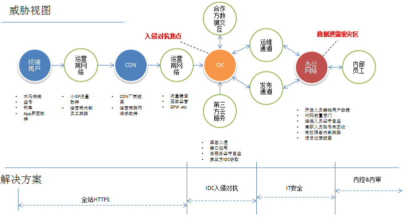
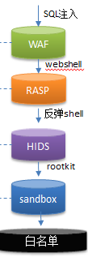

原文 by [赵彦](http://blog.nsfocus.net/company-security-techworld2017/)   

## 威胁视图
对于安全建设这件事情，如何做，首先要明确的是面临的问题本身是什么？大家可以看到这张图上所标注的威胁，涵盖了一家典型的中大型互联网公司所面临的所有威胁。譬如说像客户端常见的病毒木马，甚至竞争比较激烈的时候还有竞争对手的APP劫持。对于一般性的互联网公司来说，从客户端到服务端，经常会经过自己或者是第三方的CDN。同时，从客户端端到CDN，以及从CDN到源站也就是公司自己的服务器之间都会经过运营商网络。在运营商网络里，像跨ISP的劫持，运营商内部员工舞弊等等可能都会造成一定的信息泄漏。  
  

从CDN到源站之间，有一个比较知名的例子，是谷歌曾经在历史上被国家安全局监听，导致所有用户的流量被监视。原因就是因为CDN到源站之间没有加密。  

再就是IDC的入侵对抗，安全行业大量的笔墨都在这个领域。对于有跨境业务的公司而言，尤其是在今年6月1日《网络安全法》出台以后，实际上在海外有业务的公司都会涉及到跨境数据转移的问题，这也是现在比较重要的一条。  

IDC之后有两个通道，一是运营通道，二是发布通道。通常做的比较好的互联网企业会把IDC网络做成一个相对封闭的网络，跟办公网络之间通常只保留两个通道，一个是给运维执行命令用的运维通道，一个是给业务迭代发布用的发布通道。当然有些互联网公司技术管理做的不是特别好的时候，还做不到这点。  

就办公网络而言，互联网公司和其他行业并没有什么区别，仍然是一个数据泄漏的重灾区。这部分可能更多的还是需要依靠像内部审计、监督来预防。  

最下面的解决方案链条，实际上覆盖了对应着威胁的整体解决方案链条。  

像客户端到自有IDC之间，通过现在的主流技术——全站HTTPS基本上能解决；  

在自有IDC基础设施这块，主要是依靠IDC的入侵对抗，这也是各个安全大会讨论最多的领域。  

内部网络安全方面，包括员工舞弊等，主要是靠IT安全建设、办公网络的安全建设，以及内审内控来解决。  

## 安全体系定义的范畴
大家虽然都在讲安全，但是对于不同企业、不同规模的企业而言，需要的安全能力和需求是完全不一样的。如果用市值千亿美元的互联网公司的安全标准去衡量一个初创公司，显然是不合理的。  

我把安全体系分为5个阶段——对抗黑客、防范内部、防范第三方、防止间谍行为、国家机器。这5个阶段的对抗成本是依次上升的。现在大部分的安全话题还是聚焦于第一个阶段，对于广大中小企业来说要做到后面会比较难。  

### 第一阶段，防黑。  

防黑主要是对外，这可能是现在话题最多的部分。  

### 第二阶段，防内。  

防内在安全行业外面的解决方案、文章和产品会稍微少一点，所以现阶段很多企业暴露出来的问题最后发现都是内鬼所为。  

但是厉害的企业肯定不会止于这两步。举个例子，很多人使用iPhone，iPhone上的照片、通讯录其实都是备份到iCloud。苹果是亚马逊云计算AWS最大的客户，照片、通讯录以及手机备份都是存储在亚马逊第三方云服务，而不是存储在苹果自己的IDC机房的。但是苹果能做到什么？能做到即使亚马逊的员工去云服务器上拔了硬盘，还是没有办法拿到我用户的照片和数据。就是说我的安全机制能够做到我的安全不依赖于第三方，即使你第三方安全体系崩溃瓦解了，我仍然能保证自己的信息安全。这是做的比较好的企业和一般公司的能力上的差别。  

由此来看，大多数公司的能力，我倾向于一到二之间。大家可能也听说过一个故事。有一家知名的大型公司，购买的服务器中途被调包、偷换了固件，最后接入内网导致被渗透。大家在做安全体系的时候认为我有合规性、我做的机房有各种验证、指纹等等，但是其实这种安全能力和实际上的安全对抗的差距还是比较远的。因为你会发现在这种场景下，原来你所定义的那些合规项在这儿完成不管用，我要一个间谍买通电机房太简单了。  

但是，也有很多人会把这个问题归结为供应链问题。这里我还是要举个例子来说明，其实这个问题可以用更强的技术手段来解决。以谷歌为例，谷歌的服务器基本上都是自研的，从底层的芯片、CPU开始都会验证硬件来源，用了可信计算的方法。假如说你的服务器接入了谷歌的内网，但是你的服务器不是谷歌自己的，芯片不是自己的，你就会被拒绝接入。这就是真正厉害的公司和一般公司能力上的差别。谷歌这种公司可以做到完全通过自己的技术手段来对抗外来的间谍，而不是偏管理的手段。  

## 安全建设方法
第一，进不来。这是目前市场上讲的最多的部分，通过各种纵深防御体系，安全产品、威胁情报、态势感知等手段尽可能的将威胁阻挡在外。  

第二，看不到。假设入侵者进来了，即使渗透了一些服务器，也不知道我的数据在哪。可能我的数据都是加密的，甚至内网流量都是加密的。攻击者也分不清资产分布，我的代码也不是明文，找密钥也得找半天。  

第三，拿不走。假设更坏的情况，攻击者能看到我的一些重要资产，但当他想拿的时候，我这时候就会采取一些措施让他尽可能拿不走。  

第四，解不开。假设攻击者拿走了数据，我的加密很强或者有一部分加密的密钥链的顶层密钥没有办法通过入侵手段拿到。即使攻击者拖了我的全站数据库，还是解密不了。  

## 反入侵方法
下面我就来说说现在互联网公司比较通用的安全建设方法论。  

### 纵深防御
首先，将纵深防御这个概念分解一下，它首先要追求的是多维。多维举个形象的例子，假设你遇到的黑客很厉害，一道防御手段防御不了，就来两道三道。比如说SQL注入，我用WAF防一次，漏掉了没关系，RASP再防一次，漏掉了还没有关系，我再用数据库审计再做一次。我想你再厉害，能同时破三道关口的可能性还不是很大。  

从另一个角度来说，如果正则表达式跑一遍SQL注入跑不出来，那就用机器学习再跑一遍，反正总有办法把你抓出来。  

### 降维
大意是在攻击者不可控、不可感知的更深层次上做防御。比如说你是黑客，你进入一个操作系统你可能玩的很开心。但是你可能不知道在操作系统外围有一堆传感器，传感器的规则判定全部是在云端。这些判定、感知对于入侵者来说是完全不可控的。现在有很多具体的技术，像对于应用层的攻击，我可能是在最底层的内核做检测，实际上都属于降维的范围。  

### 入侵容忍
入侵容忍也是一个比较关键的规则，因为现在的安全体系不可能保证百分百安全。这个理念类似于我们船坞设计的概念，船坞设计的概念是说船坞会把船舱分成很多个隔离的空间，即使有几个空间触礁了、进水了，但是我仍然能够保证我的船不沉。所以理念是说，在进行整个体系设计的时候，要考虑的是假设我在一定程度入侵的情况下，如何能够保证数据的完整性，而不是一味地追求零入侵。零入侵其实是不太现实的。  

对于规模比较大的互联网公司而言，工程化是应对海量IDC规模的比较重要的手段。下图是一个常规渗透入侵的例子。  
   

像SQL注入在IDC基础设施防御的第一点可能是个WAF。当入侵上升到利用SQL注入，生成webshell的时候，语言虚拟机层面有一个RASP产品会对webshell进行更深度的检测。假如说深度更近了一步，入侵者通过WebShell得到一个反弹Shell，也就是操作系统普通用户权限的时候，我们在主机层面也会有一些检测，专门针对反弹Shell。更深层次的像入侵下一步种植内核蠕体的时候，我们也会有一些更底层的操作。

## 狭义——网络安全
狭义的网络安全基本上可以反应大多数当前的互联网公司的安全防御体系。大致  

包括反入侵（IDC和内网）、Anti-DDoS和产品安全。  

其实IDC的防御就是刚才提到的纵深防御体系的具体化实例。因为IDC规模的问题，可能规模比较大，用到一些大数据的方法。也因为自身的技术广度比较深，所以用到一些偏底层的技术。  

关于办公网络的解决方案，其实现在有一个趋势是办公OA的应用，全面的云化。云化就是把以前邮件、审批、财务、人事全部搬到了云端。然后追求的一个效果是服务端非常重，但是客户端很瘦，我只要一个浏览器随时随地都能打开。办公网络的安全解决方案，可能大家听说过谷歌的BeyondCorp模型，它不再依赖于传统的内网安全建设。而是更倾向于变成一个类似于在云端做很多防护，然后在客户端做得比较轻度的解决方案。  

然后产品安全这一块呢，对于业界最顶级的公司，在这一块花的精力是非常多的。比顶级公司稍微差一点的业界安全做得比较好的公司，通常也会在这个层面上投入一些精力。主要做的部分可能是扫描器，基于源代码的审核等。  

## 广义——信息安全
刚才讲的是一个相对狭义的网络安全。但是网络安全实际上并不是一家公司安全的全貌，从更深、更广的意义上来看的话，对于一家大型的互联网公司，通常安全体系的顶层是企业风险管理和IT风险管理。  

下层分支会包含信息安全、业务安全、风控、业务持续性管理、IT审计。对于有海外业务的全球化公司而言，可能还会涉及隐私保护，当然还会涉及认证合格。譬如有外卖这一类业务的公司，甚至还有一部分是线下安全。这部分可能跟技术部不一定强相关，但是它也是互联网安全的重要组成部分。  

在比较高层级的方法论层面，还包含周期性的风险评估。具体到了战术层面呢，实际上对于一家互联网公司而言，它最频繁的领域实际上就是研发和运维。那在研发侧呢，一个普遍的使用的方法论就是SDL，这个可能大家也听得比较多。在运维领域呢，我认为传统的P2DR模型就可以覆盖。更多的方法我认为也没有必要，大同小异。  

在最底层的支撑部分，实际上现在各个安全论坛比较火热的态势感知、安全大数据，这些实际上都是最底层的实现手段了。  

## 外挂式公司 vs 内建式公司
外挂式公司可能代表了国内的互联网行业的最佳实践，而内建式公司可能代表类似像谷歌这样的公司。我后来想了想为什么会有这样的一种差异呢？有可能是基于几个方面的原因。像国内的互联网公司，包括很多体量上不是很大的互联网公司，业务迅猛发展。其实它的业务更多是建立在大量使用开源软件的基础上的。然而开源软件其实很多设计之初并没有太考虑安全。所以做安全建设的思路上，可能还是延续了风尘仆仆，用外挂式的这种手段去切入各个点做安全。  

而对于谷歌这样的公司而言呢，它从底层开始到上层，所有的东西全都是自研的。所以它可以在基础架构和应用的实现里面，从一开始就嵌入安全，内置安全机制。也就不需要通过外挂很多安全产品来实现安全防护。  

另一方面有可能跟安全团队的知识结构有关。国内的安全团队更多是以攻防技能为主。但是在国外，可能这一点不太一样。面试的时候问的第一个问题，可能是抵御，而不是攻防。所以安全设计在国内可能是一个比较缺失的领域。  

## 影响长期建设的因素
最后我们来探讨一下：对一家大型互联网公司而言，安全做得好与不好的关键长期因素。  

### 工程技术能力
安全做得好与不好，很大程度上依赖于它的整体工程技术能力。其实做安全产品的能力，包括检出率，模型，或者说你机器学习的算法做得再好，这些都不是第一关键因素。因为对于比较大型的互联网公司，最终要使你的安全产品和安全技术转化为实现阶段，必须要在海量IDC上全部落地，这个落地的能力依靠的就是整体的工程技术能力。  

举个例子，国内互联网公司和国外互联网公司一个很大的差距就是数据安全。以全站数据加密这件事情来说，以我的所见所闻，国内暂时没有公司能做到这一点。但是国外的顶级公司其实是可以做到这一点的。  

回到技术原点来看，服务器加密、数据加密这个技术难吗？可能很多网络安全专家都有这种实现能力，但是为什么就是落地不了呢？其实不是安全技术的问题，而且整体工程技术能力不到。因为对于这项技术而言，在整个互联网公司落地，可能涉及到很多环节。譬如说全站服务的高可用、服务降级、故障容忍能力。只要有一个维度不达标，这个安全技术就没有办法落地。  

### 架构统一
架构统一首先要解决的问题是安全做一套就解决问题了，还是要做很多套。在国外的公司中，比如说有的互联网公司规模很大，但是每个自成体系，可能每个都有一套技术体系。那安全工作的适配工作量就比较大。相当于一个安全部门要做十个安全体系，那最终可能人效比很低。  

第二个方面呢，架构统一其实给安全的入口提供了很大的便利。其实我也曾经隐讳的提了一点，安全这件事情可以做得很辛苦，但是不一定讨好。举个例子，在一个技术规划做得不太好的公司，你的安全要做什么？可能要在网关上针对所有的协议，所有的流量做分析。但在一个做得比较好的公司，我可能不需要这样做。因为我对外开放的只有HTTP、HTTPS协议，我其它所有的协议全都不需要关注。我甚至禁止了IDC主动向外发起的链接，我连反弹这件事情都不用关注。那么我在这个基础上去做安全，我后端的安全体系，我的安全能力建设就会相对比较高效。所以安全这件事情做得好不好，也要看公司其它能力拖不拖后腿。  

像架构的统一性呢，刚才也提到了技术，譬如白名单也提供了一定的可行性。架构不统一去做白名单这件事情，其实是不太可能的。  

### 深入研发
如果想做到业界最牛的水平，可能还有很重要的一点要深入研发，深入源头。像谷歌那种安全体系可能大量先置于研发，把安全设计融入产品，最终才能达到这样的效果。跟外科手术般的外挂安全产品，可能还是有不同的投入点。  