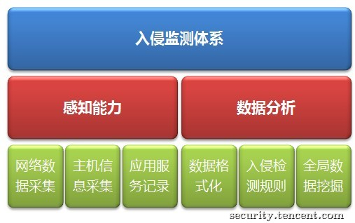
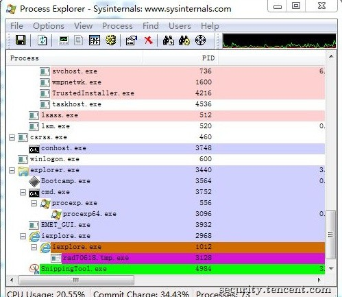
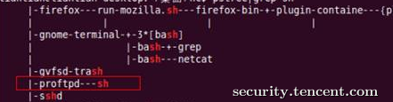
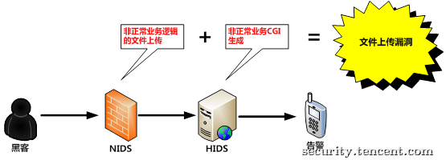

原文 by [tsrc 博客](https://security.tencent.com/index.php/blog/msg/21)  

## 一、前言
 

伊朗2010年被报出核工厂遭受“超级工厂”(Stuxnet)病毒攻击，蠕虫通过多个漏洞潜伏在工控系统近两年未被发现。相信诸如上述案例中的伊朗核工厂，大多网络中都会部署有各种形形色色的安全产品，杀毒软件,waf或IDS。但为什么那么大范围的攻击却依然久未被察觉？大型网络怎样才能更有效的做好入侵检测呢？本文讲介绍一些建设经验。  
 

## 二、监测体系
 
### 2.1、架构选择

常规的安全产品可能是一个杀毒软件，一个IDS，一个WAF，这能解决一个单点安全问题，但如果没有全局的信息汇聚与分析，很难实现对全局态势的感知。  

云计算与云安全是常被提起的概念，在大型网络中，因应用服务器对于性能消耗较为敏感，很多复杂的安全分析逻辑不易被业务部门接受，部署于主机和网络上的设备只被限制在实现提取数据功能。分析与计算在后端也就是所谓的云端来实现。   

同时，采集与计算的分离带来了诸多优点：  

1. 假设(几乎是必然出现)单点系统被黑客攻陷，安全策略不易被逆向与窃取，避免因策略失窃带来的，对手针对性研究绕过手法；

2. 可快速更新检测策略，减少对各子节点和探测设备的变更，避免干扰业务系统的稳定；

3. 原始数据的短时存储，便于对事件演变过程的重现，方便追溯审计，以及预研新检测逻辑的验证。

### 2.2、功能模块

大型网络的安全监测产品通常有各类SOC系统，分布式安全产品，以及云安全产品。产品形式千变万化，但功能模块这里将其简化如下归纳:    
    


### 2.3、态势感知能力

通常SOC系统会收集各种日志，各种NIDS\HIDS 都有数据采集功能。尽可能多的采集数据对于入侵分析是很有帮助的。  

但我们面对入侵事件时，常常面临两种尴尬局面：

#### 2.3.1、数据很少：仅有部分系统\应用默认日志

如侦探破案一般，发现入侵事件最重要的是有证据。通常系统默认的日志等数据无法满足入侵事件分析需求，必须开发专门的探测器。先需要梳理场景对抗需求，搞清楚检测某类攻击所需数据类别与纬度，并将此作为数据采集系统的开发需求。  

   

#### 2.3.2、数据很多：大型网络中各类数据很多，甚至多至无法记录。

数据并非越多越好，特别是大型网络的海量数据，如全部汇集存储是难以支撑的。且大量的噪音数据也只会带来硬件与人力成本的增加。真正流入最后存储与分析系统的数据，必然是经过精简与格式化之后的。  

    

### 2.4、数据分析

有了数据不等于有检测能力，首先第一个问题就是如何理解你获得的数据，这就是数据格式化。  

如何定义格式化数据：  

1)  分析规则决定数据纬度  

2) 关联逻辑定义字段扩展  

有了格式化好的数据，就实现了数据自动化分析的第一步，接下来才是分析引擎与规则建设。  
  

## 三、分析能力

但凡有一点渗透经验的人，对于无论是杀毒软件还是waf\ids 系统都知道使用各种逃避检测的手段。现在我们面对的是有一定反检测能力的攻击者，特别是高级APT攻击通常较为隐蔽不易触发单点的安全策略和检测，需要更多纬度和大视角的数据分析。    
美国《2013年财年国防授权法案》： **国防部下一代主机安全系统不能再是杀毒软件或任何基于签名的技术**      
传统安全产品单纯依靠特征库的检测模式，效果已大打折扣。黑客工具千变万化，攻击手法层出不穷，但他们的目的不变，行为就是殊途同归的。所以，在原有特征检测技术之外，用行为模型能更好的检测入侵，我们提出以下检测模型：   

### 3.1、单点事件描述数据的行为分析

例如一个进程的启动，进程自身的行为与环境信息。   

  

这里你看到了什么？以下均可作为恶意进程检测规则。  

1) 父进程为IE；  

2) 进程运行在IE缓存目录；  

3) 进程PE信息：加壳,未签名, 多个PE头部 等  

### 3.2、上下文事件关联分析

例如：一个进程状态的变化，以及父子进程状态的变化。  

  

这是ProFTPD的一个远程缓冲区溢出漏洞攻击后的结果，从pstree可以看到proftpd进程派生了一个bash子进程。正常情况下bash通常只会从系统登录后的sshd\login等进程启动，这可作为一个异常告警逻辑。大家再想想这个场景还会有那些特征？  

规则描述  
```
{
	"dsc":"Remote code execute",
	"cache":{
		Socket=1,
		cmd!=sshd|logoin
	},
	"rule":{
		ip=cache.ip,
		ppid=cache.ip.pid,
		cmd=/bin/shell
	}
}
```
### 3.3、多数据纬度关联分析

例如：NIDS与HIDS的数据联动分析。 

  

IDS上出现来至非正常业务逻辑的文件上传事件，于此几乎同时，HIDS出现一个CGI文件生成事件，可作为可疑webshell上传行为规则。上传漏洞千变万化，导致入侵者能上传webshell的原因也千奇百怪，我们勿需为每一个web漏洞建立检测规则，形成臃肿的规则库，只要符合上述行为特征，就能被发现。  
 
 
总结上诉架构与分析逻辑，我们得出以下整体架构图。  
  

 
## 四、实战推演

前面洋洋洒洒那么多，还是实战来得实际。下面我们通过对一个确切的攻击场景实现检测能力来实践前面的思路。  

### 4.1、场景分析

在黑客入侵过程中，通常有一个环节，就是通过漏洞对自身拥有的权限进行提升，简称提权。常见的提权手法是，发现系统存在的漏洞，执行漏洞利用程序，exp利用漏洞获取一个高权限的shell。  
    
 
### 4.2、检测思路

通过对上述漏洞的分析和测试，我们会发现一个提权攻击中的特点，那就是exploit工具自身在执行时是低权限，而得到的shell是高权限。  

有了对场景的清晰认识，检测逻辑也就很清楚了：  

某个高权限(system?uid=0?)进程(bash?cmd.exe?)的父进程为低权限，则告警。  

### 4.3、系统实现

数据采集需求:根据前面大节中的思路，我们有了场景有了规则，可以考虑采集那些数据以及数据纬度了。在这个场景中，规则分析至少需要用到几个必备的进程数据纬度：进程权限；进程ID；父进程ID  

规则逻辑:  
```
{
	"dsc":"Local Privilege Escalation",
	"cache":{
		uid>0
	},
	"rule":{
		ip=cache.ip,
		ppid=cache.ip.pid
		uid=0
	}
}
```
以上检测规则基本上能满足多数提权场景，但实际运用中还有一些细节需读者自己去思考完善：  

1、同样满足父进程权限低，子进程权限高的正常场景有哪些，如何去除误报？  
2、数据关联分析中，分析流程向前追溯还是向后追溯更易实现，更符合你自己分析系统的架构？  
3、提权攻击除了上述提到的场景，还有那些？  
 
我们可以看到，从行为描述很容易刻画攻击场景，从而实现检测，纵使攻击手法千变万化，而关键路径是不易改变的。通过行为模型实现检测能力，避免了各自漏洞技术细节差异带来的规则库冗余(且影响安全系统性能)，也避免因检测规则过分针对细节(特征库\漏洞库)可能导致的被绕过。

## 五、安全agent
### 文件监控

文件监控这部分其实相对容易实现，这部分主要监测设备插入和拔出以及业务系统文件监控，这里需要说到一个小东西：inortify。inotify 是一种文件系统的变化通知机制，如文件增加、删除等事件可以立刻让用户态得知，该机制是著名的桌面搜索引擎项目 beagle 引入的，并在 Gamin 等项目中被应用。    

### 进程监控
其实进程监控有很多种方法，比如说：  

1. 使用inotify实时监控/proc下面的文件变动即可（有可能进程启动、结束太快来不及读取文件内容从而没捕捉到必要信息）  
2. 使用ptrace监控所有进程的fork/clone/vfork/execve/exit/exit_group等系统调用（对系统性能影响太大）  
3. 写内核模块，hook一些关键的地方。想简单一些的话可以定时过task_struct的链表（从init_task开始）  

对于进程监控来说，第一种方法比较容易实现，第三种方法如果系统出于安全考虑，设置禁用了一些insmod，这样的话就不太好办了。  
 

## 六、总结

本文是在实际入侵对抗实践中，根据公司网络自身环境，外部威胁特点不断总结出来一些浅显经验。总的归纳为：入侵事件数据化、入侵检测模型化、事件分析平台化。  
在不同网络环境，安全威胁形势，对抗要求时，还须结合自身情况作不少优化和变化。个人认为前述无论是架构还是数据分析模型，是在现有网络海量数据、业务环境苛刻、外部威胁多变的情况下一种较为经济易行的入侵检测思路。  

## Reference
[基于Agent的HIDS系统设计的一点思路](https://mp.weixin.qq.com/s?__biz=MzI5MzY2MzM0Mw==&mid=2247484452&idx=1&sn=916a88a69143b09c123f2d4ddb488f94&chksm=ec6fe324db186a320c70b39652f64a347e5538ea59092132f2416bf736e910167f8500e9e912&mpshare=1&scene=1&srcid=1211OcZOLTyHaHRa4oIo05B0#rd)  