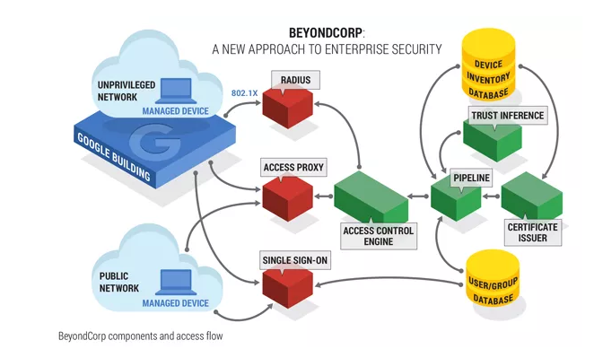

原文 by [首席安全官](https://mp.weixin.qq.com/s?__biz=MzI4NDY2MDMwMw==&mid=2247485048&idx=1&sn=ef17e6cbee24270092badf398a23ac3a&chksm=ebf94158dc8ec84e9d7b3b4fa64564fd3d518222f8f9edd37190dbe47b391ddc98146fa6be72&mpshare=1&scene=1&srcid=02018BoKi99AVrr1F2Q0QvxO#rd)  

对于谷歌公司的员工来说，无论在公司办公楼、咖啡厅还是在家，访问公司应用都是一样的：从外网访问需要的 VPN 被废弃，所有员工到企业应用的连接都要进行加密。目前谷歌所有面向员工的企业应用都拥有公共IP地址，不再拥有受防火墙保护的企业级应用，不再像有内网外网之分的公司那样，将应用置于虚拟专用网中。 
谷歌公司基础架构产品营销负责人Neal Mueller将此称为云安全的“新模式”。实际上，这种模式属于业界所称的“零信任网络”或者“无边界网络”。  

零信任网络（亦称零信任架构）模型是JohnKindervag于2010年创建的，当时他还是研究机构Forrester的首席分析师（现为PAN技术主管）。Google公司在2013年开始向零信任架构转型之后，带动“零信任”安全架构的流行。  

随着零信任的支撑技术逐渐成为主流，随着防护企业系统及数据安全的压力越来越大，随着网络攻击演变得更加复杂高端，零信任模型也在CIO、CISO和其他企业高管中间愈加流行了。Forrester认为，3年内零信任将成为网络安全流行框架之一。  

## 什么是零信任网络

零信任是一个安全概念，中心思想是企业不应自动信任内部或外部的任何人/事/物，应在授权前对任何试图接入企业系统的人/事/物进行验证。  

简言之，零信任的策略就是不相信任何人。除非网络明确知道接入者的身份，否则任谁都别想进入。什么IP地址、主机之类的，不知道用户身份或者不清楚授权途径的，统统不放进来。用户的访问权限将不再受到地理位置的影响，但不同用户将因自身不同的权限级别拥有不同的访问资源，而过去从外网登陆内网所需的VPN也将被一道废弃。  

这与无边界网络概念有点类似。在无边界网络概念中，最终用户并不是所有都位于办公室以及防火墙后，而是在远程工作，使用他们的iPad或者其他移动设备。你需要了解他们角色的更多信息，并明确哪些用户被允许连接网络来工作。  

## 选择零信任网络的背后

为什么要用零信任？可以看看下面一组统计数据：  

美国网络安全公司 CybersecurityVentures 发布的《2017年度网络犯罪报告》预测，到2021年，网络犯罪所致全球经济损失总额将达6万亿美元/年，比2015年的3万亿美元足足翻了一倍。  

同时，波耐蒙研究所在IBM资助下所做的《2017数据泄露研究》发现，数据泄露事件所致平均损失为362万美元。尽管该数字比上一年有所下降，但数据泄露事件的平均规模却上升了1.8%，达到了平均每起事件泄露2.4万条记录之多。  
  
而且，这些数据还是在公司企业对网络安全工作投入越来越多的情况下取得的。科技研究与咨询公司Gartner将2017年全球信息安全产品及服务开支标定在864亿美元上，比2016年增长了7%。这家公司还预计，到2018年，信息安全开支会达到930亿美元。  

企业高管们认识到了现有安全方法并不足以应对愈趋严峻的安全态势，他们需要更好的东西，而零信任模型恰好就能得到最好的结果。  

Neal Mueller表示，谷歌认为防护墙已经不能发挥作用。与其用VPN防护所有的基础架构，谷歌决定完全放弃防护墙。  

## 为新世界而生的安全

零信任模型基本上打破了旧式边界防护思维。旧有思维专注防御边界，假定已经在边界内的任何事物都不会造成威胁，因而边界内部事物基本畅通无阻，全都拥有访问权限。  

但安全专家和技术专家并不认同边界防御的效果。他们指出，最严重的几起数据泄露事件都是因为黑客进入公司防火墙之后基本没遇到什么阻碍就能在内部系统中来去自如。  

IT系统的一个固有问题在于，太多东西可以经由默认连接四处巡游。人们的信任太过宽泛，这是互联网得以腾飞的原因所在，因为每个人都可以在任何时间共享任意东西。但这也是互联网安全的症结所在：如果你信任所有东西，你就没机会保住任何东西的安全。  

黑客和恶意威胁并非驱动零信任模型的唯一因素。  

今天的企业IT部门为什么需要新安全思维？很大程度上是因为边界已经不存在了。纯内部系统组成的企业数据中心不再存在，企业应用一部分在办公楼里，一部分在云端——分布各地的雇员、合作伙伴和客户通过各种各样的设备访问云端应用。  

所有这些宏观变化都推动了零信任这一新模型的流行。  

面对工作流的移动化和云端化，我们难免扪心自问：“新形势下我们该如何保护自身安全呢？”新世界里，防火墙已经逼近到了需要保护的资产身边。

## 谷歌BeyondCorp实践

谷歌公司称，在2009年经历高度复杂的APT攻击——极光行动（Operation Aurora）后，该公司对员工与设备如何访问内部应用的安全架构，开始尝试重新设计。由此，零信任架构BeyondCorp开始萌芽。  

与传统的边界安全模式不同，BeyondCorp摒弃了将网络隔离作为防护敏感资源的主要机制。取而代之的是，所有的应用都部署在公网上，通过用户与设备为中心的认证与授权工作流进行访问。  

这就意味着，作为零信任安全架构的BeyondCorp，将访问控制权从边界转移到个人设备与用户上。由此员工可以实现在任何地点的安全访问，无需传统的VPN。  

谷歌的零信任安全架构涉及复杂的库存管理，记录具体谁拥有网络里的哪台设备。设备库存服务来从多个系统管理渠道搜集每个设备的各种实时信息，比如活动目录（Active Directory） 或 Puppet.  

对于用户的认证则基于一套代表敏感程度的信任层。无论员工使用什么设备或身处何处，都能得到相应的访问权限。低层次的访问不需要对设备做太严格的审核。  

谷歌企业项目经理Max Saltonstall表示，对于访问授权是基于上下文：“你是谁，是否经过严格认证？ 你使用什么设备？对你的设备了解情况如何？”  

在谷歌网络中不存在特权用户。谷歌使用安全密钥进行身份管理，比密码更难伪造。每个入网的设备都有谷歌颁发的证书。网络的加密则是通过TLS（传输层安全协议）来实现。  

与传统的边界安全模型不同，BeyondCorp不是以用户的物理登录地点或来源网络作为访问服务或工具的判定标准，其访问策略是建立在设备信息、状态和关联用户的基础上，更偏向用户行为和设备状态的分析。  

据了解，谷歌BeyondCorp的主要包括三大指导原则：  

* 无边界设计

从特定网络连接，与你能获得的服务没有关系。. 

* 上下文感知

根据对用户与设备的了解，来授予所获得的服务。  

* 动态访问控制

所有对服务的访问必须经过认证、授权和加密.  

  

## 零信任背后的技术

在各种各样的现有技术和监管过程支撑之下，零信任方法才得以完成保护企业IT环境的使命。  

它需要企业根据用户、用户所处位置和其他数据等条件，利用微分隔和细粒度边界规则，来确定是否信任请求企业特定范围访问权的用户/主机/应用。  

* 首先，要弄清楚用户身份，确保用户真的是他/她所声称的那个人；  

* 然后，要保证用户所用终端是安全终端，或者该终端处在安全状态；  

* 最后，还要有个条件策略，指定哪些人能访问哪些东西。  

零信任依靠多因子身份认证、身份与访问管理(IAM)、编排、分析、加密、安全评级和文件系统权限等技术来做上述工作。最小权限原则也是零信任倚赖的监管策略之一，也就是只赋予用户完成特定工作所需的最小访问权限。  

基本上，零信任就是公司企业收回安全战场控制权，在各部门应用网络分隔和下一代防火墙，控制网络接入的身份、对象、地点和时间，是从内而外地施行控制，而不是由外而内。  

现今的大部分IT场景中，零信任不仅仅是技术，还有关思维和过程。  

## 如何实现零信任

部分企业的IT部门已经实现了零信任的很多方面。他们通常已经部署了多因子身份验证、IAM和权限管理。其环境中也越来越多地实现了微分隔。  

** 但建立零信任环境不仅仅是实现这些单个技术，而是应用这些技术来施行“无法证明可被信任即无法获得权限”的理念**。企业得从战略上确定哪些技术有助实现这一理念，然后再去买入这些技术。  

在技术的应用上最忌讳病急乱投医，与其期待乱买来的药能治好病，不如先好好诊断诊断，弄清楚自身情况再采用相应的技术。转向零信任模型不是一朝一夕之功，也不是件容易的事儿，尤其是在有不适应该新模型的遗留系统的时候。  

很多公司都在向云端迁移，这是个全新的环境，很适合应用零信任模型，可以从云端开始零信任旅程。公司企业，尤其是有着复杂IT环境和大量遗留系统的大型企业，应将零信任迁移看做是多阶段跨年度的一项工程。  

**零信任迁移中的另一项挑战，是让员工具备该新理念的思维方式**。  

比较不幸的是，大多数企业IT专家接受的教育或培训让他们默认企业环境是可信的，他们被教导得想当然地认为防火墙能将坏人挡在外面。人们需要调整自己的思维模式，要清楚当前态势下坏人可能早就在自家环境中了。  

公司企业还需认识到，零信任与其他成功的IT或安全原则一样，需要长期坚守，不断维护，而且零信任工作中的某些部分会更具挑战性。从传统企业网络迁移至BeyondCorp前，谷歌花费两年时间来创建用户和设备信任库，这是一个比较漫长的过程。谷歌实行BeyondCorp计划离不开高层的支持，尽管该类型网络维护成本较低，但对预算要求颇高。  

比如说，微分区工作中，安全/IT团队就必须确保配置修改是恰当的，并更新不停改变的IP数据以保证员工工作或企业交易所需访问不被中断。否则，企业可能会面临工作阻塞问题。  

很多公司都会想，遭遇恶意软件导致业务中断，和配置错误导致停工一天，本质上都不是什么好事。微分隔方法所需的持续维护可能会带来很多临时应急的措施，或许会让网络更加脆弱。  

在遗留系统和现有环境中整体应用零信任模型所导致的复杂性，表明公司企业真的没有做好完全实现该模型的准备。  

因此，公司企业最好是从设计上就打造零信任，而不是在原有基础上修修补补。换句话说，应将零信任模型作为公司整体数字转型战略的一部分，实现那些有助于在云迁移过程中达成零信任的技术，淘汰掉那些老旧的遗留系统。  

而且，CISO、CIO和其他高管应参与进转向零信任的过程中，这样他们才能安排过程中各项事务的优先级，确定哪些动作应尽快完成，而哪些部分可以先等等。  

零信任迁移基本等同基础设施转型。信息安全并没有跟上数字转型/现代化环境的脚步。但企业必须转换安全管理的方式。想要整体安全，想要有安全准备度，就需要换一种思维方式。  

无论是BeyondCorp还是其他零信任网络架构，都提供了一种新的安全模式，设备和用户只能获得经过验证的资源，如此企业才构建了更为安全的环境。  