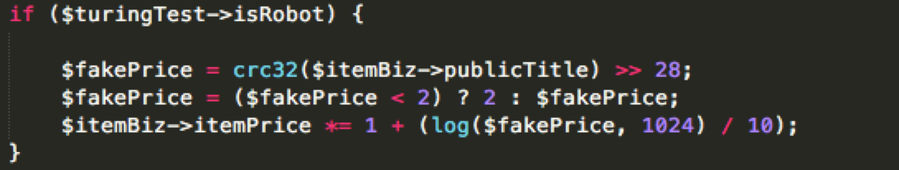
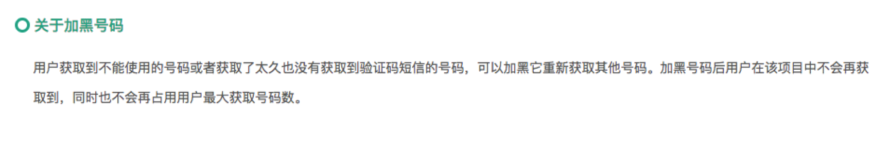
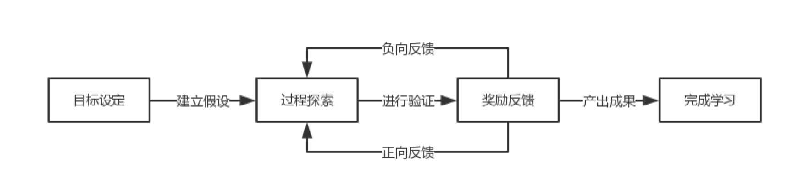

原文 by [先知社区](https://xianzhi.aliyun.com/forum/topic/1540/)  

## 一、从反爬虫的投毒开始说起

一天，产品线的小伙伴匆匆跑过来找我：兄弟，我们的站点遇到一只疯掉的“爬虫”，机器都快被爬死了，帮忙处理一下……
很多小伙伴拍脑袋就想到弹验证码，或者直接上频控，用沙包一样的的字体或者鹤立鸡群的页面告诉触发“规则”的家伙：不好意思，此路不通。  

于是，“攻击方”开始调试自己的爬虫，绞尽脑汁拟人、调整策略绕过频控，甚至考虑加载js引擎执行脚本。“防守方”被逼的用上图片显示关键信息、加入不可见字符等等前端黑魔法，甚至用上设备指纹、PoW等方式针锋相对。爬虫和反爬虫，成了相爱相杀的天平两端。  
哇，我们本是同根生。程序员和程序员就应该好好相爱搞基，别老是磨刀霍霍，非得置对方于死地，多点真诚不好吗？既然爬虫的目的是获取数据，那就给他数据好不好——不过，不那么干净就是了。  

设想一下，深夜里一只爬虫正辛勤地爬着梦寐以求的宝库，而他的主人也在美滋滋的扣着脚观赏青春期生理知识教育片，心里还说这个傻x网站一点反爬都没有简直是个垃圾。结果等到好几天后，到了真要用到数据的时候，发现爬到的数据里面真亦假来假亦真，虚虚实实无法分辨。然后因此错过关键时期被竞品干得边叫爸爸边哭，你要是他的老板你还笑得出来吗？！  

  
（针对商品价格的投毒方式，思考一下为何要用crc32做发生源而不用随机数？）  

俗话说，好人不长命，祸害遗千年。自古以来，天下武功，无所不破，唯骗不破。  
  
## 二、阻断学习途径

让我们回到《三体》，之所以地球人可以牢牢驾驭住干尸三体人，还是多亏了罗辑鼠标，哦不对，是罗辑控制的“广播系统”。我看完《三体》后深深迷恋于这个“广播系统”不可自拔，一心想着什么时候我也能向全宇宙播出全国第八套广播体操，然后用这个威胁所有不给子女零花钱的80后父母。  

三体人清楚地知道，一旦广播出了坐标将会让自己的母星彻底暴露在全宇宙面前，就如同全身赤裸跑到人民公园征婚——所有长处短处一览无疑。  

三体人都知道的东西，我们各位在做业务安全的小伙伴也应该多多学习啊。发现风险怎么办，迅速处置？那我问问你，不论场景地迅速处置真的有必要吗？  

（黑暗森林法则的变种版描述：谁先说话谁就输了）  

以注册举例，很多人花了大价钱买到了手机号的风险库，想着这下可以来一个老子杀一个。一输入接码平台的手机号，系统巴不得跳出一个全屏窗口向全世界庄严宣告：哈哈哈哈我们知道你在用接码平台的手机号哦不给你注册我们是不是很牛逼啊来怼我呀~  
历史的经验告诉我们，这么嘚瑟是不会有好下场的。  
于是，羊毛党向卡商报告这手机号已被拉黑避免扣钱，卡商唰的一声换上了崭新的一坨新卡。Ok，这下你数据库中没有这个号了吧。而你，此时还沉浸在自己识别到了多么多么大量的羊毛注册请求中沾沾自喜，却忽略了这个“看不见”的风险。这个过程中，卖威胁情报的挣了钱、接码平台挣了钱、卡商挣了钱、运营商挣了钱、羊毛党也挣了钱，那谁亏了钱？你说是谁？  

同志们，我不禁要问，为什么要这么嘴欠？！我们平常很多风控策略，像什么图灵测试，什么挑战加验，什么直接阻断，这不正给了羊毛党一个很好的调试接口吗？  

    
（接码平台通常都提供标记特定手机号在某一项目中不可用的功能，一键GG）  

我们之所以不会蠢到把手伸进熊熊燃烧的火焰中，往往是因为在此前人生中的某一时刻曾经这么干过，并且收获了满满的痛楚。从此，我们从反馈中立即学到了一个知识——傻子才把手直接伸进火里。  

事实上，对于每一个学习过程，都有：  
目标设定 过程探索 奖励反馈 完成学习  

如果丧失了奖励回馈环节，整个学习过程无法持续。就如同你想让狗狗训练成听到你叫它名字后马上坐下，但你既不在它做对的时候给它东西吃（正反馈），又不在它做错的时候揍它（负反馈），很难想象它能乖乖达到你期望的状态。  

    
（一个大致的学习过程，其中奖励反馈是最重要的环节之一）  

在鱼儿刚刚咬钩的时候就迫不及待地拉起鱼竿，这样的“果断处置”，除了能够迅速替“攻击者”完成奖励反馈的重要环节外，并不能为我们自己带来很好的收益。正如人们不能直接观测黑洞一样，沉默是对想了解你的对手最有效的武器。停止反馈，阻断学习途径，是对抗对手的第一步。  

## 三、理清业务链，风控决断后移

尽管拒绝反馈能够很好阻断羊毛党的学习过程，但很多场景下我们不能完全不给用户反馈，不然这属于杀敌一百自损一万的“绝技”。还以注册为例，我们好歹好告诉用户注册成不成对吧？  

这时候，我们应该考虑“决断后移”。不过，在讨论决断后移前，我们先要理清一个关键的链路——业务链。  

注意，这里指的业务链不是一个具体的A页面到B页面这个Action Chains（关于Action Chains可以另写一篇文章来研究），而是一个业务流程从用户发起到结束交付所经历的全部逻辑过程。以购买商品为例，这里的业务链可以是：  

用户注册/登录 → 搜索商品（可选） → 选购商品 → 咨询商品（可选） → 填写订单 → 提交订单 → 支付 → 配货（可选） → 发货 → 配送交付 → 售后（可选）。  

整个业务链有两个关键节点，一个是发货，一个是配送交付。  
对于公司来说，发货环节执行后，货物很大程度上会脱离控制，而且大量成本会在这时候产生（包括库存成本、配送费等），所以这是一个关键的业务节点。  
对于消费者来说，配送交付环节执行后，消费者才能真正收到货物，完成整个订单期望要做的事情，这样往往代表着整个业务链路的结束。  

以前的风控策略会怎么设置呢？  

我在登录注册拦你一道，不通过不让下一步。  
还不放心，那在搜索、选购商品的时候再拦你一道，机器人占库存都给你毙了。  
填完订单之后，琢磨着又可以拦你一道，同一收货人或收货地址有问题的，也给你拒了。  
付钱的时候给你拦最后一道，黑卡、黑户等等支付出风险的，到此为止。  
最后所有风控策略已Pass，还等啥，发货呀。  
看起来这个策略棒棒哒。我问你啊，一串4个英文字符的密码，你最多要猜几次才能猜对？区分大小写的情况下需要52的4次方约是700万次。那如果你每次猜1个字母，我就告诉你这个字母猜的对不对，那你要猜几次？52*4 = 208次，根本就不值一提啊。  

（以扫雷为例，玩家不可能直接标记出所有地雷的位置，必须要通过局部的、小规模的不断测试来完成游戏）  

好吧，我们经过自己优秀的风控策略，把羊毛党面临的指数阶的问题复杂度，通过分治算法给“优化”到了线性复杂度。不止数据结构课程的老师会感谢你啊，羊毛党们开着奔驰路虎在大别野里也感谢你好不好。  

从企业自身角度看，业务链只有进行到关键逻辑节点的时候才会产生大量的成本，所以我们完全可以通过将风控决断移动到关键节点上，而暂时承受前面环节带来的“风险”。譬如，我们把上面的风控策略改成：  

在登录注册发现有问题的，打一个恶意注册/登录的标签就放行。  
在搜索、选购商品的时候发现是机器人的，也打一个机器人的标签放行。  
填完订单之后，对订单信息有问题的，再打一个异常订单的标签放行。  
付钱的时候，什么支付风险啊，先扣了钱再说并赠送一个支付异常标签后放行。  
最后对于有异常标签的订单，除非有什么985、211限时达什么的，不然先一本正经告诉你在配货，完了2天之后告诉你发货失败，订单有风险已被取消。  
羊毛党看了就想哭，就很气。  
搞了2天，82年的茅台都开瓶了，别野大平层首付都付了，你告诉我订单取消？而且我前面明明已经做得很好了，你既没有警告也不报错，现在我裤子都脱了你给我取消了？  

（对于黑盒的系统，只能通过反复调整输入观察输出才能很有限地“大致”知道盒子的功能是啥）  

我们发现，整个流程下来羊毛党无法精确的确定之前到底哪个或哪几个环节出了问题。既然没有办法确定出问题的具体环节，那就有可能每个环节都有问题。所以，这样的风控策略极大增加了羊毛党的“作案”成本：一方面消耗了大量的时间，另一方面也消耗了大量的精力。  
风控决断节点的后移，除了给我们带来一些流量、计算成本外，并没有付出很高的代价。相反，我们如此一来便可以站在更完整的角度观察一个羊毛党的所有行为轨迹，从中抽象出之前没有发现的特征或特点，不断的修正自己的模型。我们不让别人学习，可从没说过不让自己学习哦。毕竟，学习才能成为更好的自己嘛。  
 
我把这样在业务链中关键节点才作出决断的风控策略称为非即时反馈策略，它是对抗对手的第二步。  

## 四、添加随机噪声

只应用非即时反馈策略是不够的，因为理论上我们还是没有斩断反馈链路。所以实际中羊毛党会尽可能去尝试发现识别他们的方式，甚至会在一些群里分享“绕过某某风控”的经验。最终，通过“多线程”或控制变量的实验方式，还是能把问题复杂度进一步降低。  

这难道是说我们前面写得辣么多的东西都是废话咯？嘿嘿嘿，知道什么叫“风控策略测不准原则”么？不知道不要紧，我们可以创立这个“风控策略测不准原则”。  

我们期望，对于任意的风控策略，即使同时满足“所有特征和所有依据特征计算的策略规则已被知晓”的情况下，其输出结果是确定的，但无法预测。

理论上这个原则是不成立的，原因是其违反了算法的确定性。即对于算法，如果确定输入，有且仅有一确定的输出。  

那怎么办？改前提条件吧：  
对于任意的风控策略，即使同时满足“所有【用户可控】特征和所有依据【用户可控】特征计算的策略规则已被知晓”的情况下，其输出结果是确定的，但无法预测。  

我们通过给风控策略增加一个脱离用户状态的“自变量”来增加整体策略的不确定性。在通常实践中，这个“自变量”为随机数。 

回到上一节提到的业务链，我们在此前非即时反馈的风控策略中增加最后一项：  
初始化一个[0,99]随机整数，当随机数<=0时，无论此前是否有标签，该商品订单依然取消；当随机数>=99时，无论此前是否有标签，该商品强制发货。  
简而言之，1%的概率使得所有风控策略直接失效，1%使得当前订单强制失效。  
当然了，上面的策略比较粗暴，实际中可以结合其他用户状态，比如商品价格、用户活跃的时间、用户风险评分等综合设置阈值。  

对于羊毛党来说，他会发现同样的薅羊毛策略有的会过，有的不会过。那么，他就不能确定他的薅羊毛策略调整是真的有效，还是单纯的看脸。整个风控系统变得如同女朋友的心一样难以琢磨——你究竟是爱我呢，还是不爱我了？  

（薛定谔的女神：你猜我到底爱不爱你）  

我们还可以举出很多类似的例子，例如在一些领券的活动中，绝对不要弹出“谢谢参与”这样让人忧伤的选项。大可以设置一些“玛莎拉蒂100元优惠券”、“满1001-1元”等兜底奖项来缓解这种尴尬，并机智的应用随机噪音干扰薅羊毛的视线。像某动物形象电商的砍价活动就做的十分讨巧（欠揍），你的每次点击价格可能会降，当然也有可能帮倒忙给加了回去，这TM怎么薅？  

上帝是爱掷骰子的，我们的世界中或者人类自己本身就充满了大量的随机性，为何非要用正则化的思维来训练一个和人对抗的系统呢？  

添加随机噪声的过程则干扰了大量正则化的判断，使得羊毛党需要排除的问题节点组合以指数阶的方式增加，在薅羊毛的路途上设下了不少障碍，对抗对手的最后一步就从这里开始。  

## 五、局限

需要深知，这个方法是有局限的。 
显然，它只能应用在一个较长的业务链中。如果业务链极短，比如点击投票、搜索查词等，没有可供施展的空间。  
而且，它因为非即时反馈的特性，无法在某些即时业务中应用。类似于用户在发起转账、发起信贷等“无法撤回”的动作时，我们总不能先告诉用户申请信贷成功，然后用户消费完了再说不好意思，我要撤回授信。  
另外，它依赖于信息传递高度统一。我们把决断后移到了关键业务节点，如果在业务流程十分复杂，系统架构、开发环境混乱，则容易因为信息同步的不一致性造成“口子”开放，也就是风控系统的疏漏。  

个人认为，风控系统牛逼程度不完全依赖于技术水平的高低，更多的是对业务的完整理解，和对用户（人性）的正确把握。因为你的对手不是机器，而是人。  

一点愚见，还请各路大侠好汉多多海涵。  