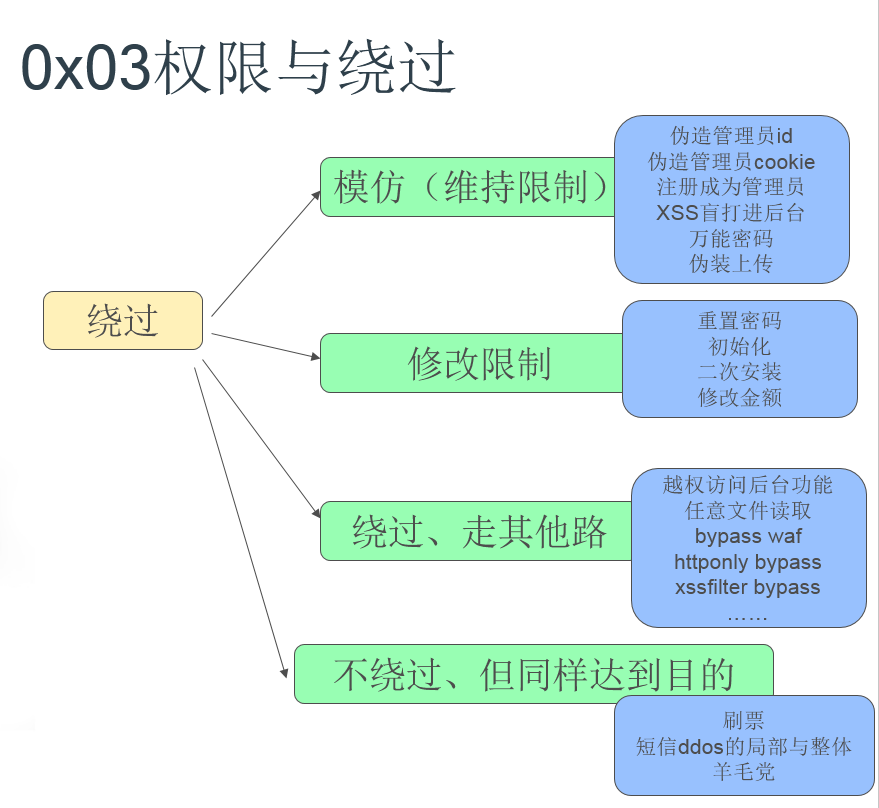

## 一、漏洞挖掘心理学
  
1. 安全的木桶理论
  
找到最薄弱的那个点；

2. 有一个漏洞的站点，很可能还会有更多的漏洞
  
开发人员的安全意识问题；
  
3. 存在于一个站点的漏洞，还可能存在于其他站点
  
业务的代码复用；
  
通用型漏洞（wordpress插件漏洞，Discuz 更新不及时）；
  
4. 修复了的漏洞不一定就全部修复完整了  
  
指哪修哪；
  
绕过修复；
  
5. 学会找扫描器扫不到/其他白帽子难发现的漏洞
  
需要深度交互/认证；
  
存储XSS/CSRF/越权/逻辑漏洞；
  
6. 挖掘漏洞的过程
  
通常需要先找到危险函数，然后回溯函数的调用过程，最终看在整个调用的过程中用户是否有可能控制输入；
  
7. 绕waf的一般思路
  
1). 预处理利用：即设法绕过 WAF的输入验证，比如 HTTP头（ X-Originating-IP 、XForwarded-For 、X-Remote-IP 、 X-Remote-Addr）的处理，就曾多次被用于绕过公司WAF 的SQL 注入防护，或者 HTTP方法头 GET/POST 的篡改、换行符的处理等等方式；
  
2). 致阻断失配：利用前后端数据处理的差异，使得无法匹配到黑名单里的规则，通常结合一些参数污染、字符编码、注释符等多种方式绕过；
  
3). 规则集绕过：通过暴力枚举出 WAF的拦截规则，或者逆向 WAF程序获取规则，然后再设法绕过。
  
8. 权限与绕过思路
  

  

  
## 二、常用的浏览器插件(Firefox)
  
1. Firebug
  
强大的网站调试工具，同时可以用来简单抓包
  
2. Tamper data
  
抓包修改功能
  
3. Hackbar
  
手工测试SQL注入/XSS的利器，有编码功能
  
4. LiveHttpHeader
  
抓包工具，使用方便，常用于测试CSRF
  

  
## 三、常用的WEB安全工具
  

  
1. AWVS
  
全能的Web安全漏洞扫描器，并附带有很多实用的工具
  
如果电脑本身需要通过代理访问外网，那么也需要设置下 application settings--application updates 设置 proxy server
  

  
2. NetSparker
  
对SQL注入，XSS，LFI等漏洞扫描效果不错的漏洞扫描器
  

  
3. BurpSuite
  
功能全面，个人常用于暴破，抓包，CSRF测试等等
  
需要设置浏览器代理为8080，才能捕获数据包，抓取https 包需要浏览器访问 http://burp 下载证书并导入。
  
有时电脑本身需要设置代理才能访问外网，则需要设置 Burp options--connections--upstream proxy servers
  
手机端 设置 WIFI 的代理为电脑burp 监听的IP和端口，手机端访问 http://burp  点击CA Certificate下载证书到手机上cacert.der
将后缀改成.cer才可以安装，华为手机需要安装为VPN 应用支持才能解析https
  
4. Layer
  
子域名/IP段收集，同时可过滤过出存活主机
  

  
5. Fiddler
  
常用的抓包工具，有XSS自动化扫描插件
  
打开fiddle，默认会设置浏览器的代理为fiddle 监听的8888端口，而fiddle 自己则从系统代理出口（也可以自己设置一个代理如 http=10.2.2.1:80）出去；需要设置一下才会拦截数据包，否则只是快照一下。
  
注意：pc 端软件发出的http/https请求也会被捕获，但私有协议（即应用层自定义包体）是抓不到的，可以用wireshark 抓到此类的包。
  
客户端软件发出的http/https请求有两种情况。一种类似内嵌了一个浏览器来解析html、执行js事件等，比如一个功能点，进来的原始页面（抓包）中可以搜到此功能点的一些关键字，往往就是以内嵌浏览器的方式执行js 来完成此功能，直接把入口页面复制到浏览器访问，然后console 搜索keyword。
  
另一种是客户端直接请求的服务端cgi，这在进来的原始页面（甚至没有入口）是找不到功能点的关键字的。
  
  
6. Sqlmap.py
  
数据库注入神器
  
7. owasp 漏洞扫描全集  
[Vulnerability_Scanning_Tools](https://www.owasp.org/index.php/Category:Vulnerability_Scanning_Tools)    

  
## 四、github安全类repo 收集
  
### 子域名爆破
  
[subDomainsBrute](https://github.com/lijiejie/subDomainsBrute)
  
[Sublist3r](https://github.com/aboul3la/Sublist3r)
  
[subbrute](https://github.com/TheRook/subbrute)
  
[altdns](https://github.com/infosec-au/altdns)
  
[wydomain](https://github.com/ring04h/wydomain)
  

  
### 主机指纹，第三方应用发现
  
[whatweb](https://github.com/urbanadventurer/whatweb)
  
[bannerscan](https://github.com/x0day/bannerscan)
  
[wyportmap](https://github.com/ring04h/wyportmap)  

[wafw00f](https://github.com/EnableSecurity/wafw00f)  
  

  
### 目录爆破，文件发现
  
[dirsearch](https://github.com/maurosoria/dirsearch)
  
[OpenDoor](https://github.com/stanislav-web/OpenDoor)
  
[DirBuster](https://www.owasp.org/index.php/Category:OWASP_DirBuster_Project)
  
[filebuster](https://github.com/henshin/filebuster)
  

  
### 敏感文件、信息泄漏
  
[BBScan](https://github.com/lijiejie/BBScan)
  
[GitHack](https://github.com/lijiejie/GitHack)
  
[htpwdScan](https://github.com/lijiejie/htpwdScan)
  
[Sreg](https://github.com/n0tr00t/Sreg)
  
[weakfilescan](https://github.com/ring04h/weakfilescan)
  
[GitPrey](https://github.com/repoog/GitPrey)
  

  
### 弱口令扫描
  
[F-Scrack](https://github.com/ysrc/F-Scrack)
  
[cupp](https://github.com/Mebus/cupp)
  

  
### 数据库注入
  
[sqli-hunter](https://github.com/zt2/sqli-hunter)
  

  
### 源代码审计（仅针对开发本身）
  
[BadCode](https://github.com/pwnsdx/BadCode)  
[cobra](https://github.com/wufeifei/cobra)  
[phpstan](https://github.com/phpstan/phpstan)  
[Source_Code_Analysis_Tools](https://www.owasp.org/index.php/Source_Code_Analysis_Tools)  

### 源代码审计（[针对第三方库依赖](https://techbeacon.com/13-tools-checking-security-risk-open-source-dependencies-0)）    
[retire.js](http://retirejs.github.io/retire.js/)  
[OSSIndex](https://github.com/OSSIndex/DevAudit)  
[DependencyCheck](https://github.com/jeremylong/DependencyCheck)  
[bundler-audit](https://github.com/rubysec/bundler-audit)  
[security-checker](https://github.com/sensiolabs/security-checker)   
[dawnscanner](https://github.com/thesp0nge/dawnscanner)  
[scancode-toolkit](https://github.com/nexB/scancode-toolkit)  
  

  
## 五、一些杂项
  

  
1. 修复Firefox 的Live HTTP headers 无法 replay 的问题：
  
在firfox 地址栏输入：about:support，然后进入配置文件夹
  
找到Live HTTP headers插件的目录，我的在~/.mozilla/firefox/df0j3s9g.default/extensions/{8f8fe09b-0bd3-4470-bc1b-8cad42b8203a}/chrome，可以看到有livehttpheaders.jar这样一个文件，用解压工具打开，进入content 目录，找到 LiveHTTPReplay.js，解压此文件，并修改。大概在32行左右，修改：
  
`document.getElementById("livehttpheaders.replay.headers").value = args[4];`
  
替换为：
  
`document.getElementById("livehttpheaders.replay.headers").value = args[4] + "If-Modified-Since: *\n";`
  
修改完成后，继续用解压工具打开刚才的 livehttpheaders.jar，将修改后的LiveHTTPReplay.js 替换 livehttpheaders.jar 里的 LiveHTTPReplay.js，由于文件被修改，导致 jar 签名改变，高级版本的 firefox 会禁止加载 livehttpHeaders，对此可以 在Firefox 配置编辑器 (about:config 页面)中，更改首选项 xpinstall.signatures.required 为 false 即可。完成后重启 Firfox，replay 功能就可以使用了。
  

  
2. 爬虫  
  
爬虫最基本的功能就是从一个页面进入，获取到url，再进一步递归访问此页面的所有url，递归多少次可以称为层数。
  
url基本存在形式：在本域以标签形式嵌入/拼接、在本域内以事件类被调用、在外域被以事件类调用
  
手工正向查找（chrome)：
  
进入某页面，inspect 某标签、查看某标签绑定的事件（可以在 console search event keyword）
  
进入某页面，触发某些按键，观察 Network 一栏发出的请求，注意看 refer 是否是当前页面
  
进入某页面，打开抓包软件，触发某些按键，观察发出的请求
  
反向验证查找与正向查找类似，但可以更便捷，进入某页面，直接在 console search url keyword 
  
对于完全没有入口，没有被调用，或者被调用时需要一些前置步骤的情况，爬虫是没办法爬到此url 的。
  
在f12 出来的左侧第二栏有个 toggle device toolbar 可以模拟客户端访问网页的请求（即修改了user-agent等字段），此时某些网站会跳到为手机客户端访问的网页，如 fun.qq.com/m/ 或者 m.fun.qq.com 等形式。
  

  
3. burpsuite 显示界面乱码问题
  
 * 如果是中文乱码的话，解决方法：options->display->font 调成微软雅黑等中文字体就可以。
  
 * linux下中文乱码，没有微软xx字体，下载文泉驿字体，即可解决。
  

  
4. js 调试
  
在浏览器(chrome)产生跳转的情况下，第一次返回的内容可能看不到，这时候借助抓包工具就能看到每次请求的返回情况，当然也可以在请求的瞬间按下ESC 键，停在第一次请求返回的页面上，然后在 source 那里设置下断点，F5 刷新一下，就可以跟踪调试了。preserve log 选中时有可能部分请求返回的数据没有显示出来。
  
console 左侧有个竖立的省略号，点开有个search 功能很好用，可以查找到 source 里面的关键词，即当前页面引用的所有js 文本都可以搜索到，对于查找ajax、事件类等才会拼接发起请求的 url 有很大帮助，同时观察下Network 一栏发出的请求。
  
如果想自己本地改js 代码调试，最好 ctrl+s 保存 Html 后浏览器打开文件进行调试。
  
注意：form action、Location header、js 中window.location.href 等最终请求时浏览器地址栏会变化；而 ajax 请求时地址栏不会变化，ajax 返回的数据一般比较少，往往只是一些状态信息。  
  

  
5. 客户端app 抓包
  
1).笔记本电脑和手机连的同个wifi，笔记本开着 burp 监听 8888 端口，手机点击连接的wifi，高级设置中设置代理为笔记本ip:8888，这样手机的网络请求也会先通过 burp。
  
2).笔记本电脑自己使用猎豹wifi 等软件开启一个wifi，手机连接此wifi，且把代理设置为此wifiip:8888
  
同理，抓不到私有协议的包，抓取https的包需要手机访问 http://笔记本ip:8888 导入证书，不同设备需要重新导入证书（一般在设置--安全选项），有些手机暂时不支持der 格式，只能识别cer 格式，使用火狐浏览器转，导入并导出下 adb push 到手机目录就可以了。  
使用 ios 手机时需要使用 safari 浏览器访问 http://burp ， 点击ca 会跳转到安装 描述文件，点击安装证书后，在设置--通用--关于本机--证书信息设置，信任此证书，即可抓到https 流量。  

3）. 在 android 手机上安装 google chrome 浏览器，开启 usb 调试选项，在 桌面版chrome 输入 chrome://inspect/ 可以看到 列出来的设备如 Che2-UL00 #DU2WKN14BS004912，以及此设备通过谷歌浏览器正在访问的网页，点击 inspect 就可以在电脑上调试手机访问的页面。  
  
tips：下载app 时先不要挂代理，否则可能下不动。
  

  
6. 外网代理扫描和端口扫描
  
网络设备就只有acl控制，没有iptables类似的功能，不能把端口封掉，只能对ip做权限控制。
  
网络做了acl控制，但是端口依然开放；nmap udp扫描会发个空udp包，如果响应icmp的回包，说明端口开放，所以做好控制，namp依然会扫出来。
  
影响：网络设备也存在被入侵的风险，黑客可能通过网络设备入侵到内网。  
  
解决方法：                                                                                                                                      
  
网络设备应当用独立与nmap的高危端口扫描模块，开发单独模块独立扫描。                                                                            
  
网络设备主要是udp协议扫描出来的，分为ntp和snmp服务；
  
a)	ntp服务可用ntpdata命令执行检测
  
b)	snmp可用snmpwalk命令执行检测
  
代理扫描：从外网ip 通过代理请求 内网web页面，如果能够获取页面内容说明代理能够访问内网，存在风险
