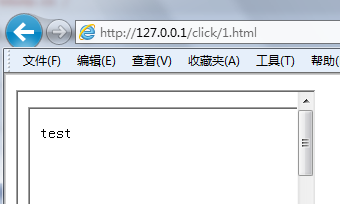
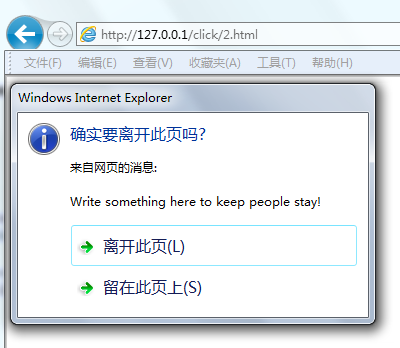
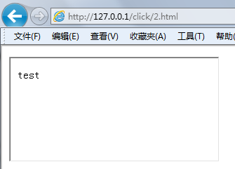

原文 by 瞌睡龙

## 0x00 相关背景介绍
  
Clickjacking（点击劫持）是由互联网安全专家罗伯特·汉森和耶利米·格劳斯曼在2008年首创的。
  
是一种视觉欺骗手段，在web端就是iframe嵌套一个透明不可见的页面，让用户在不知情的情况下，点击攻击者想要欺骗用户点击的位置。
  
由于点击劫持的出现，便出现了反frame嵌套的方式，因为点击劫持需要iframe嵌套页面来攻击。
  
下面代码是最常见的防止frame嵌套的例子：
  
``` javascript
  
if(top.location!=location)
  
    top.location=self.location;
  
```
  
事实上，这种代码很容易被绕过，在后文中讨论。
  

  
## 0x01 防御的几种方式
  
防止frame嵌套的js使用代码由高到低比例：
  
``` javascript
  
if (top != self)
  
if (top.location != self.location)
  
if (top.location != location)
  
if (parent.frames.length > 0)
  
if (window != top)
  
if (window.top !== window.self)
  
if (window.self != window.top)
  
if (parent && parent != window)
  
if (parent && parent.frames && parent.frames.length>0)
  
if((self.parent&&!(self.parent===self))&&(self.parent.frames.length!=0))
  
```
  
检测到后的处理方案：
  
``` javascript
  
top.location = self.location
  
top.location.href = document.location.href
  
top.location.href = self.location.href
  
top.location.replace(self.location)
  
top.location.href = window.location.href
  
top.location.replace(document.location)
  
top.location.href = window.location.href
  
top.location.href = "URL"
  
document.write('')
  
top.location = location
  
top.location.replace(document.location)
  
top.location.replace('URL')
  
top.location.href = document.location
  
top.location.replace(window.location.href)
  
top.location.href = location.href
  
self.parent.location = document.location
  
parent.location.href = self.document.location
  
top.location.href = self.location
  
top.location = window.location
  
top.location.replace(window.location.pathname)
  
window.top.location = window.self.location
  
setTimeout(function(){document.body.innerHTML='';},1);
  
window.self.onload = function(evt){document.body.innerHTML='';}
  
var url = window.location.href; top.location.replace(url)
  
```
  
## 0x02 绕过的几种方式
  
对于使用parent.location来防御的可以使用多层嵌套的方式绕过。
  

  
### 一、例如防御代码为：
  
``` javascript
  
if(top.location!=self.location){
  
     parent.location = self.location;
  
}
  
```
  
建立两个页面：
  
1.html代码为：
  
`<iframe src="2.html">`
  

  
2.html代码为：
  
`<iframe src="http://www.victim.com">`
  

  
访问1.html之后可以看到页面并无跳转等动作。
  

  

  
### 二、onBeforeUnload函数的利用：
  
onBeforeUnload的介绍以及各种浏览器的支持情况请见：http://w3help.org/zh-cn/causes/BX2047
  
如下的防御代码：
  
`if(top != self) top.location.replace(location);`
  

  
新建立页面，代码如下：
  
``` html
  
<script>
  
var framekiller = true;
  
window.onbeforeunload = function() { if(framekiller) { return
  
"Write something here to keep people stay!";} };
  
</script>
  
<iframe src="http://www.victim.com/">
  
```
  
打开页面显示如下：
  

  

  
欺骗用户点击留在此页后显示：
  

  

  
### 三、XSS filter的利用
  
IE8以上以及Chrome 浏览器都有XSS筛选器，这些可以用来对付防御frame 嵌套的代码。
  
防御代码如下：
  
``` javascript
  
if(top!=self){
  
    top.location=self.location;
  
}
  
```
  
新建立页面，代码如下：
  
`<iframe src="http://www.victim.com/?<script>">`
  

  
访问后页面显示：
  

  

  
IE的xss筛选器自动拦截了跳转。
  
斯坦福的文章里写了Chrome也会出现这种情况，并给出了攻击代码：
  
`<iframe src=http://www.victim.com/?v=if(top+!%3D+self)+%7B+top.location%3Dself.location%3B+%7D">`
  

  
但是测试发现，新版的Chrome并不会拦截了，会直接跳转过去。
  
如果跟的参数中有变量在页面中显示的，会把变量过滤一遍再输出，但不会阻止跳转。
  

  
### 四、Referer检查的问题
  
有一些站点允许自己的域名嵌套自己，禁止外站对自己的嵌套。通常是用document.referer来检测来源是否为自己的域名。
  
``` javascript
  
if(top.location!=location){
  
    if(document.referrer && document.referrer.indexOf("aaa.com")==1)
  
    {
  
        top.location.replace(document.location.href);
  
    }
  
}
  
```
  
判断字符串中是否含有本域名是常见的错误用法，利用二级域名的方式便可绕过，如： http://aaa.com.bbb.com
  
注：从https域下post数据到http域的时候，浏览器不带Referer。
  
IE有个属性可以设置security为restricted可以禁止iframe里执行js脚本，但是要达到点击劫持的效果，必须要能够执行js所以很鸡肋。
  
代码如下：
  
`<iframe src="http://www.victim.com/iframe.html" security="restricted"></iframe>`
  

  

  
重点是手机站点，很多主站做的很不错，但是手机站点没有做任何防护，很容易造成点击劫持。
  

  
### 五、iframe sandbox 沙盒绕过
  

  
`<iframe src="" sandbox="allow-forms allow-scripts"></iframe> ` 这样允许在 iframe 页面执行 javascript，但是禁止iframe 里的javascript 执行 `top.location = self.location`。
  
也就是禁止了跳转，绕过了反点击劫持。
  

  
### 六、location劫持
  
在IE浏览器中，如果能够在防御代码的前面可以插入form表单的话，可以利用form表单对location进行劫持。
  
``` html
  
<form name=self location="javascript:alert(1)"></form>
  
<script>
  
if(top!=self){
  
   top.location=self.location
  
}
  
</script>
  
```
  
用iframe 嵌套此代码，可以看到没有跳转，执行了alert(1)。 
  

  
## 0x03 推荐防御的方法：
  
### 一、X-FRAME-OPTIONS
  
X-FRAME-OPTIONS 是微软提出的一个http 头，专门用来防御利用iframe 嵌套的点击劫持攻击。并且在IE8、Firefox3.6、Chrome4 以上的版本均能很好的支持。
  
这个头有三个值：
  
DENY               // 拒绝任何域加载
  
SAMEORIGIN         // 允许同源域下加载
  
ALLOW-FROM         // 可以定义允许frame加载的页面地址
  
php中设置示例：
  
header ( "X-FRAME-OPTIONS:DENY");
  

  
### 二、目前最好的js的防御方案为：
  
``` html
  
<head>
  
<style> body { display : none;} </style>
  
</head>
  
<body>
  
<script>
  
if (self == top) {
  
    var theBody = document.getElementsByTagName('body')[0];
  
    theBody.style.display = "block";
  
} else {
  
    top.location = self.location;
  
}
  
</script>
  
```
  

  

  

  
