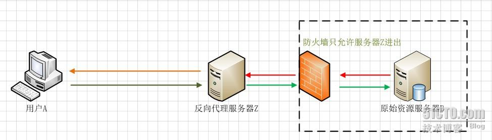
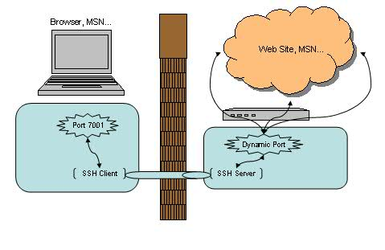
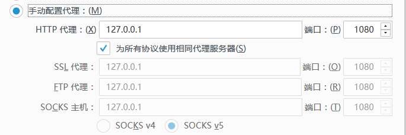

原文 by [一些关于代理的知识](http://foreversong.cn/archives/774)  

关于代理，可能我了解的就是简单的web代理，再加上渗透时需要用到的内网转发，最后可能就是上次去了解的nginx反向代理，下面问题是微信群里一大佬的面试题，本着学习的态度，还是来好好学习下各方面的代理知识。    

整理后的问题如下：  

1. Web反向代理

2. 正向端口转发，反向端口转发，动态端口转发

3. 正向socks/http代理，反向socks/http代理

4. 正向vpn,反向bridge vpn

5. 透明代理、匿名代理、混淆代理、高匿代理有什么区别 

对于上述问题一般是怎样理解的，分别有哪些代表性的工具？  

下面针对问题来详细分析。   


## 问题一：Web反向代理

这应该就是指利用服务器来处理接受Internet上的连接请求，然后将请求转发给内部网络上的服务器，并将从服务器上得到的结果返回给Internet上请求连接的客户端，此时代理服务器对外就表现为一个反向代理服务器。  

最常见的架构可能就是Nginx反向代理，一方面保护和隐藏真实服务器，另一方面实现负载均衡。  
  


## 问题二：正向端口转发，反向端口转发，动态端口转发

首先先阐述什么是正向和反向端口转发  
    


正向代理中，proxy 和 client 同属一个 LAN，对 server 透明； 反向代理中，proxy 和 server 同属一个 LAN，对 client 透明。 实际上 proxy 在两种代理中做的事都是代为收发请求和响应，不过从结构上来看正好左右互换了下，所以把前者那种代理方式叫做正向代理，后者叫做反向代理。    

正向端口转发的流程：  


`Lhost－－>proxy－－>Rhost`     
Lhost 为了访问到 Rhost，向 proxy 发送了一个请求并且指定目标是 Rhost，然后 proxy 向 Rhost 转交请求并将获得的内容返回给 Lhost，简单来说正向代理就是 proxy 代替了我们去访问 Rhost。   

反向端口转发的流程：   


`Lhost<--->proxy<--->firewall<--->Rhost`  
Lhost 只向 proxy 发送普通的请求，具体让他转到哪里，proxy 自己判断，然后将返回的数据递交回来，这样的好处就是在某些防火墙只允许 proxy 数据进出的时候可以有效的进行穿透    

这里作一个简单区分。正向代理代理的是客户端，反向代理代理的是服务端，这里用于端口转发同样适用。  

下面来阐释什么是正向和反向的端口转发：  

### ①正向的端口转发

顾名思义就是把本地主机端口通过待登录主机端口转发到远程主机端口上去。  

`ssh -L 50000:www.google.com:80 user@host`

当成功执行上面的命令之后，访问本地的50000端口，就等同于访问 www.google.com 的 80 端口。但和直接访问有着本质的区别：这次是通过登录主机来安全转发数据的，没有人知道你和远程主机之间传输了何种数据。就算你不能和远程主机建立连接（而登录主机能访问），那就能突破（绕过）防火墙的限制。  

### ②反向的端口转发  

这里就是指把登录主机端口通过本地主机端口转发到远程主机上。  

举例：ssh -R 0.0.0.0:8080:localhost:80 user@host。  

当成功执行上面的命令之后，访问登录主机的 8080 端口就相当于访问远程主机的80端口！  

设想这样一种情况：你在本机开发了一个web应用，想拿给别人测试，但现在你却处在内网，外网是无法直接访问内网的主机的，怎么办！？很多人可能会说，找台有公网IP的主机，重新部署一下就行了。这样可行，但太麻烦。然而自从你了解了的反向端口转发功能之后，一切都变得简单了。只需在本地主机上执行一下上面例子的命令即可实现外网访问内网web应用。  

### 下面来介绍什么是动态端口转发

这里常见的应用就是ssh的动态绑定。因此动态端口转发也就离不开ssh的一些相关应用，例如翻墙。    
    
  
首先，墙内的客户机跟墙外的代理服务器，建立好SSH连接，并设定动态绑定，此时墙内客户机上的SSH会监听本地的一个端口7001。  
客户机上的程序，将对www.youtube.com:80的请求告知7001端口的SSH，SSH将此请求通过SSH加密连接发送到墙外服务器的SSH上。  
由于建立的动态绑定，服务器会将www.youtube.com:80的请求发送给www.youtube.com上的80端口，并在收到回复后，通过原路返回给客户机的SSH，客户机的SSH返回给应用程序。  
在这里SSH客户端已经不仅仅是个客户端了，它同时打开了7001端口侦听本机应用程序的请求。这是SSH跟传统用法最大的区别。而服务端的SSH也不仅仅是处理客户端的请求，而是将请求转发到对应的主机和端口，这里的“动态”二字体现在服务端的SSH的转发目标是不固定的，是根据客户端的请求而定的。  

## 问题三：正向socks/http代理，反向socks/http代理
   

谷歌上搜了很长时间，一直没找到能够令自己满意的答案，大多都是在阐述http代理和socks代理的区别，有点跑题了！这里先说一下两者之间的区别吧。SOCKS工作在比HTTP代理更低的层次：SOCKS使用握手协议来通知代理软件其客户端试图进行的连接SOCKS，然后尽可能透明地进行操作，而常规代理可能会解释和重写报头（例如，使用另一种底层协议，例如FTP；然而，HTTP代理只是将HTTP请求转发到所需的HTTP服务器）。虽然HTTP代理有不同的使用模式，CONNECT方法允许转发TCP连接；然而，SOCKS代理还可以转发UDP流量和反向代理，而HTTP代理不能。HTTP代理通常更了解HTTP协议，执行更高层次的过滤。    

回到主题上，正向socks/http代理应该就是我们最常见的这种浏览器代理，通过代理服务器来进行抓包或者传送流量给对方服务器，常见工具的话就是burp或者fd。  

反向代理是先在服务器A（比如攻击机）上运行 SOCKS代理的服务端程序监听指定端口，然后在客户机（比如靶机）上运行客户端程序连接服务器的指定端口。这样就建立了一条从靶机到攻击机的反向 SOCKS 隧道，攻击机的应用程序（比如 wget nmap curl …）使用该隧道后，程序的所有流量都会先经过靶机转发出去。  

应该不是很难理解，就是从客户机上创建了一个隧道反向连接到我们的服务器，服务器的流量就可以通过从这个隧道出去，实现流量的匿名。常见的工具就是proxychains了吧。  

## 问题四：正向vpn,反向bridge vpn

正向vpn应该比较好理解，就是一般常见的vpn结构，我们客户机连接到墙外的服务器，然后通过这个创建的隧道进行流量的传输。  

反向桥接vpn这里举一个例子开头，在参加ctf线下赛时，我们时常需要下载官方提供的vpn软件，然后通过注册的账号密码来登录这个vpn，登录成功后会显示我们本机被分配的一个内网ip，最后通过vpn客户端我们才能访问比赛题目。  

这里用到两种技术，一种是反向vpn，一种是桥接模式。对于桥接模式应该比较好理解，就是指本地物理网卡和虚拟网卡通过VMnet0虚拟交换机进行桥接，物理网卡和虚拟网卡在拓扑图上处于同等地位，那么物理网卡和虚拟网卡就相当于处于同一个网段，虚拟交换机就相当于一台现实网络中的交换机。借助这种架构方式，我们可以通过互联网将客户端和服务端联系起来，使得用户可以在任意联网的机器上，接入运行服务端机器所在的局域网网络，服务器端无需外网IP及防火墙特殊设置即可实现远程接入。  

那么反向vpn最常见的应用可能就是vpn pivoting。下面来简单的介绍一下vpn pivoting。  
    

这是vpn pivoting的一个工作架构。攻击机会虚拟出一个网络接口与目标机进行对接，任何应用如果想要访问目标机里的网络，那么就会通过这个虚拟的网络接口进行流量的传输，通过vpn隧道到达目标机的网络，这时候目标机的vpn软件会监听这个隧道的流量，然后通过TUN/TAP驱动将流量传输到网络接口，从而让攻击机能够访问到目标机的网络。    

## 问题五：透明代理、匿名代理、混淆代理、高匿代理有什么区别
这4种代理，主要是在代理服务器端的配置不同，导致其向目标地址发送请求时，REMOTE_ADDR， HTTP_VIA，HTTP_X_FORWARDED_FOR三个变量不同。    

1、透明代理(Transparent Proxy)  
```
REMOTE_ADDR = Proxy IP  
HTTP_VIA = Proxy IP
HTTP_X_FORWARDED_FOR = Your IP
```
透明代理虽然可以直接“隐藏”你的IP地址，但是还是可以从HTTP_X_FORWARDED_FOR来查到你是谁。  

2、匿名代理(Anonymous Proxy)  
```
REMOTE_ADDR = proxy IP
HTTP_VIA = proxy IP
HTTP_X_FORWARDED_FOR = proxy IP
```
匿名代理比透明代理进步了一点：别人只能知道你用了代理，无法知道你是谁。  

还有一种比纯匿名代理更先进一点的：混淆代理，见下节。  

3、混淆代理(Distorting Proxies)  
```
REMOTE_ADDR = Proxy IP
HTTP_VIA = Proxy IP
HTTP_X_FORWARDED_FOR = Random IP address
```
如上，与匿名代理相同，如果使用了混淆代理，别人还是能知道你在用代理，但是会得到一个假的IP地址，伪装的更逼真：-）  

4、高匿代理(Elite proxy或High Anonymity Proxy)  
```
REMOTE_ADDR = Proxy IP
HTTP_VIA = not determined
HTTP_X_FORWARDED_FOR = not determined
```
可以看出来，高匿代理让别人根本无法发现你是在用代理，所以是最好的选择。  

上述如有不当之处，敬请指出~     

##  参考文章：

http://www.zerokeeper.com/experience/network-port-forwarding-and-penetration.html  

http://www.pchou.info/linux/2015/11/01/ssh-tunnel.html  

https://zh.wikipedia.org/zh-hans/SOCKS  

http://www.evilclay.com/2017/06/11/SOCKS4%E5%8F%8D%E5%90%91%E4%BB%A3%E7%90%86%E5%AE%9E%E9%AA%8C/  