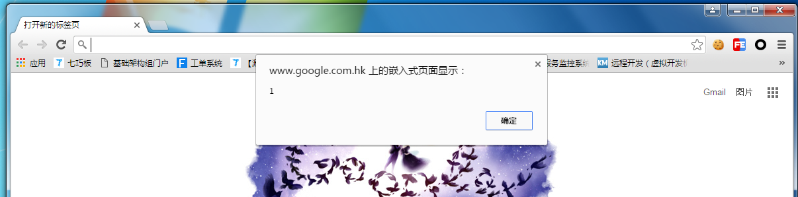
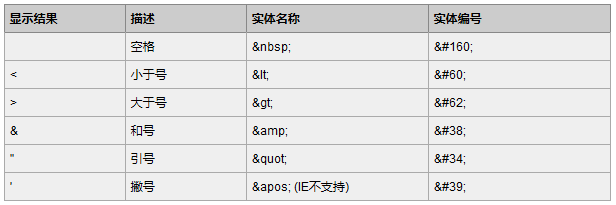
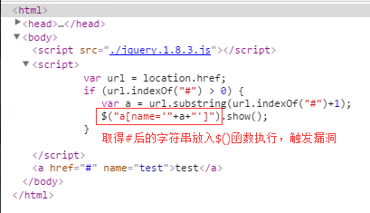

原始文档 By martin zhou(周雨阳）  
编辑：s1mba

## 0x00 背景
DOM-Based XSS是一种基于文档对象模型(Document Object Model,DOM)的Web前端漏洞，简单来说就是JavaScript代码缺陷造成的漏洞。与普通XSS不同的是，DOM XSS是在浏览器的解析中改变页面DOM树，且恶意代码并不在返回页面源码中回显，这使我们无法通过特征匹配来检测DOM XSS，给自动化漏洞检测带来了挑战。  

本文将总结高发DOM XSS的业务场景，给出缺陷代码实例，并详述漏洞产生原因，最后分类给出有效彻底的防护过滤手段。   


## 0x01 DOM XSS高发场景透视及修复技巧
### 一、 在前端实现页面跳转
在很多场景下，业务需要实现页面跳转，常见的实现方式一般有三种，第一种是在后端设置302跳转Header或通过函数接收参数实现跳转，第二种是使用Meta标签实现跳转，最后一种是通过JavaScript实现跳转。不少Web前端工程师对最后一种跳转的方式情有独钟，最常用到的方法有: location.href / location.replace() / location.assign()。  

也许提到页面跳转业务场景下的安全问题，你首先会想到限制不严导致任意URL跳转，而DOM-XSS与此似乎没啥关系。但有一种神奇的东西叫“伪协议”，比如：“javascript:”、“vbscript:”、“data:”、“tencent:”、“mobileqqapi:”等，其中  
“javascript:”、“vbscript:”、“data:”在浏览器下可以执行脚本：  
   
(图：使用“javascript:”伪协议在页面内执行脚本)  
最为要命的是，使用这些伪协议执行的JavaScript代码的上下文（context）就是当前页面，也就相当于在页面内注入了一段恶意JavaScript代码。至此，攻击者也就能实施攻击了。    

经过前几年DOM-XSS狂轰滥炸式的“洗礼”，Web前端工程处理起相关跳转代码逻辑来，也个个都是有经验的“老司机”了。直接从各种来源取跳转目标URL，然后通过上面提到的三个JavaScript实现跳转的方式，已销声匿迹。  

你以为这样就结束了？之前提到，由于JavaScript是一种客户端脚本语言，如果说Web后端代码有一层“窗户纸”护着的话，那位于Web前端的JavaScript代码基本就是在裸奔。所以，以下若干种过滤对抗手段，一下子就会眼尖的攻击者绕过，并继续大摇大摆的构造攻击：  

常见缺陷1：使用indexOf判断URL参数是否合法  
示例缺陷代码：  
``` javascript
function emptyFn(){}
function init(){
    var jump = getQueryString('jump');
    jump = decodeURIComponent(jump);
    if (jump && jump.indexOf("tmast://") > -1) {
        jump = jump;
    } else {
        jump = "tmast://found";
    }
    setTimeout(function(){
        window.JSBReady(function(readyState) {
            if (readyState) {
                jsb('closeWebView',0,'emptyFn',{});
            }
        });
    },1000);
    location.href=jump;
}
init();
```
JavaScript相关规范中指出，indexOf() 方法可返回某个指定的字符串值在字符串中首次出现的位置。该方法将从头到尾地检索字符串 stringObject，看它是否含有子串 searchvalue。  

也就是如果传入的URL中带有indexOf的关键词，那indexOf方法将直接返回true。拿上面的缺陷代码为例，只要攻击传入的URL中带有`tmast://`，indexOf将直接返回true，并进入跳转逻辑。所以攻击者只要构造 `javascript:alert(1);//tmast://` 即可完成攻击，又因为`tmast://`位于JavaScript代码的注释部分，所以JavaScript代码运行时会直接忽略，但indexOf却认为URL中存在`tmast://`直接放行。  


常见缺陷2：正则表达式缺陷  

示例缺陷代码 [1]：  
``` javascript
function VaildURL(sUrl)
{
	return (/(https?:\/\/)?[\w\-.]+\.(qq|paipai|soso|taotao)\.com($|\/|\\)/i).test(sUrl)||
           (/^[\w][\w\/\.\-_%]+$/i).test(sUrl)||(/^[\/\\][^\/\\]/i).test(sUrl) ? true : false;
}
```
示例缺陷代码 [2]：  
``` javascript
 if(typeof(pgvMain) == 'function') {
            pgvMain();
        }
        
        var durl = window.location.search.substr(6);

        var refer = document.referrer;
        if(/house.qq.com/.test(refer) || refer == ''){
            setTimeout(function(){
                window.location.replace(durl);
            }, 2000);
        }
```
聪明的Web前端工程师，当然知道indexOf下潜藏的“深坑”，所以祭出了神器“正则表达式”。但不曾想“阴沟翻船”，有对URL进行了严格限制的意识，比如跳转页面只能是qq.com/paipai.com，认为这样就可以解决DOM-XSS和URL跳转的问题，但忘了一个神奇的符号 `^`，加上和不加上，过滤的效果具有天壤之别。攻击者仍然可以构造 `javascript:alert(1);//http://www.qq.com`来绕过看似严格的过滤。  

修复技巧  
``` javascript
function VaildURL(sUrl)
{
	return 
(/^(https?:\/\/)?[\w\-.]+\.(qq|paipai|soso|taotao)\.com($|\/|\\)/i).test(sUrl)||
   (/^[\w][\w\/\.\-_%]+$/i).test(sUrl)||(/^[\/\\][^\/\\]/i).test(sUrl) ? true : false;
}
```
在前端实现页面跳转业务场景下，正确的过滤实现方法是，严格限制跳转范围。一方面要限制能够跳转页面的协议，只能是http、https或是其他指可控协议；另一方面，要严格限制跳转的范围，如果业务只要跳转到指定的几个页面，可以直接从数组中取值判断是否这几个页面，如果跳转范围稍大，使用正则表达式将跳转URL限制到可控范围内。  

### 二、 取值写入页面或动态执行

除接收URL参数经后端处理最后在前端展示外，在Web前端通过JavaScript获取不同来源的参数值，不经后端处理即刻在Web页面进行展示或动态执行的业务场景也十分常见，虽然通过此方法，优化了用户的浏览体验，但也带来了满满的安全风险。  

想要在客户端实现接受参数并写入页面或动态执行，就不得不用到JavaScript“三姐妹”，她们分别是：`innerHTML`、`document.write`、`eval`。“三姐妹”具有强大的功能的同时，不经意间也成了DOM-XSS攻击的导火索。因为JavaScript取值的来源纷繁复杂，如：`Parameter`、`Cookies`、`Referer`、`Window.name`、`SessionStorage`等，工程师稍有不慎忘记做转义处理，或过分相信取值来源的数据，直接将分离出的参数值交给JavaScript“三姐妹”处理，就有可能招来DOM-XSS。接下来，将按不同数据源，详述每种业务场景下易造成DOM-XSS的代码缺陷。  


常见缺陷1：从URL中的取参数值写入页面或动态执行  

示例缺陷代码[1]：  
``` javascript
function getParameter(name){
            var r = new RegExp("(\\?|#|&)" + name + "=([^&#]*)(&|#|$)"), 
m = location.href.match(r);
            return (!m ? "" : m[2]);
}

addEvent(window, "load", init);
function init(){
		var msg=getParameter("msg");
		if(msg=="")msg="服务器忙，请您稍候再试"
		else msg=unescape(msg);
		var div=document.getElementById("info");
		if(div) div.innerHTML=msg;
		
}
```
粗心的工程师直接从URL的锚参数（即位于#后面的参数）中取值，不经过任何处理直接innerHTML写入页面，导致攻击者只需要构造如下URL即可完成一次DOM-XSS攻击：  
`http://xxx.com/xxx.htm#msg=`
由于整个攻击过程在客户端侧完成，不需要向服务器发送任何请求数据，所以即便业务接入了waf防御系统，这类DOM-XSS也无法被感知，攻击者便可畅通无阻的利用漏洞对用户开展攻击。  


示例缺陷代码[2]:  
``` javascript
function initUI(name) {
        var name = name || "";
        $("#name").html("《"+name+"》");
```

当然，不只是innerHTML一种方法，只要传入的参数值没有做任何处理，并进入到JavaScript“三姐妹”类似的函数中，就会产生DOM-XSS漏洞。就比如在此案例下，页面内引入了jQuery库，JavaScript的initUI函数直接将获取到的未经过滤的name参数，通过`$().html()`的方式写入了页面，进而可以被攻击者利用，进行基于DOM-XSS漏洞的攻击。  

常见缺陷2：从Cookie中的取参数值写入页面或动态执行  

示例缺陷代码[1]:  
``` javascript
function goto_adtag_url(url, type) {
    var userInfo = getCookie(COOKIE_USERINFO);
    userInfo = decodeURIComponent(userInfo);
    if (userInfo != '') {
        userInfo = userInfo.replace(/</g, '\\<');
        userInfo = userInfo.replace(/>/g, '\\>');
        userInfo = eval('(' + userInfo + ')');
	}
}
```

示例缺陷代码[2]：  
``` javascript
function getISP(){var _ptisp = getCookie("ptisp");
				var isp = _ptisp ? (_ptisp + ".") : "";
				return isp;
			}
window.isp = getISP();
window.mainPath = "http://" + window.isp + "qzs.qq.com";
window.filePath = "http://" + window.isp + "i.gtimg.cn";
```
依据相关规范，在浏览器中不同域下的Cookie有隔离措施，即在google.com下是不能向qq.com下设置cookie的，可以说cookie这个来源相对来说较为可靠。但万事总是不是绝对的，由于过分相信cookie这个来源，除了直接从cookie中取值作为判断用户身份的依据造成任意用户账户登录的的高危逻辑缺陷外，不安全的cookie操作方式也产生了大量的DOM-XSS。  

示例缺陷代码[1]，直接从cookie中取值写入页面或动态执行，原理基本同从URL中的取参数值写入页面或动态执行，只是换了一个取值来源而已，相信各位已经有了大概了解。但同时我们注意到，还有一种较为特殊的业务场景，同示例缺陷代码[2]：取cookie键值，动态拼接要页面引入前端资源的URL。在此场景下，工程师已经对HTML常见的特殊字符做了过滤，是不是就安全了呢？并不。一般情况下，进行转义的HTML的特殊字符如下：  
   
在上面这个案例中，如果window.isp取到的值为 `www.attacker.com/`，最终拼接出来的静态资源URL路径为：`http://www.attacker.com/qzs.qq.com`，因为`.`和`/`都不在转义范围内，导致攻击者可以向页面引入自己站点下的恶意js文件，进而实施DOM-XSS攻击。  

常见缺陷3：从localStorage、Referer、Window name、SessionStorage中的取参数值写入页面或动态执行  

示例缺陷代码：  
``` javascript
   var payload = window.name;

      setTimeout(function() {
            trigger(window.name);
      }, 1);
      var div = document.createElement('div');
      document.documentElement.appendChild(div);

      div.innerHTML = payload;

      function trigger(payload) {
            div.innerHTML = payload;
      };
```

从localStorage、Referer、Window name、SessionStorage数据源中取数据，也时常是栽跟头的高发地。上面这段示例代码中，就首先取window.name的值，最后直接innerHTML到页面中。一般情况下，页面的window.name攻击者不可控，故往往会被认为来源相对可信。但借助iframe的name属性，攻击者可以将页面的window.name设置为攻击代码，仍然可以通过下面这段Payload，构造DOM-XSS：  

`<iframe src='http://localhost/domxss_47/index.php' name='<svg/onload=alert(1)>'></iframe>`  

修复技巧  

*  写入页面前先转义。在取值写入页面或动态执行的业务场景下，在将各种来源获取到的参数值传入JavaScript“三姐妹”函数（innerHTML、document.write、eval）处理前，对传入数据中的HTML特殊字符进行转义处理能防止大部分DOM-XSS的产生。此外，根据不同业务的真实情况，还应使用正则表达式，针对传入的数据做更严格的过滤限制，才能保证万无一失。  
``` javascript
function htmlEscape(str) {
    return str
        .replace(/&/g, '&amp;')
        .replace(/"/g, '&quot;')
        .replace(/'/g, '&#39;')
        .replace(/</g, '&lt;')
        .replace(/>/g, '&gt;');
}

  Value = htmlEscape(value);
  div.innerHTML = value;
```
* 慎用危险的“eval”。需要强调的是，由于JavaScript中的eval函数十分灵活，能够支持执行的字符串编码纷繁复杂。强烈建议，不到万不得已，不要使用eval函数处理不可控的外部数据。  
``` html
<script>eval(unescape("%64%6f...."));</script>
在JavaScript 中可以直接通过eval 执行的字符串有八进制和十六进制 两种编码方式
<script>eval("\141\154\145\162\164\50\47\u4f60\u597d\47\51");</script>
<script>eval("\x61\x6c\x65\x72\x74\x28\x27\u4f60\u597d\x27\x29");</script>
另外，虽然十进制不能直接通过 eval 来执行，但可以用 String.fromCharCode 函数先对数值进行解码，然后传递给 eval 执行
<script>eval(String.fromCharCode(97, 108, 101, ...));</script>
``` 

### 三、 使用HTML5 postMessage进行跨域通讯  

示例缺陷代码：  
``` html
<div id="message"></div>

<script>
window.addEventListener('message', writeMessage, false);
function writeMessage(event) {
    document.getElementById("message").innerHTML = event.data;
}
</script>  
```
HTML5引入的postMessage()方法允许来自不同源的脚本采用异步方式进行有限的通信，可以实现跨文本档、多窗口、跨域消息传递。其本意是方便Web前端开发者实现跨域通讯，由于浏览器遵循同源策略（Same Origin Policy），所以如下跨域向页面写入内容的操作将会被阻断：  
``` html
<iframe src="http://site-b.net/" name="siteb"></iframe>

<script>
document.getElementsByName('siteb')[0].onload = function() {
    frames[0].getElementById("message").innerHTML = "Hello World.";
}
</script>
```
但借助postMessage()方法，Web前端开发者就能实现跨域从site-a.net向site-b.net下页面写入内容。然而，开发者享受便利的同时，也却往往疏忽大意，忘记对postMessage的来源event.origin进行限制，导致任意域名下的页面只要通过如下代码，就可以与存在缺陷的页面进行跨域交互通讯，也再次落入DOM-XSS的深坑：  
``` html
<iframe name="siteb" src="http://site-b.net"></iframe>
<button onclick="frames[0].postMessage('
Send Attack</button>
```
修复技巧：  
``` javascript
window.addEventListener('message', writeMessage, false);
function writeMessage(event) {
    if (event.origin == "http://site-a.com") {
        document.getElementById("message").innerHTML = event.data;
    } else {
        return;
    }
}
```
修复此类漏洞的方法简单直接，只要在页面进行innerHTML操作前做一次even.origin的判断。当然，在innerHTML前，将event.data的数据进行一次HTML特殊字符转义，将会锦上添花，确保万无一失。 
这里是使用innerHTML 将data 写入页面，还有比如 使用 eval('var _str_json='+data); 达到 str2json 的效果，也是存在问题的。 
在查找此类漏洞时，可以chrome F12 看Element tab 右边的 Event Listeners 看是否有监听message 的事件，进一步追溯。  

### 四、使用存在缺陷的第三方库或通用组件

常见缺陷1：jQuery低版本（1.9.0以下）存在DOMXSS漏洞可导致用户身份被盗用  
  
 
(图：漏洞利用代码传入$()函数执行可触发漏洞)  

jQuery 是一个非常流行的JavaScript 库，但低版本的jQeury存在设计缺陷，导致引入低版本的jQuery文件之后，若对用户传入的参数值没有进行处理即传入$()函数中执行，且参数值中存在html标签，即$(‘``’)，jQuery会自动生成该html标签并加载在页面中，可导致DOMXSS漏洞。  

## 0x02 DOM-XSS通用编码方法

在"$var" 输出到&lt;script&gt; 时，应该执行一次 javascriptEncode(\xXX, \uUUUU)；其次，在document.write 输出到页面 html 页面时，要分具体情况对待：如果是输出到事件或者脚本，则要再做一次 javascriptEncode；如果是输出到 html 内容或者属性，则要再做一次 HtmlEncode。  
如下情况属于后者，即 htmlencode(jsencode($var))
``` html
<script>
var x = "$var";
document.write("<a href='"+x+"' >test</a>");
</script>
```

## 0x03 测试tips 分享
1)、只有使用合规的完整闭合的HTML区块对每个innerHTML节点进行赋值，因为这样才不会改变被重写段落之外的文档层级结构。如果格式不对，在重写发生之前输入的数据会先按照规定的语法进行强制转换。即通过DOM操作HTML时，可以使用`<script>alert(/xss/)`来代替`<script>alert(/xss/)</script>`，因为DOM会自动补全。  
2)、innerHTML只能使用类似 ``这种方式来触发JS。而不能以`<script>alert(1)</script>`来触发，因为这种压根不会执行`<script>..</script>`之间的内容。  
3)、不论怎么样，因为最终javascript都会通过document.write或innerHTML将内容输出到网页中，所以我们总是有办法看到输出到哪里，要么直接 inspect dom element，要么直接看 js 源码中哪里调用了 url 的 key Value。  
4)、有时候我们的输出，最终并没有流向innerHTML或document.write，而是与eval发生了邂逅，搜索源代码和调试工具都看不到任何东西，这时可以在请求后面跟一些特殊符号如 `\`, `"`, `'` 等，看 console 报什么错误，点击定位到具体 出错的 js 代码，进一步观察。  
5)、有时候，输出还会出现在 `<iframe src="[输出]"></iframe>` 。 iframe 的 src属性本来应该是一个网址，但是iframe之善变，使得它同样可以执行javascript，而且可以用不同的方式法来执行。iframe payload 变形如下：  
``` html
1.1 最好懂的，onload执行js
<iframe onload="alert(1)"></iframe>

1.2 src 执行javascript代码
<iframe src="javascript:alert(1)"></iframe>

1.3 IE下vbscript执行代码，vbscript里 ' 单引号表示注释，类似JS里的//
<iframe src="vbscript:msgbox(1)"></iframe>

1.4 Chrome下data协议执行代码
<iframe src="data:text/html,<script>alert(1)</script>"></iframe> Chrome

1.5 上面的变体
<iframe src="data:text/html,&lt;script&gt;alert(1)&lt;/script&gt;"></iframe>

1.6 Chrome下srcdoc属性
<iframe srcdoc="&lt;script&gt;alert(1)&lt;/script&gt;"></iframe>
```
6)、jsonp。`<script src="http://otherdomain.com/xx?callback=aa&id="+id></script>`
假如 id 参数可以由我们 的 A 请求输入的参数 b 传递进来，且js在取参数时有urldecode的操作，那么我们可以传递   
`id=%26callback=alert(1)`，这样请求的 是 `http://otherdomain.com/xx?callback=aa&id=&callback=alert(1)`，
即callback 的定义被覆盖掉。  

7)、自动化扫描方面，可以直接带入 payload访问，借助 qtwebkit 引擎解析 dom 树，看解析完成的页面中是否含有 payload 中希望写入的特定标签字符串，注意先把不需要人工触发的 js 执行完，每次触发一些功能（如加关注等），就要判断一次渲染后的页面是否多出一些可疑标签。 

## Reference
[驱散前端安全梦魇——DOMXSS典型场景分析与修复指南](https://security.tencent.com/index.php/blog/msg/107) 